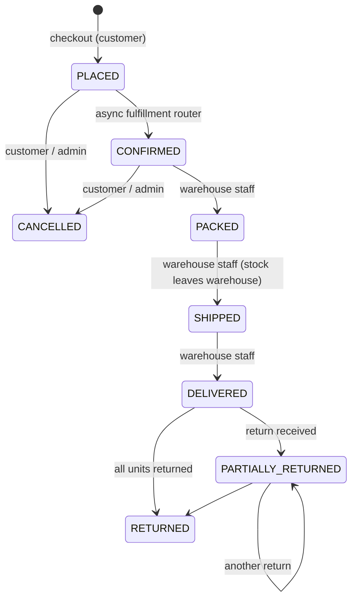

# E-commerce Order Management System

A Spring Boot REST backend for an e-commerce order management system: multi-category catalog, cart and
checkout, inventory across multiple warehouses that cannot be oversold under concurrency, payments,
discounts, taxes, an order fulfillment lifecycle, returns and refunds, and a non-blocking downstream
pipeline (fulfillment routing, customer notifications, audit logging).

## Tech stack & why
| Choice | Why |
|---|---|
| Java 21, Spring Boot 4.1 (Web MVC, Data JPA/Hibernate 7, Security 7, Validation) | Mandated stack; current LTS JDK and current Boot line |
| H2 (PostgreSQL mode, file-backed) | Zero-install persistence for reviewers; supports the row locks and check constraints the design relies on. Swap to PostgreSQL by changing the datasource URL. |
| HTTP Basic + BCrypt, role-based rules | "Basic RBAC" per spec; OAuth/JWT is explicitly out of scope |
| Transactional outbox + scheduled worker | Downstream work never blocks checkout and is never lost if the process crashes after commit |
| JUnit 5, Spring Security Test, MockMvc, AssertJ, Awaitility | Unit tests for pure logic; integration tests through real HTTP, security and database |

## Running
```bash
source "$HOME/.sdkman/bin/sdkman-init.sh"   # JDK 21
./mvnw test                                 # full test suite
./mvnw spring-boot:run                      # http://localhost:8080 (seeds demo data on first start)
```
Swagger UI: http://localhost:8080/swagger-ui.html · Sample flow: `docs/requests.http`

| Role | Email | Password |
|---|---|---|
| Admin | admin@oms.local | Admin@123 |
| Warehouse staff (BLR-01) | staff.blr@oms.local | Staff@123 |
| Warehouse staff (DEL-01) | staff.del@oms.local | Staff@123 |
| Customer | alice@example.com | Customer@123 |

Discount codes: `WELCOME10` (10%, max 500), `FLAT200` (200 off orders ≥ 1000). Payment tokens: any value
succeeds except `tok_declined` and `tok_insufficient_funds`.

## API overview
| Area | Endpoints | Role |
|---|---|---|
| Auth | `POST /api/auth/register`, `GET /api/auth/me` | public / any |
| Catalog | `GET /api/catalog/categories`, `GET /api/catalog/products?categoryId&q&minPrice&maxPrice&page&size&sort`, `GET /api/catalog/products/{id}`, `GET /api/catalog/products/{id}/availability` | public |
| Catalog admin | `/api/admin/categories`, `/api/admin/products` (CRUD; delete = deactivate) | ADMIN |
| Warehouses & stock | `/api/admin/warehouses`, `PUT /api/admin/inventory/warehouses/{w}/products/{p}`, `POST …/adjustments`, `GET /api/admin/inventory?productId|warehouseId` | ADMIN |
| Discounts | `/api/admin/discounts` | ADMIN |
| Users | `POST/GET /api/admin/users` (create staff/admins) | ADMIN |
| Cart | `GET /api/cart`, `POST /api/cart/items`, `PUT/DELETE /api/cart/items/{productId}`, `DELETE /api/cart` | CUSTOMER |
| Checkout | `POST /api/checkout` (+ optional `Idempotency-Key` header) | CUSTOMER |
| Orders | `GET /api/orders`, `GET /api/orders/{id}`, `POST /api/orders/{id}/cancel` | CUSTOMER |
| Returns | `POST/GET /api/orders/{id}/returns` | CUSTOMER |
| Notifications | `GET /api/notifications` | CUSTOMER |
| Fulfillment | `GET /api/warehouse/orders?status`, `PATCH /api/warehouse/orders/{id}/status` | WAREHOUSE_STAFF, ADMIN |
| Return handling | `GET /api/warehouse/returns`, `POST /api/warehouse/returns/{id}/receive|reject` | WAREHOUSE_STAFF, ADMIN |
| Order admin | `GET /api/admin/orders?status`, `GET /api/admin/orders/{id}`, `POST /api/admin/orders/{id}/cancel`, `GET /api/admin/audit-logs?orderId` | ADMIN |

Errors are RFC 7807 `application/problem+json`; validation errors include an `errors` map.

## Order lifecycle


## Key design decisions
**Oversell prevention.** Stock is one row per (product, warehouse) with `onHand` and `reserved`. Checkout
locks the relevant rows with `SELECT … FOR UPDATE`, always in id order so concurrent checkouts cannot
deadlock, checks availability, and increments `reserved`. A DB check constraint (`0 ≤ reserved ≤ onHand`)
is a second line of defence. Allocation is greedy by available stock: one warehouse ships the whole line
when possible, otherwise the line is split. `CheckoutConcurrencyTest` fires 12 buyers at 5 units spread
over two warehouses and asserts exactly 5 orders.

**Atomic checkout.** One transaction: lock cart → validate products → apply and redeem discount → price →
reserve stock → persist order → capture payment → clear cart → write outbox event. A declined card, missing
stock or exhausted discount rolls back everything. The cart row lock serialises double-submits.
`Idempotency-Key` makes retries safe.

**Non-blocking pipeline.** Checkout only writes an `outbox_events` row. A scheduled worker (every 500 ms)
processes each event in its own transaction: fulfillment routing (PLACED→CONFIRMED), a customer notification
(stored, and logged in place of email) and an audit log entry. Failures are retried up to 5 times, then
marked `FAILED` for inspection.

**Pricing.** Tax is per category (e.g. 18% electronics, 5% books) and applies to the discounted line amount.
The order-level discount is split across lines using the largest-remainder method: every line's share is
floored to the cent, and the leftover cents go to the lines with the largest fractional remainders, so line
discounts always sum exactly to the discount and never exceed a line's subtotal. A negative discount is
treated as zero.

**Returns & refunds.** Item-level partial returns within 30 days of delivery. Staff receive (restock and
refund) or reject. The per-unit refund is the line's paid total (after discount, including tax). The last
unit gets the remainder, so refunds always sum to exactly what was paid. Cancelling (only before packing)
releases reservations and refunds in full. Cancel and warehouse status updates lock the order row before
checking its status, so the router or a staff "packed" cannot move an order on while its refund is being
issued (`CancelConcurrencyTest`). Receiving or rejecting a return locks the return row before
checking its status, so two staff clicking "receive" at once can't refund twice — covered by a concurrency
test (`ReturnsConcurrencyTest`).

## Assumptions
1. One currency. Money is `BigDecimal`, 2 decimals, HALF_UP.
2. Payment is captured at checkout through a simulated gateway (`PaymentGateway` port). If the checkout
   transaction rolls back after a successful charge, a transaction-synchronization hook automatically voids
   (refunds) the charge; a failed void is logged at ERROR for manual reconciliation. A production PSP would
   use authorize-then-capture instead.
3. Reservation happens at checkout. Stock is only decremented from `onHand` when the order ships.
4. Order status is tracked per order, not per shipment. A staff user may advance an order if any of its
   lines ships from their warehouse.
5. Staff get 404 (not 403) for orders outside their warehouse, so the API does not reveal that an order exists.
6. Orders can be cancelled only while PLACED or CONFIRMED. After packing, the customer must return the goods.
7. A cancelled order does not give back its discount-code use.
8. Returned units are restocked into the warehouse of the line's first allocation.
9. Deleting a product or warehouse deactivates it (history keeps referencing it). Inactive products cannot be
   bought, and inactive warehouses are not allocated from.
10. The outbox worker assumes a single app instance. With several instances, the poll query would use
    `FOR UPDATE SKIP LOCKED`.
11. No shipping fees and no multi-currency. Notifications are persisted and logged, not emailed.

## Trade-offs / known limitations
- Cancellation refunds are issued inside the DB transaction (a later rollback would need manual
  reconciliation). Production would issue refunds after commit via the outbox.
- A replayed `Idempotency-Key` returns the original order even if the new request body differs.
- The outbox worker assumes a single instance (multi-instance would use `FOR UPDATE SKIP LOCKED`).
- Order status is per order, not per shipment, so staff of one warehouse can advance a split order.
- Returned units restock into the line's first allocated warehouse.
- Cart edits don't take the cart lock, so an edit racing a checkout may be lost when the cart is cleared.

## Testing approach
- **Unit:** pricing math, discount rules and the order state machine (no Spring).
- **Integration:** every core flow through MockMvc against a real H2 database with real security. The database
  is truncated before each test. Covers catalog, inventory, cart, checkout (happy path, empty cart, no stock,
  declined card, exhausted discount, idempotency, warehouse split), async pipeline and retries, tracking and
  cancellation, warehouse fulfillment and its scoping, returns and refund rounding, seeding, and OpenAPI.
- **Concurrency:** six multi-threaded tests prove there is no unsafe interleaving: the checkout oversell
  test (`CheckoutConcurrencyTest.concurrentBuyersNeverOversellAcrossWarehouses`, 12 buyers over two
  warehouses, exactly 5 orders placed), the same-customer double submit
  (`CheckoutConcurrencyTest.sameCustomerDoubleSubmitCreatesOneOrder`), and the concurrent double-receive of a
  return (`ReturnsConcurrencyTest.concurrentReceivesRefundExactlyOnce`, refunds exactly once), cancel racing a
  staff "packed" and cancel racing the fulfillment router (`CancelConcurrencyTest`, the order is either
  cancelled and refunded or moves on with no refund, never both), and two concurrent "shipped" updates
  (`FulfillmentConcurrencyTest.concurrentShipUpdatesCommitStockOnce`, stock committed once, loser gets 409).
- **Background:** one Awaitility test runs the real scheduler end to end.
- 130 tests in the suite as of this build (`./mvnw clean verify`, `BUILD SUCCESS`).

## AI workflow
Built with Claude Code and the "superpowers" skills (in `docs/ai/skills/`). The assignment PDF was turned
into scoping decisions and a TDD task plan (`docs/superpowers/plans/…`), executed task by task with
red-green-commit cycles and a review gate per task. `CLAUDE.md` holds the conventions the agents followed.

## Out of scope (per spec)
UI, deployment/containers/CI, microservices, advanced auth, production observability.
