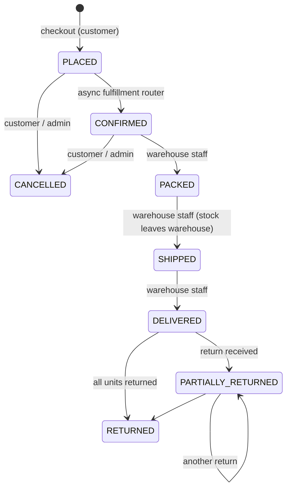

# E-commerce Order Management Implementation Plan

> **For agentic workers:** REQUIRED SUB-SKILL: Use superpowers:subagent-driven-development (recommended) or superpowers:executing-plans to implement this plan task-by-task. Steps use checkbox (`- [ ]`) syntax for tracking.

**Goal:** Build a Spring Boot REST backend for e-commerce order management: multi-category catalog, cart and checkout, inventory across multiple warehouses that cannot be oversold, payments, discounts, taxes, an order lifecycle with returns and refunds, and a non-blocking downstream pipeline for fulfillment routing, notifications and audit logging.

**Architecture:** One modular Spring Boot application, packaged by feature (`catalog`, `inventory`, `cart`, `order`, and so on), on top of JPA/H2. Checkout runs as one database transaction. It locks the customer's cart row and the relevant inventory rows (`SELECT … FOR UPDATE`, always in id order), reserves stock, prices the order, captures payment and writes an **outbox event**. If any step fails, the whole checkout rolls back. A scheduled outbox processor then runs fulfillment routing (PLACED→CONFIRMED), notifications and audit logging. That work happens after the response is sent, so it never slows checkout, and failed events are retried.

**Tech Stack:** Java 21, Spring Boot 4.1.1 (Web MVC, Data JPA / Hibernate 7, Security 7, Validation), H2 database (PostgreSQL mode, file-backed), Lombok, springdoc-openapi 3.1.1, JUnit 5, AssertJ, Mockito, Spring Security Test, Awaitility, Maven wrapper.

**Spec:** `docs/spec/E-commerce Order Management.pdf` (Task 0 moves it there from the project root). The spec is deliberately open-ended. The **Scoping Decisions** section below is the design this plan implements, and it becomes the "Assumptions" section of the README.

## Global Constraints

- Time limit: **48 hours** from assignment. Stack: **Spring Boot**. The spec fixes both.
- Java **21**, Spring Boot **4.1.1.RELEASE**, generated from start.spring.io with the Maven wrapper (`./mvnw`). No global Maven install.
- Base package: `com.ecommerce.oms`. Group `com.ecommerce`, artifact `oms`.
- Database: **H2**, file `./data/oms` in the app and a fresh in-memory database per Spring test context. No Docker. Containerization and CI/CD are out of scope.
- Every endpoint lives under `/api`, speaks JSON, and returns errors as RFC 7807 `ProblemDetail` (`application/problem+json`). Validation errors carry an `errors` map (`field -> message`).
- Authentication: **HTTP Basic** against users stored in the database with BCrypt hashes. Roles are exactly `ADMIN`, `CUSTOMER` and `WAREHOUSE_STAFF`. No OAuth, SSO, MFA or JWT, because advanced auth is out of scope.
- Money: `BigDecimal` with scale 2, rounded `HALF_UP` (`Money.of`). Tax rates: `BigDecimal` with scale 4 (for example `0.1800`).
- Never expose JPA entities from controllers. Use Java `record` DTOs. `spring.jpa.open-in-view=false`.
- Out of scope, so spend no time on: UI, deployment, containerization, CI/CD, microservices, advanced auth, production observability.
- Submission must contain: `README.md`, `CLAUDE.md`, the skills used during development, all raw files used (spec PDF, this plan), and **multiple commits**. Commit after every task.
- Every commit message ends with the trailer line `Co-Authored-By: Claude Opus 5.5 <noreply@anthropic.com>`.
- `./mvnw test` must be green at the end of every task.

## Scoping Decisions (document these in the README)

1. **Order lifecycle:** `PLACED → CONFIRMED → PACKED → SHIPPED → DELIVERED → (PARTIALLY_RETURNED)* → RETURNED`, with `CANCELLED` reachable only from `PLACED` or `CONFIRMED`. Transitions are enforced by `OrderStateMachine`. Every transition is saved in `OrderStatusHistory` along with who made it.
2. **Who moves the order:** the system (async fulfillment router) moves PLACED→CONFIRMED. Warehouse staff (or an admin) set PACKED, SHIPPED and DELIVERED. Returns set PARTIALLY_RETURNED or RETURNED when the goods are received. A customer or an admin can cancel.
3. **Inventory model:** one `InventoryItem` row per (product, warehouse), holding `onHand` and `reserved`. Available stock is `onHand - reserved`. A DB check constraint guarantees `0 ≤ reserved ≤ onHand`. Checkout reserves stock, shipping commits it (`onHand -= q`, `reserved -= q`), cancelling releases it, and a received return restocks it.
4. **Oversell prevention:** pessimistic row locks (`PESSIMISTIC_WRITE`), always taken in inventory-id order to avoid deadlocks, plus the DB check constraint as a safety net. Allocation is greedy: warehouses are ranked by available stock (highest first), so one warehouse ships the whole line when it can, and the order is split across warehouses only when it has to be.
5. **Atomic checkout:** cart lock, stock reservation, discount redemption, order creation, payment capture, cart clearing and the outbox event all commit in **one** transaction. A declined payment rolls everything back.
6. **Non-blocking pipeline:** transactional outbox (`outbox_events`) plus a `@Scheduled` poller (every 500 ms). Handlers: `FulfillmentRoutingHandler`, `NotificationHandler` (stored in the DB and logged to stand in for email) and `AuditHandler`. Each event is handled in its own transaction and retried up to 5 times before being marked `FAILED`.
7. **Payments:** the `PaymentGateway` interface has a `FakePaymentGateway`. Token `tok_declined` returns "Card declined", `tok_insufficient_funds` returns "Insufficient funds", and any other token is approved. Payment is captured at checkout. Refunds can be partial, and the total refunded can never exceed the amount captured.
8. **Pricing:** line subtotal = unit price × qty. An order-level discount code is spread across lines in proportion to their subtotals (the rounding remainder goes to the largest line). Tax = (line subtotal − line discount) × category tax rate. Grand total = the sum of the line totals.
9. **Discounts:** admin-managed codes, either `PERCENTAGE` (optional cap) or `FIXED_AMOUNT`, with an optional minimum order, validity window, usage limit and active flag. Usage is counted with one atomic conditional UPDATE, so a usage limit holds under concurrent checkouts. A cancelled order does not give back its discount use.
10. **Returns:** item-level partial returns are allowed within **30 days** of delivery (`oms.returns.window-days`). The customer requests a return, then warehouse staff mark it received (restock plus refund) or reject it. Per unit, the refund is the line's paid total (after discount, including tax). The last unit returned gets the remainder, so refunds always add up exactly to what was paid. Restocked units go to the warehouse of the line's first allocation.
11. **Warehouse staff scoping:** a staff user belongs to exactly one warehouse. They can see and act only on orders or returns that have an allocation in that warehouse. For anything else they get 404, so the API does not reveal that the order exists. Order status is tracked per order, not per shipment.
12. **Idempotent checkout:** the optional `Idempotency-Key` header is unique per customer. Replaying a key returns the original order with `200`. A same-customer double-submit without a key is serialized by the cart lock, and the second request gets `400 Cart is empty`.
13. **Catalog visibility:** "deleting" a product actually deactivates it, because orders keep referencing it. Inactive products are hidden from the public catalog and cannot be added to a cart or checked out.

## Review Focus

1. **Same customer double-submits checkout concurrently with no idempotency key.** Expect exactly one order and one reservation. The other request gets 400 "Cart is empty". Tested in Task 10 (`sameCustomerDoubleSubmitCreatesOneOrder`).
2. **Several partial returns whose per-unit refunds don't divide evenly.** The refunds must add up to exactly the line total, the payment ends `REFUNDED`, and nothing is refunded past the captured amount. Tested in Task 14 (`threeSingleUnitReturnsRefundExactlyTheLineTotal`).
3. **Order cancelled before the async router runs.** The router must not bring it back to CONFIRMED. Tested in Task 12 (`routerDoesNotConfirmAnOrderCancelledFirst`).
4. **Admin lowers stock below what is already reserved.** Expect 409, and availability never goes negative. Tested in Task 3 (`setStockBelowReservedIsRejected`, `adjustBelowReservedIsRejected`).
5. **A usage-limited discount is used up by another customer before checkout.** The second checkout fails with 400, and nothing is reserved or charged. Tested in Task 10 (`exhaustedDiscountRollsBackCheckout`).

## File Structure

```
pom.xml, mvnw, .mvn/                         (generated, Task 0)
src/main/resources/application.properties
src/main/java/com/ecommerce/oms/
  OmsApplication.java
  common/    ApiException, NotFoundException, BadRequestException, ConflictException,
             ForbiddenException, GlobalExceptionHandler, Money, PageResponse, Pageables, TimeConfig
  auth/      Role, User, UserRepository, AppUserDetails, AppUserDetailsService, SecurityConfig,
             UserService, AuthDtos, AuthController, AccountAdminService, AdminUserController
  catalog/   Category, Product, CategoryRepository, ProductRepository, ProductSpecifications,
             CatalogDtos, CatalogService, AdminCatalogController, PublicCatalogController
  inventory/ Warehouse, InventoryItem, StockAllocation, InsufficientStockException,
             WarehouseRepository, InventoryItemRepository, InventoryDtos, WarehouseService,
             InventoryService, AdminWarehouseController, AdminInventoryController, AvailabilityController
  discount/  DiscountType, Discount, DiscountRepository, AppliedDiscount, DiscountDtos,
             DiscountService, AdminDiscountController
  pricing/   PricingLine, PricedLine, PricingResult, PricingService
  cart/      Cart, CartItem, CartRepository, CartDtos, CartService, CartController
  payment/   PaymentStatus, Payment, Refund, PaymentRepository, RefundRepository, GatewayResult,
             PaymentGateway, FakePaymentGateway, PaymentDeclinedException, PaymentSummary, PaymentService
  order/     OrderStatus, OrderStateMachine, Address, CustomerOrder, OrderItem, OrderAllocation,
             OrderStatusHistory, OrderRepository, OrderAllocationRepository, OrderNumbers, OrderDtos,
             OrderMapper, CheckoutService, CheckoutController, OrderService, OrderController, AdminOrderController
  events/    OrderEventType, OutboxStatus, OutboxEvent, OutboxRepository, OrderEventPublisher,
             OrderEventHandler, OutboxProcessor, OutboxScheduler, Notification, NotificationRepository,
             NotificationHandler, NotificationController, AuditLog, AuditLogRepository, AuditHandler,
             AdminAuditController
  fulfillment/ FulfillmentRoutingHandler, WarehouseAccessPolicy, FulfillmentService, WarehouseOrderController
  returns/   ReturnStatus, ReturnRequest, ReturnItem, ReturnRequestRepository, ReturnDtos, ReturnService,
             OrderReturnsController, WarehouseReturnsController
  seed/      DataSeeder
  config/    OpenApiConfig
src/test/java/com/ecommerce/oms/
  support/   IntegrationTestBase, DatabaseCleaner, TestFixtures
  <feature>/ one test class per feature (named in each task)
docs/spec/, docs/superpowers/plans/, docs/ai/skills/, docs/requests.http
README.md, CLAUDE.md
```

---
### Task 0: Toolchain, project scaffold, git

**Files:**
- Create: `pom.xml`, `mvnw`, `.mvn/`, `src/main/java/com/ecommerce/oms/OmsApplication.java` (generated)
- Create: `src/main/resources/application.properties`, `src/test/resources/application-test.properties`
- Modify: `src/test/java/com/ecommerce/oms/OmsApplicationTests.java`, `.gitignore`
- Move: `E-commerce Order Management.pdf` → `docs/spec/`

**Interfaces:**
- Produces: a buildable project; the `test` Spring profile; `./mvnw test`.

- [ ] **Step 1: Install JDK 21 (this machine has no Java, Maven, or Homebrew)**

```bash
curl -s "https://get.sdkman.io" | bash
source "$HOME/.sdkman/bin/sdkman-init.sh"
sdk list java | grep -E '21\.[0-9.]+-tem' | head -3
sdk install java 21.0.8-tem     # use the newest 21.x-tem identifier printed by the previous line
java -version
```
Expected: `openjdk version "21.…"`. Each new shell must run `source "$HOME/.sdkman/bin/sdkman-init.sh"` first (SDKMAN adds this to `~/.zshrc`).

- [ ] **Step 2: Initialise git, move the spec, generate the project**

```bash
cd "/Users/yashvigoyal/Desktop/DMG project"
git init -b main
mkdir -p docs/spec && mv "E-commerce Order Management.pdf" docs/spec/
curl -s https://start.spring.io/starter.zip \
  -d type=maven-project -d language=java -d bootVersion=4.1.1.RELEASE -d javaVersion=21 \
  -d groupId=com.ecommerce -d artifactId=oms -d name=oms -d packageName=com.ecommerce.oms \
  -d dependencies=web,data-jpa,security,validation,h2,lombok -o "$TMPDIR/oms.zip"
unzip -o "$TMPDIR/oms.zip" -d .
rm -f HELP.md
```

- [ ] **Step 3: Edit `pom.xml`**

Delete the `spring-boot-h2console` dependency block. The H2 console registers a second servlet, and Spring Security path matching gets ambiguous when there are two. Set `<description>E-commerce order management API</description>`. Keep everything else as generated. The generated test starters are `spring-boot-starter-data-jpa-test`, `spring-boot-starter-security-test`, `spring-boot-starter-validation-test` and `spring-boot-starter-webmvc-test`.

- [ ] **Step 4: Write `src/main/resources/application.properties`**

```properties
spring.application.name=oms
spring.datasource.url=jdbc:h2:file:./data/oms;MODE=PostgreSQL;LOCK_TIMEOUT=10000
spring.datasource.username=sa
spring.datasource.password=
spring.jpa.hibernate.ddl-auto=update
spring.jpa.open-in-view=false
spring.jpa.properties.hibernate.jdbc.time_zone=UTC
spring.data.web.pageable.max-page-size=100

oms.security.bcrypt-strength=10
oms.seed.enabled=true
oms.outbox.scheduler-enabled=true
oms.outbox.poll-interval-ms=500
oms.outbox.batch-size=50
oms.outbox.max-attempts=5
oms.returns.window-days=30
```

- [ ] **Step 5: Write `src/test/resources/application-test.properties`**

```properties
spring.datasource.url=jdbc:h2:mem:${random.uuid};DB_CLOSE_DELAY=-1;MODE=PostgreSQL;LOCK_TIMEOUT=10000
spring.jpa.hibernate.ddl-auto=create-drop
oms.security.bcrypt-strength=4
oms.seed.enabled=false
oms.outbox.scheduler-enabled=false
```

- [ ] **Step 6: Enable scheduling and use the test profile**

`src/main/java/com/ecommerce/oms/OmsApplication.java`:
```java
package com.ecommerce.oms;

import org.springframework.boot.SpringApplication;
import org.springframework.boot.autoconfigure.SpringBootApplication;
import org.springframework.scheduling.annotation.EnableScheduling;

@SpringBootApplication
@EnableScheduling
public class OmsApplication {

    public static void main(String[] args) {
        SpringApplication.run(OmsApplication.class, args);
    }
}
```

`src/test/java/com/ecommerce/oms/OmsApplicationTests.java`:
```java
package com.ecommerce.oms;

import org.junit.jupiter.api.Test;
import org.springframework.boot.test.context.SpringBootTest;
import org.springframework.test.context.ActiveProfiles;

@SpringBootTest
@ActiveProfiles("test")
class OmsApplicationTests {

    @Test
    void contextLoads() {
    }
}
```

- [ ] **Step 7: Ignore local DB files**

```bash
printf '\n# local runtime\ndata/\n.DS_Store\n' >> .gitignore
```

- [ ] **Step 8: Build**

Run: `./mvnw -q test`
Expected: `BUILD SUCCESS`, 1 test run. If the wrapper fails with a path error caused by the space in `DMG project`, move the repo to `~/Desktop/dmg-oms` and use that path from now on.

- [ ] **Step 9: Commit**

```bash
git add -A
git commit -m "chore: scaffold Spring Boot 4.1 project with H2 and test profile

Co-Authored-By: Claude Opus 5.5 <noreply@anthropic.com>"
```

---

### Task 1: Error handling, security, registration, test harness

**Files:**
- Create: `src/main/java/com/ecommerce/oms/common/{ApiException,NotFoundException,BadRequestException,ConflictException,ForbiddenException,GlobalExceptionHandler,Money,PageResponse,Pageables,TimeConfig}.java`
- Create: `src/main/java/com/ecommerce/oms/auth/{Role,User,UserRepository,AppUserDetails,AppUserDetailsService,SecurityConfig,UserService,AuthDtos,AuthController}.java`
- Create: `src/test/java/com/ecommerce/oms/support/{IntegrationTestBase,DatabaseCleaner,TestFixtures}.java`
- Test: `src/test/java/com/ecommerce/oms/auth/AuthApiTest.java`

**Interfaces:**
- Produces:
  - `ApiException(HttpStatus, String)` with `getStatus()`. Subclasses `NotFoundException(String)` (404), `BadRequestException(String)` (400), `ConflictException(String)` (409), `ForbiddenException(String)` (403). The handler maps any `ApiException` to its own status.
  - `Money.ZERO`, `Money.of(BigDecimal)`, `PageResponse<T>.from(Page<T>)`, `Pageables.requireSortableBy(Pageable, Set<String>)`, a `Clock` bean.
  - `Role {ADMIN, CUSTOMER, WAREHOUSE_STAFF}`. `User` entity with `id, email, passwordHash, fullName, role, warehouseId (Long, nullable), createdAt`.
  - `UserRepository.findByEmailIgnoreCase(String)`, `existsByEmailIgnoreCase(String)`.
  - `record AppUserDetails(Long id, String email, String passwordHash, Role role, Long warehouseId) implements UserDetails` with `static from(User)`. Controllers receive it through `@AuthenticationPrincipal`.
  - `UserService.create(String email, String rawPassword, String fullName, Role role, Long warehouseId): User`, `registerCustomer(RegisterRequest)`, `getById(Long)`.
  - Test harness: `IntegrationTestBase` (fields `mvc`, `fixtures`, `tx`; helpers `as(User)` and `idFrom(MvcResult)`), `TestFixtures.PASSWORD`, `fixtures.customer(email)`, `fixtures.admin()`, `fixtures.user(email, role, warehouseId)`. Fixture creators are find-or-create.

- [ ] **Step 1: Write the test harness**

`src/test/java/com/ecommerce/oms/support/DatabaseCleaner.java`:
```java
package com.ecommerce.oms.support;

import java.util.List;
import org.springframework.jdbc.core.JdbcTemplate;

/** Truncates every table between tests so tests (including multi-threaded ones) never share state. */
public class DatabaseCleaner {

    private final JdbcTemplate jdbc;

    public DatabaseCleaner(JdbcTemplate jdbc) {
        this.jdbc = jdbc;
    }

    public void clean() {
        List<String> tables = jdbc.queryForList(
                "SELECT TABLE_NAME FROM INFORMATION_SCHEMA.TABLES WHERE TABLE_SCHEMA = 'PUBLIC' AND TABLE_TYPE = 'BASE TABLE'",
                String.class);
        jdbc.execute("SET REFERENTIAL_INTEGRITY FALSE");
        for (String table : tables) {
            jdbc.execute("TRUNCATE TABLE \"" + table + "\" RESTART IDENTITY");
        }
        jdbc.execute("SET REFERENTIAL_INTEGRITY TRUE");
    }
}
```

`src/test/java/com/ecommerce/oms/support/TestFixtures.java`:
```java
package com.ecommerce.oms.support;

import com.ecommerce.oms.auth.Role;
import com.ecommerce.oms.auth.User;
import com.ecommerce.oms.auth.UserRepository;
import java.util.Locale;
import org.springframework.beans.factory.annotation.Autowired;
import org.springframework.security.crypto.password.PasswordEncoder;

/** Builds persistent test data directly through repositories. Later tasks add more creators here. */
public class TestFixtures {

    public static final String PASSWORD = "password123";

    @Autowired private UserRepository userRepository;
    @Autowired private PasswordEncoder passwordEncoder;

    public User customer(String email) {
        return user(email, Role.CUSTOMER, null);
    }

    public User admin() {
        return user("admin@test.local", Role.ADMIN, null);
    }

    public User user(String email, Role role, Long warehouseId) {
        return userRepository.findByEmailIgnoreCase(email).orElseGet(() -> {
            User user = new User();
            user.setEmail(email.toLowerCase(Locale.ROOT));
            user.setPasswordHash(passwordEncoder.encode(PASSWORD));
            user.setFullName("Test " + role.name());
            user.setRole(role);
            user.setWarehouseId(warehouseId);
            return userRepository.save(user);
        });
    }
}
```

`src/test/java/com/ecommerce/oms/support/IntegrationTestBase.java`:
```java
package com.ecommerce.oms.support;

import static org.springframework.security.test.web.servlet.request.SecurityMockMvcRequestPostProcessors.httpBasic;
import static org.springframework.security.test.web.servlet.setup.SecurityMockMvcConfigurers.springSecurity;

import com.ecommerce.oms.auth.User;
import com.jayway.jsonpath.JsonPath;
import org.junit.jupiter.api.BeforeEach;
import org.springframework.beans.factory.annotation.Autowired;
import org.springframework.boot.test.context.SpringBootTest;
import org.springframework.context.annotation.Import;
import org.springframework.test.context.ActiveProfiles;
import org.springframework.test.web.servlet.MockMvc;
import org.springframework.test.web.servlet.MvcResult;
import org.springframework.test.web.servlet.request.RequestPostProcessor;
import org.springframework.test.web.servlet.setup.MockMvcBuilders;
import org.springframework.transaction.support.TransactionTemplate;
import org.springframework.web.context.WebApplicationContext;

@SpringBootTest
@ActiveProfiles("test")
@Import({TestFixtures.class, DatabaseCleaner.class})
public abstract class IntegrationTestBase {

    @Autowired protected WebApplicationContext context;
    @Autowired protected TestFixtures fixtures;
    @Autowired protected TransactionTemplate tx;
    @Autowired private DatabaseCleaner databaseCleaner;

    protected MockMvc mvc;

    @BeforeEach
    void setUpBase() {
        databaseCleaner.clean();
        mvc = MockMvcBuilders.webAppContextSetup(context).apply(springSecurity()).build();
    }

    protected static RequestPostProcessor as(User user) {
        return httpBasic(user.getEmail(), TestFixtures.PASSWORD);
    }

    protected static long idFrom(MvcResult result) throws Exception {
        Number id = JsonPath.read(result.getResponse().getContentAsString(), "$.id");
        return id.longValue();
    }
}
```

- [ ] **Step 2: Write the failing test**

`src/test/java/com/ecommerce/oms/auth/AuthApiTest.java`:
```java
package com.ecommerce.oms.auth;

import static org.springframework.http.MediaType.APPLICATION_JSON;
import static org.springframework.security.test.web.servlet.request.SecurityMockMvcRequestPostProcessors.httpBasic;
import static org.springframework.test.web.servlet.request.MockMvcRequestBuilders.get;
import static org.springframework.test.web.servlet.request.MockMvcRequestBuilders.post;
import static org.springframework.test.web.servlet.result.MockMvcResultMatchers.jsonPath;
import static org.springframework.test.web.servlet.result.MockMvcResultMatchers.status;

import com.ecommerce.oms.support.IntegrationTestBase;
import org.junit.jupiter.api.Test;

class AuthApiTest extends IntegrationTestBase {

    @Test
    void registerCreatesCustomerWithNormalizedEmail() throws Exception {
        mvc.perform(post("/api/auth/register").contentType(APPLICATION_JSON).content("""
                        {"email":"Alice@Example.com","password":"supersecret","fullName":"Alice"}
                        """))
                .andExpect(status().isCreated())
                .andExpect(jsonPath("$.email").value("alice@example.com"))
                .andExpect(jsonPath("$.role").value("CUSTOMER"))
                .andExpect(jsonPath("$.passwordHash").doesNotExist());
    }

    @Test
    void duplicateEmailIsConflict() throws Exception {
        fixtures.customer("alice@example.com");
        mvc.perform(post("/api/auth/register").contentType(APPLICATION_JSON).content("""
                        {"email":"ALICE@example.com","password":"supersecret","fullName":"Alice"}
                        """))
                .andExpect(status().isConflict())
                .andExpect(jsonPath("$.detail").value("Email already registered"));
    }

    @Test
    void invalidPayloadReturnsFieldErrors() throws Exception {
        mvc.perform(post("/api/auth/register").contentType(APPLICATION_JSON).content("""
                        {"email":"not-an-email","password":"short","fullName":""}
                        """))
                .andExpect(status().isBadRequest())
                .andExpect(jsonPath("$.errors.email").exists())
                .andExpect(jsonPath("$.errors.password").exists())
                .andExpect(jsonPath("$.errors.fullName").exists());
    }

    @Test
    void malformedJsonIsBadRequest() throws Exception {
        mvc.perform(post("/api/auth/register").contentType(APPLICATION_JSON).content("{not json"))
                .andExpect(status().isBadRequest());
    }

    @Test
    void meRequiresAuthentication() throws Exception {
        mvc.perform(get("/api/auth/me")).andExpect(status().isUnauthorized());
    }

    @Test
    void meReturnsCurrentUser() throws Exception {
        User alice = fixtures.customer("alice@example.com");
        mvc.perform(get("/api/auth/me").with(as(alice)))
                .andExpect(status().isOk())
                .andExpect(jsonPath("$.email").value("alice@example.com"))
                .andExpect(jsonPath("$.role").value("CUSTOMER"));
    }

    @Test
    void wrongPasswordIsUnauthorized() throws Exception {
        fixtures.customer("alice@example.com");
        mvc.perform(get("/api/auth/me").with(httpBasic("alice@example.com", "wrong-password")))
                .andExpect(status().isUnauthorized());
    }
}
```

- [ ] **Step 3: Run the test and confirm it fails**

Run: `./mvnw -q test -Dtest=AuthApiTest`
Expected: compilation failure (`package com.ecommerce.oms.auth does not exist` / `cannot find symbol User`).

- [ ] **Step 4: Write `common`**

`common/ApiException.java`:
```java
package com.ecommerce.oms.common;

import org.springframework.http.HttpStatus;

/** Business error that carries its HTTP status; GlobalExceptionHandler renders it as ProblemDetail. */
public class ApiException extends RuntimeException {

    private final HttpStatus status;

    public ApiException(HttpStatus status, String message) {
        super(message);
        this.status = status;
    }

    public HttpStatus getStatus() {
        return status;
    }
}
```

`common/NotFoundException.java`:
```java
package com.ecommerce.oms.common;

import org.springframework.http.HttpStatus;

public class NotFoundException extends ApiException {
    public NotFoundException(String message) {
        super(HttpStatus.NOT_FOUND, message);
    }
}
```
`common/BadRequestException.java`, `common/ConflictException.java` and `common/ForbiddenException.java` follow the same pattern:
```java
package com.ecommerce.oms.common;

import org.springframework.http.HttpStatus;

public class BadRequestException extends ApiException {
    public BadRequestException(String message) {
        super(HttpStatus.BAD_REQUEST, message);
    }
}
```
```java
package com.ecommerce.oms.common;

import org.springframework.http.HttpStatus;

public class ConflictException extends ApiException {
    public ConflictException(String message) {
        super(HttpStatus.CONFLICT, message);
    }
}
```
```java
package com.ecommerce.oms.common;

import org.springframework.http.HttpStatus;

public class ForbiddenException extends ApiException {
    public ForbiddenException(String message) {
        super(HttpStatus.FORBIDDEN, message);
    }
}
```

`common/GlobalExceptionHandler.java`:
```java
package com.ecommerce.oms.common;

import java.util.LinkedHashMap;
import java.util.Map;
import org.slf4j.Logger;
import org.slf4j.LoggerFactory;
import org.springframework.dao.DataIntegrityViolationException;
import org.springframework.dao.OptimisticLockingFailureException;
import org.springframework.dao.PessimisticLockingFailureException;
import org.springframework.http.HttpHeaders;
import org.springframework.http.HttpStatus;
import org.springframework.http.HttpStatusCode;
import org.springframework.http.ProblemDetail;
import org.springframework.http.ResponseEntity;
import org.springframework.security.access.AccessDeniedException;
import org.springframework.web.bind.MethodArgumentNotValidException;
import org.springframework.web.bind.annotation.ExceptionHandler;
import org.springframework.web.bind.annotation.RestControllerAdvice;
import org.springframework.web.context.request.WebRequest;
import org.springframework.web.servlet.mvc.method.annotation.ResponseEntityExceptionHandler;

@RestControllerAdvice
public class GlobalExceptionHandler extends ResponseEntityExceptionHandler {

    private static final Logger log = LoggerFactory.getLogger(GlobalExceptionHandler.class);

    @ExceptionHandler(ApiException.class)
    public ResponseEntity<ProblemDetail> handleApi(ApiException ex) {
        return ResponseEntity.status(ex.getStatus()).body(problem(ex.getStatus(), ex.getMessage()));
    }

    @ExceptionHandler(AccessDeniedException.class)
    public ResponseEntity<ProblemDetail> handleAccessDenied(AccessDeniedException ex) {
        return ResponseEntity.status(HttpStatus.FORBIDDEN).body(problem(HttpStatus.FORBIDDEN, "Access denied"));
    }

    @ExceptionHandler({OptimisticLockingFailureException.class, PessimisticLockingFailureException.class,
            DataIntegrityViolationException.class})
    public ResponseEntity<ProblemDetail> handleConcurrency(Exception ex) {
        log.warn("Conflict: {}", ex.getMessage());
        return ResponseEntity.status(HttpStatus.CONFLICT).body(problem(HttpStatus.CONFLICT,
                "The resource was modified concurrently or violates a constraint; please retry"));
    }

    @ExceptionHandler(Exception.class)
    public ResponseEntity<ProblemDetail> handleUnexpected(Exception ex) {
        log.error("Unexpected error", ex);
        return ResponseEntity.internalServerError().body(problem(HttpStatus.INTERNAL_SERVER_ERROR, "Unexpected error"));
    }

    @Override
    protected ResponseEntity<Object> handleMethodArgumentNotValid(MethodArgumentNotValidException ex,
            HttpHeaders headers, HttpStatusCode status, WebRequest request) {
        ProblemDetail body = problem(HttpStatus.BAD_REQUEST, "Validation failed");
        Map<String, String> errors = new LinkedHashMap<>();
        ex.getBindingResult().getFieldErrors()
                .forEach(error -> errors.putIfAbsent(error.getField(), error.getDefaultMessage()));
        body.setProperty("errors", errors);
        return ResponseEntity.badRequest().body(body);
    }

    private static ProblemDetail problem(HttpStatus status, String detail) {
        ProblemDetail body = ProblemDetail.forStatusAndDetail(status, detail);
        body.setTitle(status.getReasonPhrase());
        return body;
    }
}
```

`common/Money.java`:
```java
package com.ecommerce.oms.common;

import java.math.BigDecimal;
import java.math.RoundingMode;

public final class Money {

    public static final BigDecimal ZERO = BigDecimal.ZERO.setScale(2);

    private Money() {
    }

    public static BigDecimal of(BigDecimal value) {
        return value.setScale(2, RoundingMode.HALF_UP);
    }
}
```

`common/PageResponse.java`:
```java
package com.ecommerce.oms.common;

import java.util.List;
import org.springframework.data.domain.Page;

public record PageResponse<T>(List<T> content, int page, int size, long totalElements, int totalPages) {

    public static <T> PageResponse<T> from(Page<T> page) {
        return new PageResponse<>(page.getContent(), page.getNumber(), page.getSize(),
                page.getTotalElements(), page.getTotalPages());
    }
}
```

`common/Pageables.java`:
```java
package com.ecommerce.oms.common;

import java.util.Set;
import java.util.TreeSet;
import org.springframework.data.domain.Pageable;
import org.springframework.data.domain.Sort;

public final class Pageables {

    private Pageables() {
    }

    /** Rejects client-supplied sort properties outside the whitelist (otherwise JPA fails with a 500). */
    public static void requireSortableBy(Pageable pageable, Set<String> allowed) {
        for (Sort.Order order : pageable.getSort()) {
            if (!allowed.contains(order.getProperty())) {
                throw new BadRequestException("Cannot sort by '" + order.getProperty() + "'; allowed: "
                        + String.join(", ", new TreeSet<>(allowed)));
            }
        }
    }
}
```

`common/TimeConfig.java`:
```java
package com.ecommerce.oms.common;

import java.time.Clock;
import org.springframework.context.annotation.Bean;
import org.springframework.context.annotation.Configuration;

@Configuration
public class TimeConfig {

    @Bean
    public Clock clock() {
        return Clock.systemUTC();
    }
}
```

- [ ] **Step 5: Write `auth`**

`auth/Role.java`:
```java
package com.ecommerce.oms.auth;

public enum Role {
    ADMIN, CUSTOMER, WAREHOUSE_STAFF
}
```

`auth/User.java`:
```java
package com.ecommerce.oms.auth;

import jakarta.persistence.Column;
import jakarta.persistence.Entity;
import jakarta.persistence.EnumType;
import jakarta.persistence.Enumerated;
import jakarta.persistence.GeneratedValue;
import jakarta.persistence.GenerationType;
import jakarta.persistence.Id;
import jakarta.persistence.Table;
import java.time.Instant;
import lombok.Getter;
import lombok.NoArgsConstructor;
import lombok.Setter;

@Entity
@Table(name = "app_users")
@Getter
@Setter
@NoArgsConstructor
public class User {

    @Id
    @GeneratedValue(strategy = GenerationType.IDENTITY)
    private Long id;

    @Column(nullable = false, unique = true, length = 254)
    private String email;

    @Column(nullable = false)
    private String passwordHash;

    @Column(nullable = false, length = 120)
    private String fullName;

    @Enumerated(EnumType.STRING)
    @Column(nullable = false, length = 32)
    private Role role;

    /** Only set for WAREHOUSE_STAFF: the warehouse whose orders they may fulfil. */
    private Long warehouseId;

    @Column(nullable = false)
    private Instant createdAt = Instant.now();
}
```

`auth/UserRepository.java`:
```java
package com.ecommerce.oms.auth;

import java.util.Optional;
import org.springframework.data.jpa.repository.JpaRepository;

public interface UserRepository extends JpaRepository<User, Long> {

    Optional<User> findByEmailIgnoreCase(String email);

    boolean existsByEmailIgnoreCase(String email);
}
```

`auth/AppUserDetails.java`:
```java
package com.ecommerce.oms.auth;

import java.util.Collection;
import java.util.List;
import org.springframework.security.core.GrantedAuthority;
import org.springframework.security.core.authority.SimpleGrantedAuthority;
import org.springframework.security.core.userdetails.UserDetails;

/** Authenticated principal; controllers receive it via @AuthenticationPrincipal. */
public record AppUserDetails(Long id, String email, String passwordHash, Role role, Long warehouseId)
        implements UserDetails {

    public static AppUserDetails from(User user) {
        return new AppUserDetails(user.getId(), user.getEmail(), user.getPasswordHash(), user.getRole(),
                user.getWarehouseId());
    }

    @Override
    public Collection<? extends GrantedAuthority> getAuthorities() {
        return List.of(new SimpleGrantedAuthority("ROLE_" + role.name()));
    }

    @Override
    public String getPassword() {
        return passwordHash;
    }

    @Override
    public String getUsername() {
        return email;
    }

    @Override
    public boolean isAccountNonExpired() {
        return true;
    }

    @Override
    public boolean isAccountNonLocked() {
        return true;
    }

    @Override
    public boolean isCredentialsNonExpired() {
        return true;
    }

    @Override
    public boolean isEnabled() {
        return true;
    }
}
```

`auth/AppUserDetailsService.java`:
```java
package com.ecommerce.oms.auth;

import org.springframework.security.core.userdetails.UserDetails;
import org.springframework.security.core.userdetails.UserDetailsService;
import org.springframework.security.core.userdetails.UsernameNotFoundException;
import org.springframework.stereotype.Service;

@Service
public class AppUserDetailsService implements UserDetailsService {

    private final UserRepository userRepository;

    public AppUserDetailsService(UserRepository userRepository) {
        this.userRepository = userRepository;
    }

    @Override
    public UserDetails loadUserByUsername(String username) {
        return userRepository.findByEmailIgnoreCase(username)
                .map(AppUserDetails::from)
                .orElseThrow(() -> new UsernameNotFoundException("Unknown user"));
    }
}
```

`auth/SecurityConfig.java`:
```java
package com.ecommerce.oms.auth;

import org.springframework.beans.factory.annotation.Value;
import org.springframework.context.annotation.Bean;
import org.springframework.context.annotation.Configuration;
import org.springframework.http.HttpMethod;
import org.springframework.security.config.Customizer;
import org.springframework.security.config.annotation.method.configuration.EnableMethodSecurity;
import org.springframework.security.config.annotation.web.builders.HttpSecurity;
import org.springframework.security.config.annotation.web.configuration.EnableWebSecurity;
import org.springframework.security.config.http.SessionCreationPolicy;
import org.springframework.security.crypto.bcrypt.BCryptPasswordEncoder;
import org.springframework.security.crypto.password.PasswordEncoder;
import org.springframework.security.web.SecurityFilterChain;

@Configuration
@EnableWebSecurity
@EnableMethodSecurity
public class SecurityConfig {

    @Bean
    public PasswordEncoder passwordEncoder(@Value("${oms.security.bcrypt-strength:10}") int strength) {
        return new BCryptPasswordEncoder(strength);
    }

    @Bean
    public SecurityFilterChain filterChain(HttpSecurity http) throws Exception {
        http.csrf(csrf -> csrf.disable())
                .sessionManagement(session -> session.sessionCreationPolicy(SessionCreationPolicy.STATELESS))
                .authorizeHttpRequests(auth -> auth
                        .requestMatchers("/swagger-ui/**", "/swagger-ui.html", "/v3/api-docs/**", "/error").permitAll()
                        .requestMatchers(HttpMethod.POST, "/api/auth/register").permitAll()
                        .requestMatchers(HttpMethod.GET, "/api/catalog/**").permitAll()
                        .requestMatchers("/api/admin/**").hasRole("ADMIN")
                        .requestMatchers("/api/warehouse/**").hasAnyRole("WAREHOUSE_STAFF", "ADMIN")
                        .requestMatchers("/api/cart/**", "/api/checkout/**", "/api/orders/**", "/api/notifications/**")
                                .hasRole("CUSTOMER")
                        .anyRequest().authenticated())
                .httpBasic(Customizer.withDefaults());
        return http.build();
    }
}
```

`auth/AuthDtos.java`:
```java
package com.ecommerce.oms.auth;

import jakarta.validation.constraints.Email;
import jakarta.validation.constraints.NotBlank;
import jakarta.validation.constraints.Size;

public final class AuthDtos {

    private AuthDtos() {
    }

    public record RegisterRequest(
            @NotBlank @Email @Size(max = 254) String email,
            @NotBlank @Size(min = 8, max = 72) String password,
            @NotBlank @Size(max = 120) String fullName) {
    }

    public record UserResponse(Long id, String email, String fullName, Role role, Long warehouseId) {
        public static UserResponse from(User user) {
            return new UserResponse(user.getId(), user.getEmail(), user.getFullName(), user.getRole(),
                    user.getWarehouseId());
        }
    }
}
```

`auth/UserService.java`:
```java
package com.ecommerce.oms.auth;

import com.ecommerce.oms.auth.AuthDtos.RegisterRequest;
import com.ecommerce.oms.common.ConflictException;
import com.ecommerce.oms.common.NotFoundException;
import java.util.Locale;
import org.springframework.security.crypto.password.PasswordEncoder;
import org.springframework.stereotype.Service;
import org.springframework.transaction.annotation.Transactional;

@Service
public class UserService {

    private final UserRepository userRepository;
    private final PasswordEncoder passwordEncoder;

    public UserService(UserRepository userRepository, PasswordEncoder passwordEncoder) {
        this.userRepository = userRepository;
        this.passwordEncoder = passwordEncoder;
    }

    @Transactional
    public User registerCustomer(RegisterRequest request) {
        return create(request.email(), request.password(), request.fullName(), Role.CUSTOMER, null);
    }

    @Transactional
    public User create(String email, String rawPassword, String fullName, Role role, Long warehouseId) {
        String normalized = email.trim().toLowerCase(Locale.ROOT);
        if (userRepository.existsByEmailIgnoreCase(normalized)) {
            throw new ConflictException("Email already registered");
        }
        User user = new User();
        user.setEmail(normalized);
        user.setPasswordHash(passwordEncoder.encode(rawPassword));
        user.setFullName(fullName.trim());
        user.setRole(role);
        user.setWarehouseId(warehouseId);
        return userRepository.save(user);
    }

    @Transactional(readOnly = true)
    public User getById(Long id) {
        return userRepository.findById(id).orElseThrow(() -> new NotFoundException("User not found"));
    }
}
```

`auth/AuthController.java`:
```java
package com.ecommerce.oms.auth;

import com.ecommerce.oms.auth.AuthDtos.RegisterRequest;
import com.ecommerce.oms.auth.AuthDtos.UserResponse;
import jakarta.validation.Valid;
import java.net.URI;
import org.springframework.http.ResponseEntity;
import org.springframework.security.core.annotation.AuthenticationPrincipal;
import org.springframework.web.bind.annotation.GetMapping;
import org.springframework.web.bind.annotation.PostMapping;
import org.springframework.web.bind.annotation.RequestBody;
import org.springframework.web.bind.annotation.RequestMapping;
import org.springframework.web.bind.annotation.RestController;

@RestController
@RequestMapping("/api/auth")
public class AuthController {

    private final UserService userService;

    public AuthController(UserService userService) {
        this.userService = userService;
    }

    @PostMapping("/register")
    public ResponseEntity<UserResponse> register(@Valid @RequestBody RegisterRequest request) {
        User user = userService.registerCustomer(request);
        return ResponseEntity.created(URI.create("/api/auth/me")).body(UserResponse.from(user));
    }

    @GetMapping("/me")
    public UserResponse me(@AuthenticationPrincipal AppUserDetails me) {
        return UserResponse.from(userService.getById(me.id()));
    }
}
```

- [ ] **Step 6: Run the tests and confirm they pass**

Run: `./mvnw -q test`
Expected: `AuthApiTest` passes all 7 tests, and `OmsApplicationTests` passes.

- [ ] **Step 7: Commit**

```bash
git add -A
git commit -m "feat: add RFC7807 error handling, HTTP Basic RBAC and customer registration

Co-Authored-By: Claude Opus 5.5 <noreply@anthropic.com>"
```

---
### Task 2: Multi-category product catalog

**Files:**
- Create: `src/main/java/com/ecommerce/oms/catalog/{Category,Product,CategoryRepository,ProductRepository,ProductSpecifications,CatalogDtos,CatalogService,AdminCatalogController,PublicCatalogController}.java`
- Modify: `src/test/java/com/ecommerce/oms/support/TestFixtures.java` (add catalog creators)
- Test: `src/test/java/com/ecommerce/oms/catalog/CatalogApiTest.java`

**Interfaces:**
- Consumes: `NotFoundException`, `ConflictException`, `BadRequestException`, `Money`, `PageResponse`, `Pageables` (Task 1).
- Produces:
  - `Category` fields: `id, name, description, taxRate (BigDecimal scale 4), parent`.
  - `Product` fields: `id, sku, name, description, price, category, active, createdAt, version`.
  - `ProductRepository.findByIdAndActiveTrue(Long)`, `existsByCategoryId(Long)`.
  - `CatalogService.requireActiveProduct(Long): Product` (404 if missing or inactive).
  - Endpoints: `POST/PUT/DELETE/GET /api/admin/categories[/{id}]`, `POST/PUT/DELETE/GET /api/admin/products[/{id}]`, `GET /api/catalog/categories`, `GET /api/catalog/products?categoryId&q&minPrice&maxPrice&page&size&sort`, `GET /api/catalog/products/{id}`.
  - Fixtures: `fixtures.category(String name, String taxRate)`, `fixtures.product(Category, String sku, String name, String price)`, `fixtures.deactivate(Product)`.

- [ ] **Step 1: Add the catalog fixtures**

Add to `TestFixtures` (extra imports: `com.ecommerce.oms.catalog.*`, `java.math.BigDecimal`):
```java
    @Autowired private CategoryRepository categoryRepository;
    @Autowired private ProductRepository productRepository;

    public Category category(String name, String taxRate) {
        Category category = new Category();
        category.setName(name);
        category.setTaxRate(new BigDecimal(taxRate));
        return categoryRepository.save(category);
    }

    public Product product(Category category, String sku, String name, String price) {
        Product product = new Product();
        product.setSku(sku);
        product.setName(name);
        product.setDescription(name + " description");
        product.setPrice(new BigDecimal(price));
        product.setCategory(category);
        return productRepository.save(product);
    }

    public Product deactivate(Product product) {
        product.setActive(false);
        return productRepository.save(product);
    }
```

- [ ] **Step 2: Write the failing test**

`src/test/java/com/ecommerce/oms/catalog/CatalogApiTest.java`:
```java
package com.ecommerce.oms.catalog;

import static org.springframework.http.MediaType.APPLICATION_JSON;
import static org.springframework.test.web.servlet.request.MockMvcRequestBuilders.delete;
import static org.springframework.test.web.servlet.request.MockMvcRequestBuilders.get;
import static org.springframework.test.web.servlet.request.MockMvcRequestBuilders.post;
import static org.springframework.test.web.servlet.result.MockMvcResultMatchers.jsonPath;
import static org.springframework.test.web.servlet.result.MockMvcResultMatchers.status;

import com.ecommerce.oms.auth.User;
import com.ecommerce.oms.support.IntegrationTestBase;
import org.junit.jupiter.api.BeforeEach;
import org.junit.jupiter.api.Test;

class CatalogApiTest extends IntegrationTestBase {

    private User admin;

    @BeforeEach
    void setUp() {
        admin = fixtures.admin();
    }

    @Test
    void adminCreatesCategoryAndProduct() throws Exception {
        long categoryId = idFrom(mvc.perform(post("/api/admin/categories").with(as(admin))
                        .contentType(APPLICATION_JSON).content("""
                                {"name":"Electronics","description":"Gadgets","taxRate":0.18}
                                """))
                .andExpect(status().isCreated())
                .andExpect(jsonPath("$.name").value("Electronics"))
                .andReturn());

        mvc.perform(post("/api/admin/products").with(as(admin)).contentType(APPLICATION_JSON).content("""
                        {"sku":"lap-001","name":"Laptop","description":"14 inch","price":1499.99,"categoryId":%d}
                        """.formatted(categoryId)))
                .andExpect(status().isCreated())
                .andExpect(jsonPath("$.sku").value("LAP-001"))
                .andExpect(jsonPath("$.categoryName").value("Electronics"))
                .andExpect(jsonPath("$.active").value(true));
    }

    @Test
    void customerCannotManageCatalogAndAnonymousMustAuthenticate() throws Exception {
        User customer = fixtures.customer("c@test.local");
        String body = """
                {"name":"Books","taxRate":0.05}
                """;
        mvc.perform(post("/api/admin/categories").with(as(customer)).contentType(APPLICATION_JSON).content(body))
                .andExpect(status().isForbidden());
        mvc.perform(post("/api/admin/categories").contentType(APPLICATION_JSON).content(body))
                .andExpect(status().isUnauthorized());
    }

    @Test
    void duplicateSkuIsConflict() throws Exception {
        Category electronics = fixtures.category("Electronics", "0.18");
        fixtures.product(electronics, "LAP-001", "Laptop", "1000.00");
        mvc.perform(post("/api/admin/products").with(as(admin)).contentType(APPLICATION_JSON).content("""
                        {"sku":"lap-001","name":"Other","price":10.00,"categoryId":%d}
                        """.formatted(electronics.getId())))
                .andExpect(status().isConflict());
    }

    @Test
    void invalidProductIsRejected() throws Exception {
        Category electronics = fixtures.category("Electronics", "0.18");
        mvc.perform(post("/api/admin/products").with(as(admin)).contentType(APPLICATION_JSON).content("""
                        {"sku":"X-1","name":"","price":0,"categoryId":%d}
                        """.formatted(electronics.getId())))
                .andExpect(status().isBadRequest())
                .andExpect(jsonPath("$.errors.name").exists())
                .andExpect(jsonPath("$.errors.price").exists());
    }

    @Test
    void publicSearchFiltersAndHidesInactiveProducts() throws Exception {
        Category electronics = fixtures.category("Electronics", "0.18");
        Category books = fixtures.category("Books", "0.05");
        fixtures.product(electronics, "LAP-1", "Laptop Pro", "1500.00");
        fixtures.product(electronics, "PHN-1", "Phone", "800.00");
        fixtures.product(books, "BK-1", "Novel", "20.00");
        Product old = fixtures.deactivate(fixtures.product(electronics, "PHN-0", "Old Phone", "100.00"));

        mvc.perform(get("/api/catalog/products").param("categoryId", electronics.getId().toString()))
                .andExpect(status().isOk())
                .andExpect(jsonPath("$.totalElements").value(2));
        mvc.perform(get("/api/catalog/products").param("q", "PHONE"))
                .andExpect(jsonPath("$.totalElements").value(1))
                .andExpect(jsonPath("$.content[0].sku").value("PHN-1"));
        mvc.perform(get("/api/catalog/products").param("minPrice", "500").param("maxPrice", "1000"))
                .andExpect(jsonPath("$.totalElements").value(1));
        mvc.perform(get("/api/catalog/products").param("sort", "price,desc"))
                .andExpect(jsonPath("$.content[0].sku").value("LAP-1"));
        mvc.perform(get("/api/catalog/products/" + old.getId())).andExpect(status().isNotFound());
        mvc.perform(get("/api/admin/products/" + old.getId()).with(as(admin)))
                .andExpect(status().isOk())
                .andExpect(jsonPath("$.active").value(false));
    }

    @Test
    void badSearchParametersAreRejected() throws Exception {
        mvc.perform(get("/api/catalog/products").param("sort", "bogus")).andExpect(status().isBadRequest());
        mvc.perform(get("/api/catalog/products").param("minPrice", "100").param("maxPrice", "10"))
                .andExpect(status().isBadRequest());
    }

    @Test
    void deletingCategoryWithProductsIsConflictAndDeletingProductDeactivates() throws Exception {
        Category electronics = fixtures.category("Electronics", "0.18");
        Product phone = fixtures.product(electronics, "PHN-1", "Phone", "800.00");
        mvc.perform(delete("/api/admin/categories/" + electronics.getId()).with(as(admin)))
                .andExpect(status().isConflict());
        mvc.perform(delete("/api/admin/products/" + phone.getId()).with(as(admin)))
                .andExpect(status().isNoContent());
        mvc.perform(get("/api/catalog/products/" + phone.getId())).andExpect(status().isNotFound());
    }
}
```

- [ ] **Step 3: Run the test and confirm it fails**

Run: `./mvnw -q test -Dtest=CatalogApiTest`
Expected: compilation failure (`cannot find symbol Category`).

- [ ] **Step 4: Write the entities and repositories**

`catalog/Category.java`:
```java
package com.ecommerce.oms.catalog;

import jakarta.persistence.Column;
import jakarta.persistence.Entity;
import jakarta.persistence.FetchType;
import jakarta.persistence.GeneratedValue;
import jakarta.persistence.GenerationType;
import jakarta.persistence.Id;
import jakarta.persistence.JoinColumn;
import jakarta.persistence.ManyToOne;
import jakarta.persistence.Table;
import java.math.BigDecimal;
import lombok.Getter;
import lombok.NoArgsConstructor;
import lombok.Setter;

@Entity
@Table(name = "categories")
@Getter
@Setter
@NoArgsConstructor
public class Category {

    @Id
    @GeneratedValue(strategy = GenerationType.IDENTITY)
    private Long id;

    @Column(nullable = false, unique = true, length = 100)
    private String name;

    @Column(length = 500)
    private String description;

    /** Fraction, e.g. 0.1800 = 18% GST. Applied to discounted line amounts. */
    @Column(nullable = false, precision = 5, scale = 4)
    private BigDecimal taxRate;

    @ManyToOne(fetch = FetchType.LAZY)
    @JoinColumn(name = "parent_id")
    private Category parent;
}
```

`catalog/Product.java`:
```java
package com.ecommerce.oms.catalog;

import jakarta.persistence.Column;
import jakarta.persistence.Entity;
import jakarta.persistence.FetchType;
import jakarta.persistence.GeneratedValue;
import jakarta.persistence.GenerationType;
import jakarta.persistence.Id;
import jakarta.persistence.JoinColumn;
import jakarta.persistence.ManyToOne;
import jakarta.persistence.Table;
import jakarta.persistence.Version;
import java.math.BigDecimal;
import java.time.Instant;
import lombok.Getter;
import lombok.NoArgsConstructor;
import lombok.Setter;

@Entity
@Table(name = "products")
@Getter
@Setter
@NoArgsConstructor
public class Product {

    @Id
    @GeneratedValue(strategy = GenerationType.IDENTITY)
    private Long id;

    @Column(nullable = false, unique = true, length = 64)
    private String sku;

    @Column(nullable = false, length = 200)
    private String name;

    @Column(length = 2000)
    private String description;

    @Column(nullable = false, precision = 19, scale = 2)
    private BigDecimal price;

    @ManyToOne(fetch = FetchType.LAZY, optional = false)
    @JoinColumn(name = "category_id", nullable = false)
    private Category category;

    @Column(nullable = false)
    private boolean active = true;

    @Column(nullable = false)
    private Instant createdAt = Instant.now();

    @Version
    private long version;
}
```

`catalog/CategoryRepository.java`:
```java
package com.ecommerce.oms.catalog;

import org.springframework.data.jpa.repository.JpaRepository;

public interface CategoryRepository extends JpaRepository<Category, Long> {

    boolean existsByNameIgnoreCase(String name);

    boolean existsByNameIgnoreCaseAndIdNot(String name, Long id);

    boolean existsByParentId(Long parentId);
}
```

`catalog/ProductRepository.java`:
```java
package com.ecommerce.oms.catalog;

import java.util.Optional;
import org.springframework.data.jpa.repository.JpaRepository;
import org.springframework.data.jpa.repository.JpaSpecificationExecutor;

public interface ProductRepository extends JpaRepository<Product, Long>, JpaSpecificationExecutor<Product> {

    boolean existsBySkuIgnoreCase(String sku);

    boolean existsBySkuIgnoreCaseAndIdNot(String sku, Long id);

    boolean existsByCategoryId(Long categoryId);

    Optional<Product> findByIdAndActiveTrue(Long id);
}
```

`catalog/ProductSpecifications.java`:
```java
package com.ecommerce.oms.catalog;

import jakarta.persistence.criteria.Predicate;
import java.math.BigDecimal;
import java.util.ArrayList;
import java.util.List;
import java.util.Locale;
import org.springframework.data.jpa.domain.Specification;

final class ProductSpecifications {

    private ProductSpecifications() {
    }

    static Specification<Product> filter(Long categoryId, String q, BigDecimal minPrice, BigDecimal maxPrice,
            boolean activeOnly) {
        return (root, query, cb) -> {
            List<Predicate> predicates = new ArrayList<>();
            if (activeOnly) {
                predicates.add(cb.isTrue(root.<Boolean>get("active")));
            }
            if (categoryId != null) {
                predicates.add(cb.equal(root.get("category").get("id"), categoryId));
            }
            if (q != null && !q.isBlank()) {
                String like = "%" + q.trim().toLowerCase(Locale.ROOT) + "%";
                predicates.add(cb.or(
                        cb.like(cb.lower(root.<String>get("name")), like),
                        cb.like(cb.lower(root.<String>get("description")), like)));
            }
            if (minPrice != null) {
                predicates.add(cb.greaterThanOrEqualTo(root.<BigDecimal>get("price"), minPrice));
            }
            if (maxPrice != null) {
                predicates.add(cb.lessThanOrEqualTo(root.<BigDecimal>get("price"), maxPrice));
            }
            return cb.and(predicates.toArray(Predicate[]::new));
        };
    }
}
```

- [ ] **Step 5: Write the DTOs and the service**

`catalog/CatalogDtos.java`:
```java
package com.ecommerce.oms.catalog;

import jakarta.validation.constraints.DecimalMax;
import jakarta.validation.constraints.DecimalMin;
import jakarta.validation.constraints.Digits;
import jakarta.validation.constraints.NotBlank;
import jakarta.validation.constraints.NotNull;
import jakarta.validation.constraints.Pattern;
import jakarta.validation.constraints.Size;
import java.math.BigDecimal;

public final class CatalogDtos {

    private CatalogDtos() {
    }

    public record CategoryRequest(
            @NotBlank @Size(max = 100) String name,
            @Size(max = 500) String description,
            @NotNull @DecimalMin("0.0") @DecimalMax("1.0") @Digits(integer = 1, fraction = 4) BigDecimal taxRate,
            Long parentId) {
    }

    public record CategoryResponse(Long id, String name, String description, BigDecimal taxRate, Long parentId) {
        static CategoryResponse from(Category category) {
            return new CategoryResponse(category.getId(), category.getName(), category.getDescription(),
                    category.getTaxRate(), category.getParent() == null ? null : category.getParent().getId());
        }
    }

    public record ProductRequest(
            @NotBlank @Size(max = 64) @Pattern(regexp = "[A-Za-z0-9-]+") String sku,
            @NotBlank @Size(max = 200) String name,
            @Size(max = 2000) String description,
            @NotNull @DecimalMin("0.01") @Digits(integer = 17, fraction = 2) BigDecimal price,
            @NotNull Long categoryId,
            Boolean active) {
    }

    public record ProductResponse(Long id, String sku, String name, String description, BigDecimal price,
            Long categoryId, String categoryName, boolean active) {
        static ProductResponse from(Product product) {
            return new ProductResponse(product.getId(), product.getSku(), product.getName(), product.getDescription(),
                    product.getPrice(), product.getCategory().getId(), product.getCategory().getName(),
                    product.isActive());
        }
    }
}
```

`catalog/CatalogService.java`:
```java
package com.ecommerce.oms.catalog;

import com.ecommerce.oms.catalog.CatalogDtos.CategoryRequest;
import com.ecommerce.oms.catalog.CatalogDtos.CategoryResponse;
import com.ecommerce.oms.catalog.CatalogDtos.ProductRequest;
import com.ecommerce.oms.catalog.CatalogDtos.ProductResponse;
import com.ecommerce.oms.common.BadRequestException;
import com.ecommerce.oms.common.ConflictException;
import com.ecommerce.oms.common.Money;
import com.ecommerce.oms.common.NotFoundException;
import com.ecommerce.oms.common.PageResponse;
import com.ecommerce.oms.common.Pageables;
import java.math.BigDecimal;
import java.util.List;
import java.util.Locale;
import java.util.Set;
import org.springframework.data.domain.Pageable;
import org.springframework.data.domain.Sort;
import org.springframework.stereotype.Service;
import org.springframework.transaction.annotation.Transactional;

@Service
public class CatalogService {

    private static final Set<String> SORTABLE = Set.of("id", "name", "price", "createdAt");

    private final CategoryRepository categoryRepository;
    private final ProductRepository productRepository;

    public CatalogService(CategoryRepository categoryRepository, ProductRepository productRepository) {
        this.categoryRepository = categoryRepository;
        this.productRepository = productRepository;
    }

    @Transactional
    public CategoryResponse createCategory(CategoryRequest request) {
        if (categoryRepository.existsByNameIgnoreCase(request.name().trim())) {
            throw new ConflictException("Category '" + request.name() + "' already exists");
        }
        Category category = new Category();
        apply(category, request);
        return CategoryResponse.from(categoryRepository.save(category));
    }

    @Transactional
    public CategoryResponse updateCategory(Long id, CategoryRequest request) {
        Category category = requireCategory(id);
        if (categoryRepository.existsByNameIgnoreCaseAndIdNot(request.name().trim(), id)) {
            throw new ConflictException("Category '" + request.name() + "' already exists");
        }
        if (id.equals(request.parentId())) {
            throw new BadRequestException("A category cannot be its own parent");
        }
        apply(category, request);
        return CategoryResponse.from(category);
    }

    @Transactional
    public void deleteCategory(Long id) {
        Category category = requireCategory(id);
        if (productRepository.existsByCategoryId(id)) {
            throw new ConflictException("Category has products; move or deactivate them first");
        }
        if (categoryRepository.existsByParentId(id)) {
            throw new ConflictException("Category has sub-categories");
        }
        categoryRepository.delete(category);
    }

    @Transactional(readOnly = true)
    public List<CategoryResponse> listCategories() {
        return categoryRepository.findAll(Sort.by("name")).stream().map(CategoryResponse::from).toList();
    }

    @Transactional
    public ProductResponse createProduct(ProductRequest request) {
        if (productRepository.existsBySkuIgnoreCase(request.sku().trim())) {
            throw new ConflictException("SKU '" + request.sku() + "' already exists");
        }
        Product product = new Product();
        apply(product, request);
        return ProductResponse.from(productRepository.save(product));
    }

    @Transactional
    public ProductResponse updateProduct(Long id, ProductRequest request) {
        Product product = productRepository.findById(id).orElseThrow(() -> new NotFoundException("Product not found"));
        if (productRepository.existsBySkuIgnoreCaseAndIdNot(request.sku().trim(), id)) {
            throw new ConflictException("SKU '" + request.sku() + "' already exists");
        }
        apply(product, request);
        return ProductResponse.from(product);
    }

    @Transactional
    public void deactivateProduct(Long id) {
        productRepository.findById(id).orElseThrow(() -> new NotFoundException("Product not found")).setActive(false);
    }

    @Transactional(readOnly = true)
    public PageResponse<ProductResponse> searchProducts(Long categoryId, String q, BigDecimal minPrice,
            BigDecimal maxPrice, boolean activeOnly, Pageable pageable) {
        Pageables.requireSortableBy(pageable, SORTABLE);
        if (minPrice != null && maxPrice != null && minPrice.compareTo(maxPrice) > 0) {
            throw new BadRequestException("minPrice must not exceed maxPrice");
        }
        return PageResponse.from(productRepository
                .findAll(ProductSpecifications.filter(categoryId, q, minPrice, maxPrice, activeOnly), pageable)
                .map(ProductResponse::from));
    }

    @Transactional(readOnly = true)
    public ProductResponse getProduct(Long id, boolean activeOnly) {
        Product product = activeOnly
                ? productRepository.findByIdAndActiveTrue(id).orElse(null)
                : productRepository.findById(id).orElse(null);
        if (product == null) {
            throw new NotFoundException("Product not found");
        }
        return ProductResponse.from(product);
    }

    /** Used by cart/checkout; no readOnly flag because callers run inside write transactions. */
    @Transactional
    public Product requireActiveProduct(Long id) {
        return productRepository.findByIdAndActiveTrue(id).orElseThrow(() -> new NotFoundException("Product not found"));
    }

    private Category requireCategory(Long id) {
        return categoryRepository.findById(id).orElseThrow(() -> new NotFoundException("Category not found"));
    }

    private void apply(Category category, CategoryRequest request) {
        category.setName(request.name().trim());
        category.setDescription(request.description());
        category.setTaxRate(request.taxRate());
        category.setParent(request.parentId() == null ? null : requireCategory(request.parentId()));
    }

    private void apply(Product product, ProductRequest request) {
        product.setSku(request.sku().trim().toUpperCase(Locale.ROOT));
        product.setName(request.name().trim());
        product.setDescription(request.description());
        product.setPrice(Money.of(request.price()));
        product.setCategory(requireCategory(request.categoryId()));
        if (request.active() != null) {
            product.setActive(request.active());
        }
    }
}
```

- [ ] **Step 6: Write the controllers**

`catalog/AdminCatalogController.java`:
```java
package com.ecommerce.oms.catalog;

import com.ecommerce.oms.catalog.CatalogDtos.CategoryRequest;
import com.ecommerce.oms.catalog.CatalogDtos.CategoryResponse;
import com.ecommerce.oms.catalog.CatalogDtos.ProductRequest;
import com.ecommerce.oms.catalog.CatalogDtos.ProductResponse;
import com.ecommerce.oms.common.PageResponse;
import jakarta.validation.Valid;
import java.math.BigDecimal;
import java.net.URI;
import java.util.List;
import org.springframework.data.domain.Pageable;
import org.springframework.data.web.PageableDefault;
import org.springframework.http.ResponseEntity;
import org.springframework.web.bind.annotation.*;

@RestController
@RequestMapping("/api/admin")
public class AdminCatalogController {

    private final CatalogService catalogService;

    public AdminCatalogController(CatalogService catalogService) {
        this.catalogService = catalogService;
    }

    @PostMapping("/categories")
    public ResponseEntity<CategoryResponse> createCategory(@Valid @RequestBody CategoryRequest request) {
        CategoryResponse created = catalogService.createCategory(request);
        return ResponseEntity.created(URI.create("/api/admin/categories/" + created.id())).body(created);
    }

    @PutMapping("/categories/{id}")
    public CategoryResponse updateCategory(@PathVariable Long id, @Valid @RequestBody CategoryRequest request) {
        return catalogService.updateCategory(id, request);
    }

    @DeleteMapping("/categories/{id}")
    public ResponseEntity<Void> deleteCategory(@PathVariable Long id) {
        catalogService.deleteCategory(id);
        return ResponseEntity.noContent().build();
    }

    @GetMapping("/categories")
    public List<CategoryResponse> listCategories() {
        return catalogService.listCategories();
    }

    @PostMapping("/products")
    public ResponseEntity<ProductResponse> createProduct(@Valid @RequestBody ProductRequest request) {
        ProductResponse created = catalogService.createProduct(request);
        return ResponseEntity.created(URI.create("/api/admin/products/" + created.id())).body(created);
    }

    @PutMapping("/products/{id}")
    public ProductResponse updateProduct(@PathVariable Long id, @Valid @RequestBody ProductRequest request) {
        return catalogService.updateProduct(id, request);
    }

    @DeleteMapping("/products/{id}")
    public ResponseEntity<Void> deactivateProduct(@PathVariable Long id) {
        catalogService.deactivateProduct(id);
        return ResponseEntity.noContent().build();
    }

    @GetMapping("/products")
    public PageResponse<ProductResponse> listProducts(@RequestParam(required = false) Long categoryId,
            @RequestParam(required = false) String q, @RequestParam(required = false) BigDecimal minPrice,
            @RequestParam(required = false) BigDecimal maxPrice, @PageableDefault(size = 20, sort = "id") Pageable pageable) {
        return catalogService.searchProducts(categoryId, q, minPrice, maxPrice, false, pageable);
    }

    @GetMapping("/products/{id}")
    public ProductResponse getProduct(@PathVariable Long id) {
        return catalogService.getProduct(id, false);
    }
}
```

`catalog/PublicCatalogController.java`:
```java
package com.ecommerce.oms.catalog;

import com.ecommerce.oms.catalog.CatalogDtos.CategoryResponse;
import com.ecommerce.oms.catalog.CatalogDtos.ProductResponse;
import com.ecommerce.oms.common.PageResponse;
import java.math.BigDecimal;
import java.util.List;
import org.springframework.data.domain.Pageable;
import org.springframework.data.web.PageableDefault;
import org.springframework.web.bind.annotation.GetMapping;
import org.springframework.web.bind.annotation.PathVariable;
import org.springframework.web.bind.annotation.RequestMapping;
import org.springframework.web.bind.annotation.RequestParam;
import org.springframework.web.bind.annotation.RestController;

@RestController
@RequestMapping("/api/catalog")
public class PublicCatalogController {

    private final CatalogService catalogService;

    public PublicCatalogController(CatalogService catalogService) {
        this.catalogService = catalogService;
    }

    @GetMapping("/categories")
    public List<CategoryResponse> categories() {
        return catalogService.listCategories();
    }

    @GetMapping("/products")
    public PageResponse<ProductResponse> products(@RequestParam(required = false) Long categoryId,
            @RequestParam(required = false) String q, @RequestParam(required = false) BigDecimal minPrice,
            @RequestParam(required = false) BigDecimal maxPrice, @PageableDefault(size = 20, sort = "id") Pageable pageable) {
        return catalogService.searchProducts(categoryId, q, minPrice, maxPrice, true, pageable);
    }

    @GetMapping("/products/{id}")
    public ProductResponse product(@PathVariable Long id) {
        return catalogService.getProduct(id, true);
    }
}
```

- [ ] **Step 7: Run the tests and confirm they pass**

Run: `./mvnw -q test`
Expected: every test passes (7 in `CatalogApiTest`).

- [ ] **Step 8: Commit**

```bash
git add -A
git commit -m "feat: add multi-category catalog with admin management and public search

Co-Authored-By: Claude Opus 5.5 <noreply@anthropic.com>"
```

---
### Task 3: Warehouses, multi-warehouse inventory, staff accounts

**Files:**
- Create: `src/main/java/com/ecommerce/oms/inventory/{Warehouse,InventoryItem,StockAllocation,InsufficientStockException,WarehouseRepository,InventoryItemRepository,InventoryDtos,WarehouseService,InventoryService,AdminWarehouseController,AdminInventoryController,AvailabilityController}.java`
- Create: `src/main/java/com/ecommerce/oms/auth/{AccountAdminService,AdminUserController}.java`
- Modify: `src/main/java/com/ecommerce/oms/auth/AuthDtos.java` (add `CreateUserRequest`)
- Modify: `src/test/java/com/ecommerce/oms/support/TestFixtures.java`
- Test: `src/test/java/com/ecommerce/oms/inventory/InventoryApiTest.java`, `src/test/java/com/ecommerce/oms/inventory/InventoryReservationTest.java`

**Interfaces:**
- Consumes: `Product`, `ProductRepository` (Task 2). `UserService.create` (Task 1).
- Produces:
  - `record StockAllocation(Long productId, Long warehouseId, int quantity)`.
  - `InsufficientStockException(Long productId, long requested, long available) extends ConflictException`.
  - `InventoryService` methods. Each one annotated `propagation = MANDATORY` must be called inside an existing transaction:
    - `List<StockAllocation> reserve(Map<Long,Integer> quantityByProductId)` (MANDATORY)
    - `void releaseReservations(List<StockAllocation>)` (MANDATORY)
    - `void commitShipment(List<StockAllocation>)` (MANDATORY)
    - `void restock(List<StockAllocation>)` (MANDATORY)
    - `long availableForProduct(Long productId)`
    - `InventoryResponse setStock(Long warehouseId, Long productId, int onHand)`, `adjustStock(Long warehouseId, Long productId, int delta)`
  - `WarehouseRepository` (JpaRepository<Warehouse, Long>).
  - Endpoints: `/api/admin/warehouses`, `/api/admin/inventory`, `/api/admin/users`, `GET /api/catalog/products/{id}/availability`.
  - Fixtures: `warehouse(String code)`, `deactivate(Warehouse)`, `stock(Product, Warehouse, int onHand, int reserved)`, `inventory(Product, Warehouse)`, `staff(String email, Warehouse)`.

- [ ] **Step 1: Add fixtures**

Add to `TestFixtures` (extra imports: `com.ecommerce.oms.inventory.*`):
```java
    @Autowired private WarehouseRepository warehouseRepository;
    @Autowired private InventoryItemRepository inventoryItemRepository;

    public Warehouse warehouse(String code) {
        Warehouse warehouse = new Warehouse();
        warehouse.setCode(code);
        warehouse.setName("Warehouse " + code);
        warehouse.setCity("City " + code);
        return warehouseRepository.save(warehouse);
    }

    public Warehouse deactivate(Warehouse warehouse) {
        warehouse.setActive(false);
        return warehouseRepository.save(warehouse);
    }

    public InventoryItem stock(Product product, Warehouse warehouse, int onHand, int reserved) {
        InventoryItem item = new InventoryItem();
        item.setProduct(product);
        item.setWarehouse(warehouse);
        item.setOnHand(onHand);
        item.setReserved(reserved);
        return inventoryItemRepository.save(item);
    }

    public InventoryItem inventory(Product product, Warehouse warehouse) {
        return inventoryItemRepository.findByProductIdAndWarehouseId(product.getId(), warehouse.getId()).orElseThrow();
    }

    public User staff(String email, Warehouse warehouse) {
        return user(email, Role.WAREHOUSE_STAFF, warehouse.getId());
    }
```

- [ ] **Step 2: Write the failing tests**

`src/test/java/com/ecommerce/oms/inventory/InventoryApiTest.java`:
```java
package com.ecommerce.oms.inventory;

import static org.springframework.http.MediaType.APPLICATION_JSON;
import static org.springframework.test.web.servlet.request.MockMvcRequestBuilders.get;
import static org.springframework.test.web.servlet.request.MockMvcRequestBuilders.post;
import static org.springframework.test.web.servlet.request.MockMvcRequestBuilders.put;
import static org.springframework.test.web.servlet.result.MockMvcResultMatchers.jsonPath;
import static org.springframework.test.web.servlet.result.MockMvcResultMatchers.status;

import com.ecommerce.oms.auth.User;
import com.ecommerce.oms.catalog.Product;
import com.ecommerce.oms.support.IntegrationTestBase;
import org.junit.jupiter.api.BeforeEach;
import org.junit.jupiter.api.Test;

class InventoryApiTest extends IntegrationTestBase {

    private User admin;
    private Product laptop;

    @BeforeEach
    void setUp() {
        admin = fixtures.admin();
        laptop = fixtures.product(fixtures.category("Electronics", "0.18"), "LAP-1", "Laptop", "1000.00");
    }

    @Test
    void adminCreatesWarehouseSetsStockAndPublicSeesAvailability() throws Exception {
        long warehouseId = idFrom(mvc.perform(post("/api/admin/warehouses").with(as(admin))
                        .contentType(APPLICATION_JSON).content("""
                                {"code":"BLR-01","name":"Bangalore DC","city":"Bengaluru"}
                                """))
                .andExpect(status().isCreated()).andReturn());

        mvc.perform(put("/api/admin/inventory/warehouses/%d/products/%d".formatted(warehouseId, laptop.getId()))
                        .with(as(admin)).contentType(APPLICATION_JSON).content("""
                                {"onHand":25}
                                """))
                .andExpect(status().isOk())
                .andExpect(jsonPath("$.onHand").value(25))
                .andExpect(jsonPath("$.reserved").value(0))
                .andExpect(jsonPath("$.available").value(25))
                .andExpect(jsonPath("$.warehouseCode").value("BLR-01"));

        mvc.perform(get("/api/admin/inventory").param("productId", laptop.getId().toString()).with(as(admin)))
                .andExpect(jsonPath("$.length()").value(1));
        mvc.perform(get("/api/catalog/products/%d/availability".formatted(laptop.getId())))
                .andExpect(status().isOk())
                .andExpect(jsonPath("$.available").value(25))
                .andExpect(jsonPath("$.inStock").value(true));
    }

    @Test
    void duplicateWarehouseCodeIsConflict() throws Exception {
        fixtures.warehouse("BLR-01");
        mvc.perform(post("/api/admin/warehouses").with(as(admin)).contentType(APPLICATION_JSON).content("""
                        {"code":"BLR-01","name":"Again","city":"Bengaluru"}
                        """))
                .andExpect(status().isConflict());
    }

    @Test
    void setStockBelowReservedIsRejected() throws Exception {
        Warehouse w = fixtures.warehouse("W1");
        fixtures.stock(laptop, w, 10, 4);
        String url = "/api/admin/inventory/warehouses/%d/products/%d".formatted(w.getId(), laptop.getId());
        mvc.perform(put(url).with(as(admin)).contentType(APPLICATION_JSON).content("{\"onHand\":3}"))
                .andExpect(status().isConflict());
        mvc.perform(put(url).with(as(admin)).contentType(APPLICATION_JSON).content("{\"onHand\":4}"))
                .andExpect(status().isOk())
                .andExpect(jsonPath("$.available").value(0));
    }

    @Test
    void adjustBelowReservedIsRejected() throws Exception {
        Warehouse w = fixtures.warehouse("W1");
        fixtures.stock(laptop, w, 10, 4);
        String url = "/api/admin/inventory/warehouses/%d/products/%d/adjustments".formatted(w.getId(), laptop.getId());
        mvc.perform(post(url).with(as(admin)).contentType(APPLICATION_JSON).content("{\"delta\":-7}"))
                .andExpect(status().isConflict());
        mvc.perform(post(url).with(as(admin)).contentType(APPLICATION_JSON).content("{\"delta\":-6}"))
                .andExpect(status().isOk())
                .andExpect(jsonPath("$.onHand").value(4));
    }

    @Test
    void availabilityIgnoresInactiveWarehouses() throws Exception {
        fixtures.stock(laptop, fixtures.warehouse("W1"), 10, 0);
        fixtures.stock(laptop, fixtures.deactivate(fixtures.warehouse("W2")), 5, 0);
        mvc.perform(get("/api/catalog/products/%d/availability".formatted(laptop.getId())))
                .andExpect(jsonPath("$.available").value(10));
    }

    @Test
    void inventoryListingNeedsAFilter() throws Exception {
        mvc.perform(get("/api/admin/inventory").with(as(admin))).andExpect(status().isBadRequest());
    }

    @Test
    void staffAccountsRequireAnExistingWarehouse() throws Exception {
        Warehouse w = fixtures.warehouse("W1");
        mvc.perform(post("/api/admin/users").with(as(admin)).contentType(APPLICATION_JSON).content("""
                        {"email":"s@test.local","password":"password123","fullName":"Sam","role":"WAREHOUSE_STAFF"}
                        """))
                .andExpect(status().isBadRequest());
        mvc.perform(post("/api/admin/users").with(as(admin)).contentType(APPLICATION_JSON).content("""
                        {"email":"s@test.local","password":"password123","fullName":"Sam","role":"WAREHOUSE_STAFF","warehouseId":%d}
                        """.formatted(w.getId())))
                .andExpect(status().isCreated())
                .andExpect(jsonPath("$.warehouseId").value(w.getId()));
    }

    @Test
    void customersCannotManageWarehouses() throws Exception {
        mvc.perform(get("/api/admin/warehouses").with(as(fixtures.customer("c@test.local"))))
                .andExpect(status().isForbidden());
    }
}
```

`src/test/java/com/ecommerce/oms/inventory/InventoryReservationTest.java`:
```java
package com.ecommerce.oms.inventory;

import static org.assertj.core.api.Assertions.assertThat;
import static org.assertj.core.api.Assertions.assertThatThrownBy;

import com.ecommerce.oms.catalog.Product;
import com.ecommerce.oms.support.IntegrationTestBase;
import java.util.List;
import java.util.Map;
import org.junit.jupiter.api.BeforeEach;
import org.junit.jupiter.api.Test;
import org.springframework.beans.factory.annotation.Autowired;

class InventoryReservationTest extends IntegrationTestBase {

    @Autowired private InventoryService inventoryService;

    private Product product;
    private Warehouse w1;
    private Warehouse w2;

    @BeforeEach
    void setUp() {
        product = fixtures.product(fixtures.category("Electronics", "0.18"), "LAP-1", "Laptop", "1000.00");
        w1 = fixtures.warehouse("W1");
        w2 = fixtures.warehouse("W2");
    }

    private List<StockAllocation> reserve(int quantity) {
        return tx.execute(s -> inventoryService.reserve(Map.of(product.getId(), quantity)));
    }

    @Test
    void usesASingleWarehouseWhenOneCanShipEverything() {
        fixtures.stock(product, w1, 3, 0);
        fixtures.stock(product, w2, 10, 0);
        assertThat(reserve(5)).containsExactly(new StockAllocation(product.getId(), w2.getId(), 5));
        assertThat(fixtures.inventory(product, w2).getReserved()).isEqualTo(5);
        assertThat(fixtures.inventory(product, w1).getReserved()).isZero();
    }

    @Test
    void splitsAcrossWarehousesWhenNeeded() {
        fixtures.stock(product, w1, 3, 0);
        fixtures.stock(product, w2, 2, 0);
        assertThat(reserve(4)).containsExactly(
                new StockAllocation(product.getId(), w1.getId(), 3),
                new StockAllocation(product.getId(), w2.getId(), 1));
    }

    @Test
    void insufficientStockThrowsAndReservesNothing() {
        fixtures.stock(product, w1, 2, 0);
        fixtures.stock(product, w2, 1, 1);
        assertThatThrownBy(() -> reserve(3))
                .isInstanceOf(InsufficientStockException.class)
                .hasMessageContaining("requested 3, available 2");
        assertThat(fixtures.inventory(product, w1).getReserved()).isZero();
    }

    @Test
    void inactiveWarehousesAreSkipped() {
        fixtures.stock(product, fixtures.deactivate(w1), 10, 0);
        fixtures.stock(product, w2, 1, 0);
        assertThatThrownBy(() -> reserve(2)).isInstanceOf(InsufficientStockException.class);
    }

    @Test
    void commitReleaseAndRestockAdjustCounters() {
        fixtures.stock(product, w1, 10, 0);
        reserve(4);
        tx.executeWithoutResult(s -> inventoryService.commitShipment(
                List.of(new StockAllocation(product.getId(), w1.getId(), 3))));
        tx.executeWithoutResult(s -> inventoryService.releaseReservations(
                List.of(new StockAllocation(product.getId(), w1.getId(), 1))));
        tx.executeWithoutResult(s -> inventoryService.restock(
                List.of(new StockAllocation(product.getId(), w1.getId(), 2))));
        InventoryItem item = fixtures.inventory(product, w1);
        assertThat(item.getOnHand()).isEqualTo(9);
        assertThat(item.getReserved()).isZero();
    }

    @Test
    void releasingMoreThanReservedFails() {
        fixtures.stock(product, w1, 10, 1);
        assertThatThrownBy(() -> tx.executeWithoutResult(s -> inventoryService.releaseReservations(
                List.of(new StockAllocation(product.getId(), w1.getId(), 2)))))
                .isInstanceOf(IllegalStateException.class);
    }
}
```

- [ ] **Step 3: Run the tests and confirm they fail**

Run: `./mvnw -q test -Dtest='Inventory*Test'`
Expected: compilation failure (`cannot find symbol Warehouse`).

- [ ] **Step 4: Write the entities, value types and repositories**

`inventory/Warehouse.java`:
```java
package com.ecommerce.oms.inventory;

import jakarta.persistence.Column;
import jakarta.persistence.Entity;
import jakarta.persistence.GeneratedValue;
import jakarta.persistence.GenerationType;
import jakarta.persistence.Id;
import jakarta.persistence.Table;
import lombok.Getter;
import lombok.NoArgsConstructor;
import lombok.Setter;

@Entity
@Table(name = "warehouses")
@Getter
@Setter
@NoArgsConstructor
public class Warehouse {

    @Id
    @GeneratedValue(strategy = GenerationType.IDENTITY)
    private Long id;

    @Column(nullable = false, unique = true, length = 32)
    private String code;

    @Column(nullable = false, length = 120)
    private String name;

    @Column(nullable = false, length = 100)
    private String city;

    @Column(nullable = false)
    private boolean active = true;
}
```

`inventory/InventoryItem.java` uses the JPA 3.2 `check` attribute. If compiling fails on `CheckConstraint`, replace the `check = …` attribute with the class annotation `@org.hibernate.annotations.Check(constraints = "on_hand >= 0 AND reserved >= 0 AND reserved <= on_hand")`:
```java
package com.ecommerce.oms.inventory;

import com.ecommerce.oms.catalog.Product;
import jakarta.persistence.CheckConstraint;
import jakarta.persistence.Column;
import jakarta.persistence.Entity;
import jakarta.persistence.FetchType;
import jakarta.persistence.GeneratedValue;
import jakarta.persistence.GenerationType;
import jakarta.persistence.Id;
import jakarta.persistence.JoinColumn;
import jakarta.persistence.ManyToOne;
import jakarta.persistence.Table;
import jakarta.persistence.UniqueConstraint;
import jakarta.persistence.Version;
import lombok.Getter;
import lombok.NoArgsConstructor;
import lombok.Setter;

/** Stock of one product in one warehouse. available = onHand - reserved; the DB refuses to oversell. */
@Entity
@Table(name = "inventory_items",
        uniqueConstraints = @UniqueConstraint(name = "uk_inventory_product_warehouse",
                columnNames = {"product_id", "warehouse_id"}),
        check = @CheckConstraint(name = "ck_inventory_quantities",
                constraint = "on_hand >= 0 AND reserved >= 0 AND reserved <= on_hand"))
@Getter
@Setter
@NoArgsConstructor
public class InventoryItem {

    @Id
    @GeneratedValue(strategy = GenerationType.IDENTITY)
    private Long id;

    @ManyToOne(fetch = FetchType.LAZY, optional = false)
    @JoinColumn(name = "product_id", nullable = false)
    private Product product;

    @ManyToOne(fetch = FetchType.LAZY, optional = false)
    @JoinColumn(name = "warehouse_id", nullable = false)
    private Warehouse warehouse;

    @Column(name = "on_hand", nullable = false)
    private int onHand;

    @Column(nullable = false)
    private int reserved;

    @Version
    private long version;

    public int available() {
        return onHand - reserved;
    }
}
```

`inventory/StockAllocation.java`:
```java
package com.ecommerce.oms.inventory;

/** "quantity units of productId come from warehouseId" — the unit of reserve/release/ship/restock. */
public record StockAllocation(Long productId, Long warehouseId, int quantity) {
}
```

`inventory/InsufficientStockException.java`:
```java
package com.ecommerce.oms.inventory;

import com.ecommerce.oms.common.ConflictException;

public class InsufficientStockException extends ConflictException {

    public InsufficientStockException(Long productId, long requested, long available) {
        super("Insufficient stock for product %d: requested %d, available %d".formatted(productId, requested, available));
    }
}
```

`inventory/WarehouseRepository.java`:
```java
package com.ecommerce.oms.inventory;

import org.springframework.data.jpa.repository.JpaRepository;

public interface WarehouseRepository extends JpaRepository<Warehouse, Long> {

    boolean existsByCodeIgnoreCase(String code);
}
```

`inventory/InventoryItemRepository.java`:
```java
package com.ecommerce.oms.inventory;

import jakarta.persistence.LockModeType;
import java.util.Collection;
import java.util.List;
import java.util.Optional;
import org.springframework.data.jpa.repository.JpaRepository;
import org.springframework.data.jpa.repository.Lock;
import org.springframework.data.jpa.repository.Query;
import org.springframework.data.repository.query.Param;

public interface InventoryItemRepository extends JpaRepository<InventoryItem, Long> {

    Optional<InventoryItem> findByProductIdAndWarehouseId(Long productId, Long warehouseId);

    List<InventoryItem> findByProductIdOrderByWarehouseId(Long productId);

    List<InventoryItem> findByWarehouseIdOrderByProductId(Long warehouseId);

    /**
     * SELECT ... FOR UPDATE on every stock row of the given products, always in id order so concurrent
     * checkouts acquire locks in the same sequence (no deadlocks). No joins: only inventory rows get locked.
     */
    @Lock(LockModeType.PESSIMISTIC_WRITE)
    @Query("select i from InventoryItem i where i.product.id in :productIds order by i.id")
    List<InventoryItem> lockAllByProductIds(@Param("productIds") Collection<Long> productIds);

    @Lock(LockModeType.PESSIMISTIC_WRITE)
    @Query("select i from InventoryItem i where i.product.id = :productId and i.warehouse.id = :warehouseId")
    Optional<InventoryItem> lockByProductAndWarehouse(@Param("productId") Long productId,
            @Param("warehouseId") Long warehouseId);

    @Query("select coalesce(sum(i.onHand - i.reserved), 0) from InventoryItem i "
            + "where i.product.id = :productId and i.warehouse.active = true")
    long availableForProduct(@Param("productId") Long productId);
}
```

- [ ] **Step 5: Write the DTOs and services**

`inventory/InventoryDtos.java`:
```java
package com.ecommerce.oms.inventory;

import jakarta.validation.constraints.Min;
import jakarta.validation.constraints.NotBlank;
import jakarta.validation.constraints.NotNull;
import jakarta.validation.constraints.Pattern;
import jakarta.validation.constraints.Size;

public final class InventoryDtos {

    private InventoryDtos() {
    }

    public record WarehouseRequest(
            @NotBlank @Size(max = 32) @Pattern(regexp = "[A-Za-z0-9-]+") String code,
            @NotBlank @Size(max = 120) String name,
            @NotBlank @Size(max = 100) String city) {
    }

    public record WarehouseResponse(Long id, String code, String name, String city, boolean active) {
        static WarehouseResponse from(Warehouse w) {
            return new WarehouseResponse(w.getId(), w.getCode(), w.getName(), w.getCity(), w.isActive());
        }
    }

    public record SetStockRequest(@NotNull @Min(0) Integer onHand) {
    }

    public record AdjustStockRequest(@NotNull Integer delta) {
    }

    public record InventoryResponse(Long id, Long productId, String sku, Long warehouseId, String warehouseCode,
            int onHand, int reserved, int available) {
        static InventoryResponse from(InventoryItem i) {
            return new InventoryResponse(i.getId(), i.getProduct().getId(), i.getProduct().getSku(),
                    i.getWarehouse().getId(), i.getWarehouse().getCode(), i.getOnHand(), i.getReserved(), i.available());
        }
    }

    public record AvailabilityResponse(Long productId, long available, boolean inStock) {
    }
}
```

`inventory/WarehouseService.java`:
```java
package com.ecommerce.oms.inventory;

import com.ecommerce.oms.common.ConflictException;
import com.ecommerce.oms.common.NotFoundException;
import com.ecommerce.oms.inventory.InventoryDtos.WarehouseRequest;
import com.ecommerce.oms.inventory.InventoryDtos.WarehouseResponse;
import java.util.List;
import java.util.Locale;
import org.springframework.data.domain.Sort;
import org.springframework.stereotype.Service;
import org.springframework.transaction.annotation.Transactional;

@Service
public class WarehouseService {

    private final WarehouseRepository warehouseRepository;

    public WarehouseService(WarehouseRepository warehouseRepository) {
        this.warehouseRepository = warehouseRepository;
    }

    @Transactional
    public WarehouseResponse create(WarehouseRequest request) {
        if (warehouseRepository.existsByCodeIgnoreCase(request.code())) {
            throw new ConflictException("Warehouse code '" + request.code() + "' already exists");
        }
        Warehouse warehouse = new Warehouse();
        warehouse.setCode(request.code().toUpperCase(Locale.ROOT));
        warehouse.setName(request.name().trim());
        warehouse.setCity(request.city().trim());
        return WarehouseResponse.from(warehouseRepository.save(warehouse));
    }

    @Transactional
    public WarehouseResponse update(Long id, WarehouseRequest request) {
        Warehouse warehouse = require(id);
        if (!warehouse.getCode().equalsIgnoreCase(request.code()) && warehouseRepository.existsByCodeIgnoreCase(request.code())) {
            throw new ConflictException("Warehouse code '" + request.code() + "' already exists");
        }
        warehouse.setCode(request.code().toUpperCase(Locale.ROOT));
        warehouse.setName(request.name().trim());
        warehouse.setCity(request.city().trim());
        return WarehouseResponse.from(warehouse);
    }

    @Transactional
    public void deactivate(Long id) {
        require(id).setActive(false);
    }

    @Transactional(readOnly = true)
    public List<WarehouseResponse> list() {
        return warehouseRepository.findAll(Sort.by("code")).stream().map(WarehouseResponse::from).toList();
    }

    private Warehouse require(Long id) {
        return warehouseRepository.findById(id).orElseThrow(() -> new NotFoundException("Warehouse not found"));
    }
}
```

`inventory/InventoryService.java`:
```java
package com.ecommerce.oms.inventory;

import com.ecommerce.oms.catalog.Product;
import com.ecommerce.oms.catalog.ProductRepository;
import com.ecommerce.oms.common.ConflictException;
import com.ecommerce.oms.common.NotFoundException;
import com.ecommerce.oms.inventory.InventoryDtos.InventoryResponse;
import java.util.ArrayList;
import java.util.Comparator;
import java.util.List;
import java.util.Map;
import java.util.Set;
import java.util.TreeMap;
import java.util.function.BiConsumer;
import java.util.stream.Collectors;
import org.springframework.stereotype.Service;
import org.springframework.transaction.annotation.Propagation;
import org.springframework.transaction.annotation.Transactional;

@Service
public class InventoryService {

    private final InventoryItemRepository inventoryRepository;
    private final WarehouseRepository warehouseRepository;
    private final ProductRepository productRepository;

    public InventoryService(InventoryItemRepository inventoryRepository, WarehouseRepository warehouseRepository,
            ProductRepository productRepository) {
        this.inventoryRepository = inventoryRepository;
        this.warehouseRepository = warehouseRepository;
        this.productRepository = productRepository;
    }

    /**
     * Reserves stock for every product atomically (caller's transaction). Rows are locked FOR UPDATE, so two
     * concurrent checkouts can never both see the same unit as available. Throws InsufficientStockException,
     * which rolls back any reservation already made in this transaction.
     */
    @Transactional(propagation = Propagation.MANDATORY)
    public List<StockAllocation> reserve(Map<Long, Integer> quantityByProductId) {
        Map<Long, List<InventoryItem>> rowsByProduct = inventoryRepository
                .lockAllByProductIds(quantityByProductId.keySet()).stream()
                .filter(row -> row.getWarehouse().isActive())
                .collect(Collectors.groupingBy(row -> row.getProduct().getId()));
        List<StockAllocation> allocations = new ArrayList<>();
        for (Map.Entry<Long, Integer> entry : new TreeMap<>(quantityByProductId).entrySet()) {
            allocations.addAll(allocate(entry.getKey(), entry.getValue(),
                    rowsByProduct.getOrDefault(entry.getKey(), List.of())));
        }
        return allocations;
    }

    /**
     * Greedy by available stock (desc): if one warehouse can ship the whole line it is picked alone,
     * otherwise the line is split across the fewest warehouses this heuristic finds.
     */
    private List<StockAllocation> allocate(Long productId, int requested, List<InventoryItem> rows) {
        int totalAvailable = rows.stream().mapToInt(InventoryItem::available).sum();
        if (totalAvailable < requested) {
            throw new InsufficientStockException(productId, requested, totalAvailable);
        }
        List<InventoryItem> ranked = rows.stream()
                .sorted(Comparator.comparingInt(InventoryItem::available).reversed().thenComparing(InventoryItem::getId))
                .toList();
        List<StockAllocation> result = new ArrayList<>();
        int remaining = requested;
        for (InventoryItem row : ranked) {
            if (remaining == 0) {
                break;
            }
            int take = Math.min(remaining, row.available());
            if (take <= 0) {
                continue;
            }
            row.setReserved(row.getReserved() + take);
            result.add(new StockAllocation(productId, row.getWarehouse().getId(), take));
            remaining -= take;
        }
        return result;
    }

    /** Order cancelled before shipping: reserved units become available again. */
    @Transactional(propagation = Propagation.MANDATORY)
    public void releaseReservations(List<StockAllocation> allocations) {
        apply(allocations, (row, quantity) -> {
            requireReserved(row, quantity);
            row.setReserved(row.getReserved() - quantity);
        });
    }

    /** Order shipped: units physically leave the warehouse. */
    @Transactional(propagation = Propagation.MANDATORY)
    public void commitShipment(List<StockAllocation> allocations) {
        apply(allocations, (row, quantity) -> {
            requireReserved(row, quantity);
            row.setReserved(row.getReserved() - quantity);
            row.setOnHand(row.getOnHand() - quantity);
        });
    }

    /** Returned goods received back into a warehouse. */
    @Transactional(propagation = Propagation.MANDATORY)
    public void restock(List<StockAllocation> allocations) {
        apply(allocations, (row, quantity) -> row.setOnHand(row.getOnHand() + quantity));
    }

    @Transactional
    public long availableForProduct(Long productId) {
        return inventoryRepository.availableForProduct(productId);
    }

    @Transactional
    public InventoryResponse setStock(Long warehouseId, Long productId, int onHand) {
        InventoryItem row = lockOrCreate(warehouseId, productId);
        if (onHand < row.getReserved()) {
            throw new ConflictException("On-hand quantity %d is below the %d units already reserved"
                    .formatted(onHand, row.getReserved()));
        }
        row.setOnHand(onHand);
        return InventoryResponse.from(row);
    }

    @Transactional
    public InventoryResponse adjustStock(Long warehouseId, Long productId, int delta) {
        InventoryItem row = lockOrCreate(warehouseId, productId);
        int newOnHand = row.getOnHand() + delta;
        if (newOnHand < row.getReserved()) {
            throw new ConflictException("Adjustment would leave %d on hand but %d units are reserved"
                    .formatted(newOnHand, row.getReserved()));
        }
        row.setOnHand(newOnHand);
        return InventoryResponse.from(row);
    }

    @Transactional(readOnly = true)
    public List<InventoryResponse> listByProduct(Long productId) {
        return inventoryRepository.findByProductIdOrderByWarehouseId(productId).stream().map(InventoryResponse::from).toList();
    }

    @Transactional(readOnly = true)
    public List<InventoryResponse> listByWarehouse(Long warehouseId) {
        return inventoryRepository.findByWarehouseIdOrderByProductId(warehouseId).stream().map(InventoryResponse::from).toList();
    }

    private InventoryItem lockOrCreate(Long warehouseId, Long productId) {
        return inventoryRepository.lockByProductAndWarehouse(productId, warehouseId).orElseGet(() -> {
            Warehouse warehouse = warehouseRepository.findById(warehouseId)
                    .orElseThrow(() -> new NotFoundException("Warehouse not found"));
            Product product = productRepository.findById(productId)
                    .orElseThrow(() -> new NotFoundException("Product not found"));
            InventoryItem row = new InventoryItem();
            row.setWarehouse(warehouse);
            row.setProduct(product);
            return inventoryRepository.save(row);
        });
    }

    /** Locks affected rows in the same id order as reserve() so no two transactions deadlock. */
    private void apply(List<StockAllocation> allocations, BiConsumer<InventoryItem, Integer> operation) {
        if (allocations.isEmpty()) {
            return;
        }
        Set<Long> productIds = allocations.stream().map(StockAllocation::productId).collect(Collectors.toSet());
        Map<String, InventoryItem> rows = inventoryRepository.lockAllByProductIds(productIds).stream()
                .collect(Collectors.toMap(row -> key(row.getProduct().getId(), row.getWarehouse().getId()), row -> row));
        for (StockAllocation allocation : allocations) {
            InventoryItem row = rows.get(key(allocation.productId(), allocation.warehouseId()));
            if (row == null) {
                throw new IllegalStateException("No inventory row for " + allocation);
            }
            operation.accept(row, allocation.quantity());
        }
    }

    private static void requireReserved(InventoryItem row, int quantity) {
        if (row.getReserved() < quantity) {
            throw new IllegalStateException("Inventory row %d has %d reserved, cannot consume %d"
                    .formatted(row.getId(), row.getReserved(), quantity));
        }
    }

    private static String key(Long productId, Long warehouseId) {
        return productId + ":" + warehouseId;
    }
}
```

- [ ] **Step 6: Write the controllers and staff accounts**

`inventory/AdminWarehouseController.java`:
```java
package com.ecommerce.oms.inventory;

import com.ecommerce.oms.inventory.InventoryDtos.WarehouseRequest;
import com.ecommerce.oms.inventory.InventoryDtos.WarehouseResponse;
import jakarta.validation.Valid;
import java.net.URI;
import java.util.List;
import org.springframework.http.ResponseEntity;
import org.springframework.web.bind.annotation.*;

@RestController
@RequestMapping("/api/admin/warehouses")
public class AdminWarehouseController {

    private final WarehouseService warehouseService;

    public AdminWarehouseController(WarehouseService warehouseService) {
        this.warehouseService = warehouseService;
    }

    @PostMapping
    public ResponseEntity<WarehouseResponse> create(@Valid @RequestBody WarehouseRequest request) {
        WarehouseResponse created = warehouseService.create(request);
        return ResponseEntity.created(URI.create("/api/admin/warehouses/" + created.id())).body(created);
    }

    @PutMapping("/{id}")
    public WarehouseResponse update(@PathVariable Long id, @Valid @RequestBody WarehouseRequest request) {
        return warehouseService.update(id, request);
    }

    @DeleteMapping("/{id}")
    public ResponseEntity<Void> deactivate(@PathVariable Long id) {
        warehouseService.deactivate(id);
        return ResponseEntity.noContent().build();
    }

    @GetMapping
    public List<WarehouseResponse> list() {
        return warehouseService.list();
    }
}
```

`inventory/AdminInventoryController.java`:
```java
package com.ecommerce.oms.inventory;

import com.ecommerce.oms.common.BadRequestException;
import com.ecommerce.oms.inventory.InventoryDtos.AdjustStockRequest;
import com.ecommerce.oms.inventory.InventoryDtos.InventoryResponse;
import com.ecommerce.oms.inventory.InventoryDtos.SetStockRequest;
import jakarta.validation.Valid;
import java.util.List;
import org.springframework.web.bind.annotation.*;

@RestController
@RequestMapping("/api/admin/inventory")
public class AdminInventoryController {

    private final InventoryService inventoryService;

    public AdminInventoryController(InventoryService inventoryService) {
        this.inventoryService = inventoryService;
    }

    @PutMapping("/warehouses/{warehouseId}/products/{productId}")
    public InventoryResponse setStock(@PathVariable Long warehouseId, @PathVariable Long productId,
            @Valid @RequestBody SetStockRequest request) {
        return inventoryService.setStock(warehouseId, productId, request.onHand());
    }

    @PostMapping("/warehouses/{warehouseId}/products/{productId}/adjustments")
    public InventoryResponse adjust(@PathVariable Long warehouseId, @PathVariable Long productId,
            @Valid @RequestBody AdjustStockRequest request) {
        return inventoryService.adjustStock(warehouseId, productId, request.delta());
    }

    @GetMapping
    public List<InventoryResponse> list(@RequestParam(required = false) Long productId,
            @RequestParam(required = false) Long warehouseId) {
        if (productId != null) {
            return inventoryService.listByProduct(productId);
        }
        if (warehouseId != null) {
            return inventoryService.listByWarehouse(warehouseId);
        }
        throw new BadRequestException("Provide productId or warehouseId");
    }
}
```

`inventory/AvailabilityController.java`:
```java
package com.ecommerce.oms.inventory;

import com.ecommerce.oms.catalog.CatalogService;
import com.ecommerce.oms.inventory.InventoryDtos.AvailabilityResponse;
import org.springframework.web.bind.annotation.GetMapping;
import org.springframework.web.bind.annotation.PathVariable;
import org.springframework.web.bind.annotation.RestController;

/** Public, aggregated availability — customers never see per-warehouse stock. */
@RestController
public class AvailabilityController {

    private final CatalogService catalogService;
    private final InventoryService inventoryService;

    public AvailabilityController(CatalogService catalogService, InventoryService inventoryService) {
        this.catalogService = catalogService;
        this.inventoryService = inventoryService;
    }

    @GetMapping("/api/catalog/products/{id}/availability")
    public AvailabilityResponse availability(@PathVariable Long id) {
        catalogService.getProduct(id, true);
        long available = inventoryService.availableForProduct(id);
        return new AvailabilityResponse(id, available, available > 0);
    }
}
```

Add to `auth/AuthDtos.java` (extra import `jakarta.validation.constraints.NotNull`):
```java
    public record CreateUserRequest(
            @NotBlank @Email @Size(max = 254) String email,
            @NotBlank @Size(min = 8, max = 72) String password,
            @NotBlank @Size(max = 120) String fullName,
            @NotNull Role role,
            Long warehouseId) {
    }
```

`auth/AccountAdminService.java`:
```java
package com.ecommerce.oms.auth;

import com.ecommerce.oms.auth.AuthDtos.CreateUserRequest;
import com.ecommerce.oms.auth.AuthDtos.UserResponse;
import com.ecommerce.oms.common.BadRequestException;
import com.ecommerce.oms.common.NotFoundException;
import com.ecommerce.oms.inventory.WarehouseRepository;
import java.util.List;
import org.springframework.data.domain.Sort;
import org.springframework.stereotype.Service;
import org.springframework.transaction.annotation.Transactional;

@Service
public class AccountAdminService {

    private final UserService userService;
    private final UserRepository userRepository;
    private final WarehouseRepository warehouseRepository;

    public AccountAdminService(UserService userService, UserRepository userRepository,
            WarehouseRepository warehouseRepository) {
        this.userService = userService;
        this.userRepository = userRepository;
        this.warehouseRepository = warehouseRepository;
    }

    @Transactional
    public UserResponse createUser(CreateUserRequest request) {
        if (request.role() == Role.WAREHOUSE_STAFF) {
            if (request.warehouseId() == null) {
                throw new BadRequestException("warehouseId is required for warehouse staff");
            }
            if (!warehouseRepository.existsById(request.warehouseId())) {
                throw new NotFoundException("Warehouse not found");
            }
        } else if (request.warehouseId() != null) {
            throw new BadRequestException("warehouseId is only valid for warehouse staff");
        }
        return UserResponse.from(userService.create(request.email(), request.password(), request.fullName(),
                request.role(), request.warehouseId()));
    }

    @Transactional(readOnly = true)
    public List<UserResponse> listUsers() {
        return userRepository.findAll(Sort.by("id")).stream().map(UserResponse::from).toList();
    }
}
```

`auth/AdminUserController.java`:
```java
package com.ecommerce.oms.auth;

import com.ecommerce.oms.auth.AuthDtos.CreateUserRequest;
import com.ecommerce.oms.auth.AuthDtos.UserResponse;
import jakarta.validation.Valid;
import java.net.URI;
import java.util.List;
import org.springframework.http.ResponseEntity;
import org.springframework.web.bind.annotation.GetMapping;
import org.springframework.web.bind.annotation.PostMapping;
import org.springframework.web.bind.annotation.RequestBody;
import org.springframework.web.bind.annotation.RequestMapping;
import org.springframework.web.bind.annotation.RestController;

@RestController
@RequestMapping("/api/admin/users")
public class AdminUserController {

    private final AccountAdminService accountAdminService;

    public AdminUserController(AccountAdminService accountAdminService) {
        this.accountAdminService = accountAdminService;
    }

    @PostMapping
    public ResponseEntity<UserResponse> create(@Valid @RequestBody CreateUserRequest request) {
        UserResponse created = accountAdminService.createUser(request);
        return ResponseEntity.created(URI.create("/api/admin/users/" + created.id())).body(created);
    }

    @GetMapping
    public List<UserResponse> list() {
        return accountAdminService.listUsers();
    }
}
```

- [ ] **Step 7: Run the tests and confirm they pass**

Run: `./mvnw -q test`
Expected: every test passes (8 in `InventoryApiTest`, 6 in `InventoryReservationTest`).

- [ ] **Step 8: Commit**

```bash
git add -A
git commit -m "feat: add warehouses, locked multi-warehouse stock reservation and staff accounts

Co-Authored-By: Claude Opus 5.5 <noreply@anthropic.com>"
```

---
### Task 4: Discount codes

**Files:**
- Create: `src/main/java/com/ecommerce/oms/discount/{DiscountType,Discount,DiscountRepository,AppliedDiscount,DiscountDtos,DiscountService,AdminDiscountController}.java`
- Modify: `src/test/java/com/ecommerce/oms/support/TestFixtures.java`
- Test: `src/test/java/com/ecommerce/oms/discount/DiscountServiceTest.java` (unit), `src/test/java/com/ecommerce/oms/discount/DiscountApiTest.java`

**Interfaces:**
- Consumes: `Money`, exceptions (Task 1).
- Produces:
  - `record AppliedDiscount(Long discountId, String code, BigDecimal amount)`.
  - `DiscountService.apply(String code, BigDecimal subtotal, Instant now): AppliedDiscount`. It validates the code and throws `BadRequestException` when it can't be used.
  - `DiscountService.redeem(Long discountId)` (MANDATORY tx). Increments usage atomically. Throws `BadRequestException("Discount code usage limit reached")`.
  - `static BigDecimal DiscountService.calculate(Discount, BigDecimal subtotal)`.
  - Endpoints: `POST/PUT/DELETE/GET /api/admin/discounts[/{id}]`.
  - Fixture: `fixtures.discount(String code, DiscountType type, String value, Integer usageLimit)`.

- [ ] **Step 1: Add the fixture**

Add to `TestFixtures` (imports `com.ecommerce.oms.discount.*`):
```java
    @Autowired private DiscountRepository discountRepository;

    public Discount discount(String code, DiscountType type, String value, Integer usageLimit) {
        Discount discount = new Discount();
        discount.setCode(code);
        discount.setType(type);
        discount.setValue(new BigDecimal(value));
        discount.setUsageLimit(usageLimit);
        return discountRepository.save(discount);
    }
```

- [ ] **Step 2: Write the failing unit test**

`src/test/java/com/ecommerce/oms/discount/DiscountServiceTest.java`:
```java
package com.ecommerce.oms.discount;

import static org.assertj.core.api.Assertions.assertThat;
import static org.assertj.core.api.Assertions.assertThatThrownBy;
import static org.mockito.Mockito.mock;
import static org.mockito.Mockito.when;

import com.ecommerce.oms.common.BadRequestException;
import java.math.BigDecimal;
import java.time.Instant;
import java.util.Optional;
import org.junit.jupiter.api.Test;

class DiscountServiceTest {

    private final DiscountRepository repository = mock(DiscountRepository.class);
    private final DiscountService service = new DiscountService(repository);
    private final Instant now = Instant.parse("2026-09-26T10:00:00Z");

    private Discount discount(DiscountType type, String value) {
        Discount discount = new Discount();
        discount.setId(1L);
        discount.setCode("SAVE");
        discount.setType(type);
        discount.setValue(new BigDecimal(value));
        when(repository.findByCodeIgnoreCase("SAVE")).thenReturn(Optional.of(discount));
        return discount;
    }

    @Test
    void percentageOfSubtotal() {
        discount(DiscountType.PERCENTAGE, "10");
        assertThat(service.apply("save", new BigDecimal("250.00"), now).amount()).isEqualByComparingTo("25.00");
    }

    @Test
    void percentageIsCappedByMaxDiscount() {
        discount(DiscountType.PERCENTAGE, "50").setMaxDiscountAmount(new BigDecimal("200.00"));
        assertThat(service.apply("SAVE", new BigDecimal("1000.00"), now).amount()).isEqualByComparingTo("200.00");
    }

    @Test
    void fixedAmountNeverExceedsSubtotal() {
        discount(DiscountType.FIXED_AMOUNT, "300.00");
        assertThat(service.apply("SAVE", new BigDecimal("250.00"), now).amount()).isEqualByComparingTo("250.00");
    }

    @Test
    void unknownCodeIsRejected() {
        when(repository.findByCodeIgnoreCase("NOPE")).thenReturn(Optional.empty());
        assertThatThrownBy(() -> service.apply("NOPE", BigDecimal.TEN, now))
                .isInstanceOf(BadRequestException.class).hasMessage("Invalid discount code");
    }

    @Test
    void inactiveExpiredNotYetValidBelowMinimumAndExhaustedAreRejected() {
        Discount d = discount(DiscountType.PERCENTAGE, "10");
        BigDecimal subtotal = new BigDecimal("100.00");

        d.setActive(false);
        assertThatThrownBy(() -> service.apply("SAVE", subtotal, now)).hasMessageContaining("not active");
        d.setActive(true);

        d.setValidUntil(now);
        assertThatThrownBy(() -> service.apply("SAVE", subtotal, now)).hasMessageContaining("expired");
        d.setValidUntil(null);

        d.setValidFrom(now.plusSeconds(60));
        assertThatThrownBy(() -> service.apply("SAVE", subtotal, now)).hasMessageContaining("not yet valid");
        d.setValidFrom(null);

        d.setMinOrderAmount(new BigDecimal("100.01"));
        assertThatThrownBy(() -> service.apply("SAVE", subtotal, now)).hasMessageContaining("at least 100.01");
        d.setMinOrderAmount(null);

        d.setUsageLimit(2);
        d.setTimesUsed(2);
        assertThatThrownBy(() -> service.apply("SAVE", subtotal, now)).hasMessageContaining("usage limit");
    }
}
```

- [ ] **Step 3: Write the failing integration test**

`src/test/java/com/ecommerce/oms/discount/DiscountApiTest.java`:
```java
package com.ecommerce.oms.discount;

import static org.assertj.core.api.Assertions.assertThat;
import static org.assertj.core.api.Assertions.assertThatThrownBy;
import static org.springframework.http.MediaType.APPLICATION_JSON;
import static org.springframework.test.web.servlet.request.MockMvcRequestBuilders.post;
import static org.springframework.test.web.servlet.result.MockMvcResultMatchers.jsonPath;
import static org.springframework.test.web.servlet.result.MockMvcResultMatchers.status;

import com.ecommerce.oms.auth.User;
import com.ecommerce.oms.common.BadRequestException;
import com.ecommerce.oms.support.IntegrationTestBase;
import org.junit.jupiter.api.BeforeEach;
import org.junit.jupiter.api.Test;
import org.springframework.beans.factory.annotation.Autowired;

class DiscountApiTest extends IntegrationTestBase {

    @Autowired private DiscountService discountService;
    @Autowired private DiscountRepository discountRepository;

    private User admin;

    @BeforeEach
    void setUp() {
        admin = fixtures.admin();
    }

    @Test
    void adminCreatesDiscountWithUppercasedCode() throws Exception {
        mvc.perform(post("/api/admin/discounts").with(as(admin)).contentType(APPLICATION_JSON).content("""
                        {"code":"welcome10","type":"PERCENTAGE","value":10,"maxDiscountAmount":500,"usageLimit":100}
                        """))
                .andExpect(status().isCreated())
                .andExpect(jsonPath("$.code").value("WELCOME10"))
                .andExpect(jsonPath("$.timesUsed").value(0))
                .andExpect(jsonPath("$.active").value(true));
    }

    @Test
    void duplicateAndInvalidDiscountsAreRejected() throws Exception {
        fixtures.discount("SAVE10", DiscountType.PERCENTAGE, "10", null);
        mvc.perform(post("/api/admin/discounts").with(as(admin)).contentType(APPLICATION_JSON).content("""
                        {"code":"save10","type":"FIXED_AMOUNT","value":5}
                        """))
                .andExpect(status().isConflict());
        mvc.perform(post("/api/admin/discounts").with(as(admin)).contentType(APPLICATION_JSON).content("""
                        {"code":"HUGE","type":"PERCENTAGE","value":150}
                        """))
                .andExpect(status().isBadRequest());
        mvc.perform(post("/api/admin/discounts").with(as(admin)).contentType(APPLICATION_JSON).content("""
                        {"code":"WINDOW","type":"FIXED_AMOUNT","value":5,
                         "validFrom":"2026-10-01T00:00:00Z","validUntil":"2026-09-01T00:00:00Z"}
                        """))
                .andExpect(status().isBadRequest());
    }

    @Test
    void redeemEnforcesUsageLimitAtomically() {
        Discount once = fixtures.discount("ONCE", DiscountType.FIXED_AMOUNT, "5", 1);
        tx.executeWithoutResult(s -> discountService.redeem(once.getId()));
        assertThatThrownBy(() -> tx.executeWithoutResult(s -> discountService.redeem(once.getId())))
                .isInstanceOf(BadRequestException.class)
                .hasMessage("Discount code usage limit reached");
        assertThat(discountRepository.findById(once.getId()).orElseThrow().getTimesUsed()).isEqualTo(1);
    }
}
```

- [ ] **Step 4: Run the tests and confirm they fail**

Run: `./mvnw -q test -Dtest='Discount*Test'`
Expected: compilation failure (`cannot find symbol DiscountService`).

- [ ] **Step 5: Write the entity and repository**

`discount/DiscountType.java`:
```java
package com.ecommerce.oms.discount;

public enum DiscountType {
    PERCENTAGE, FIXED_AMOUNT
}
```

`discount/Discount.java`:
```java
package com.ecommerce.oms.discount;

import jakarta.persistence.Column;
import jakarta.persistence.Entity;
import jakarta.persistence.EnumType;
import jakarta.persistence.Enumerated;
import jakarta.persistence.GeneratedValue;
import jakarta.persistence.GenerationType;
import jakarta.persistence.Id;
import jakarta.persistence.Table;
import java.math.BigDecimal;
import java.time.Instant;
import lombok.Getter;
import lombok.NoArgsConstructor;
import lombok.Setter;

@Entity
@Table(name = "discounts")
@Getter
@Setter
@NoArgsConstructor
public class Discount {

    @Id
    @GeneratedValue(strategy = GenerationType.IDENTITY)
    private Long id;

    @Column(nullable = false, unique = true, length = 32)
    private String code;

    @Column(length = 255)
    private String description;

    @Enumerated(EnumType.STRING)
    @Column(nullable = false, length = 20)
    private DiscountType type;

    /** Percent (0-100] for PERCENTAGE, currency amount for FIXED_AMOUNT. */
    @Column(name = "discount_value", nullable = false, precision = 19, scale = 2)
    private BigDecimal value;

    @Column(precision = 19, scale = 2)
    private BigDecimal minOrderAmount;

    @Column(precision = 19, scale = 2)
    private BigDecimal maxDiscountAmount;

    private Instant validFrom;

    private Instant validUntil;

    private Integer usageLimit;

    @Column(nullable = false)
    private int timesUsed;

    @Column(nullable = false)
    private boolean active = true;
}
```

`discount/DiscountRepository.java`:
```java
package com.ecommerce.oms.discount;

import java.util.Optional;
import org.springframework.data.jpa.repository.JpaRepository;
import org.springframework.data.jpa.repository.Modifying;
import org.springframework.data.jpa.repository.Query;
import org.springframework.data.repository.query.Param;

public interface DiscountRepository extends JpaRepository<Discount, Long> {

    Optional<Discount> findByCodeIgnoreCase(String code);

    boolean existsByCodeIgnoreCase(String code);

    /** Single conditional UPDATE: two concurrent checkouts can never both take the last use. Returns rows changed. */
    @Modifying(flushAutomatically = true)
    @Query("update Discount d set d.timesUsed = d.timesUsed + 1 "
            + "where d.id = :id and (d.usageLimit is null or d.timesUsed < d.usageLimit)")
    int incrementUsage(@Param("id") Long id);
}
```

- [ ] **Step 6: Write the DTOs, service and controller**

`discount/AppliedDiscount.java`:
```java
package com.ecommerce.oms.discount;

import java.math.BigDecimal;

public record AppliedDiscount(Long discountId, String code, BigDecimal amount) {
}
```

`discount/DiscountDtos.java`:
```java
package com.ecommerce.oms.discount;

import jakarta.validation.constraints.DecimalMin;
import jakarta.validation.constraints.Min;
import jakarta.validation.constraints.NotBlank;
import jakarta.validation.constraints.NotNull;
import jakarta.validation.constraints.Pattern;
import jakarta.validation.constraints.Size;
import java.math.BigDecimal;
import java.time.Instant;

public final class DiscountDtos {

    private DiscountDtos() {
    }

    public record DiscountRequest(
            @NotBlank @Pattern(regexp = "[A-Za-z0-9_-]{3,32}") String code,
            @Size(max = 255) String description,
            @NotNull DiscountType type,
            @NotNull @DecimalMin("0.01") BigDecimal value,
            @DecimalMin("0.00") BigDecimal minOrderAmount,
            @DecimalMin("0.01") BigDecimal maxDiscountAmount,
            Instant validFrom,
            Instant validUntil,
            @Min(1) Integer usageLimit,
            Boolean active) {
    }

    public record DiscountResponse(Long id, String code, String description, DiscountType type, BigDecimal value,
            BigDecimal minOrderAmount, BigDecimal maxDiscountAmount, Instant validFrom, Instant validUntil,
            Integer usageLimit, int timesUsed, boolean active) {
        static DiscountResponse from(Discount d) {
            return new DiscountResponse(d.getId(), d.getCode(), d.getDescription(), d.getType(), d.getValue(),
                    d.getMinOrderAmount(), d.getMaxDiscountAmount(), d.getValidFrom(), d.getValidUntil(),
                    d.getUsageLimit(), d.getTimesUsed(), d.isActive());
        }
    }
}
```

`discount/DiscountService.java`:
```java
package com.ecommerce.oms.discount;

import com.ecommerce.oms.common.BadRequestException;
import com.ecommerce.oms.common.ConflictException;
import com.ecommerce.oms.common.Money;
import com.ecommerce.oms.common.NotFoundException;
import com.ecommerce.oms.discount.DiscountDtos.DiscountRequest;
import com.ecommerce.oms.discount.DiscountDtos.DiscountResponse;
import java.math.BigDecimal;
import java.math.RoundingMode;
import java.time.Instant;
import java.util.List;
import java.util.Locale;
import org.springframework.data.domain.Sort;
import org.springframework.stereotype.Service;
import org.springframework.transaction.annotation.Propagation;
import org.springframework.transaction.annotation.Transactional;

@Service
public class DiscountService {

    private static final BigDecimal HUNDRED = new BigDecimal("100");

    private final DiscountRepository discountRepository;

    public DiscountService(DiscountRepository discountRepository) {
        this.discountRepository = discountRepository;
    }

    /** Validates the code for this subtotal and returns the money it takes off. Does not consume a use. */
    public AppliedDiscount apply(String code, BigDecimal subtotal, Instant now) {
        Discount d = discountRepository.findByCodeIgnoreCase(code.trim())
                .orElseThrow(() -> new BadRequestException("Invalid discount code"));
        if (!d.isActive()) {
            throw new BadRequestException("Discount code is not active");
        }
        if (d.getValidFrom() != null && now.isBefore(d.getValidFrom())) {
            throw new BadRequestException("Discount code is not yet valid");
        }
        if (d.getValidUntil() != null && !now.isBefore(d.getValidUntil())) {
            throw new BadRequestException("Discount code has expired");
        }
        if (d.getMinOrderAmount() != null && subtotal.compareTo(d.getMinOrderAmount()) < 0) {
            throw new BadRequestException("Order subtotal must be at least " + d.getMinOrderAmount() + " to use this code");
        }
        if (d.getUsageLimit() != null && d.getTimesUsed() >= d.getUsageLimit()) {
            throw new BadRequestException("Discount code usage limit reached");
        }
        return new AppliedDiscount(d.getId(), d.getCode(), calculate(d, subtotal));
    }

    public static BigDecimal calculate(Discount d, BigDecimal subtotal) {
        BigDecimal amount = switch (d.getType()) {
            case PERCENTAGE -> subtotal.multiply(d.getValue()).divide(HUNDRED, 2, RoundingMode.HALF_UP);
            case FIXED_AMOUNT -> d.getValue();
        };
        if (d.getMaxDiscountAmount() != null) {
            amount = amount.min(d.getMaxDiscountAmount());
        }
        return Money.of(amount.min(subtotal));
    }

    @Transactional(propagation = Propagation.MANDATORY)
    public void redeem(Long discountId) {
        if (discountRepository.incrementUsage(discountId) == 0) {
            throw new BadRequestException("Discount code usage limit reached");
        }
    }

    @Transactional
    public DiscountResponse create(DiscountRequest request) {
        if (discountRepository.existsByCodeIgnoreCase(request.code())) {
            throw new ConflictException("Discount code '" + request.code() + "' already exists");
        }
        Discount discount = new Discount();
        apply(discount, request);
        return DiscountResponse.from(discountRepository.save(discount));
    }

    @Transactional
    public DiscountResponse update(Long id, DiscountRequest request) {
        Discount discount = require(id);
        if (!discount.getCode().equalsIgnoreCase(request.code()) && discountRepository.existsByCodeIgnoreCase(request.code())) {
            throw new ConflictException("Discount code '" + request.code() + "' already exists");
        }
        apply(discount, request);
        return DiscountResponse.from(discount);
    }

    @Transactional
    public void deactivate(Long id) {
        require(id).setActive(false);
    }

    @Transactional(readOnly = true)
    public List<DiscountResponse> list() {
        return discountRepository.findAll(Sort.by("code")).stream().map(DiscountResponse::from).toList();
    }

    private Discount require(Long id) {
        return discountRepository.findById(id).orElseThrow(() -> new NotFoundException("Discount not found"));
    }

    private void apply(Discount discount, DiscountRequest request) {
        if (request.type() == DiscountType.PERCENTAGE && request.value().compareTo(HUNDRED) > 0) {
            throw new BadRequestException("A percentage discount cannot exceed 100");
        }
        if (request.validFrom() != null && request.validUntil() != null && !request.validUntil().isAfter(request.validFrom())) {
            throw new BadRequestException("validUntil must be after validFrom");
        }
        discount.setCode(request.code().toUpperCase(Locale.ROOT));
        discount.setDescription(request.description());
        discount.setType(request.type());
        discount.setValue(Money.of(request.value()));
        discount.setMinOrderAmount(request.minOrderAmount());
        discount.setMaxDiscountAmount(request.maxDiscountAmount());
        discount.setValidFrom(request.validFrom());
        discount.setValidUntil(request.validUntil());
        discount.setUsageLimit(request.usageLimit());
        if (request.active() != null) {
            discount.setActive(request.active());
        }
    }
}
```

`discount/AdminDiscountController.java`:
```java
package com.ecommerce.oms.discount;

import com.ecommerce.oms.discount.DiscountDtos.DiscountRequest;
import com.ecommerce.oms.discount.DiscountDtos.DiscountResponse;
import jakarta.validation.Valid;
import java.net.URI;
import java.util.List;
import org.springframework.http.ResponseEntity;
import org.springframework.web.bind.annotation.*;

@RestController
@RequestMapping("/api/admin/discounts")
public class AdminDiscountController {

    private final DiscountService discountService;

    public AdminDiscountController(DiscountService discountService) {
        this.discountService = discountService;
    }

    @PostMapping
    public ResponseEntity<DiscountResponse> create(@Valid @RequestBody DiscountRequest request) {
        DiscountResponse created = discountService.create(request);
        return ResponseEntity.created(URI.create("/api/admin/discounts/" + created.id())).body(created);
    }

    @PutMapping("/{id}")
    public DiscountResponse update(@PathVariable Long id, @Valid @RequestBody DiscountRequest request) {
        return discountService.update(id, request);
    }

    @DeleteMapping("/{id}")
    public ResponseEntity<Void> deactivate(@PathVariable Long id) {
        discountService.deactivate(id);
        return ResponseEntity.noContent().build();
    }

    @GetMapping
    public List<DiscountResponse> list() {
        return discountService.list();
    }
}
```

- [ ] **Step 7: Run the tests and confirm they pass**

Run: `./mvnw -q test`
Expected: every test passes.

- [ ] **Step 8: Commit**

```bash
git add -A
git commit -m "feat: add discount codes with validity rules and atomic usage limits

Co-Authored-By: Claude Opus 5.5 <noreply@anthropic.com>"
```

---

### Task 5: Pricing engine (discount allocation and per-category tax)

**Files:**
- Create: `src/main/java/com/ecommerce/oms/pricing/{PricingLine,PricedLine,PricingResult,PricingService}.java`
- Test: `src/test/java/com/ecommerce/oms/pricing/PricingServiceTest.java` (pure unit test)

**Interfaces:**
- Consumes: `Money` (Task 1).
- Produces:
  - `record PricingLine(Long productId, BigDecimal unitPrice, int quantity, BigDecimal taxRate)`
  - `record PricedLine(Long productId, BigDecimal unitPrice, int quantity, BigDecimal taxRate, BigDecimal subtotal, BigDecimal discount, BigDecimal tax, BigDecimal total)`
  - `record PricingResult(List<PricedLine> lines, BigDecimal subtotal, BigDecimal discountTotal, BigDecimal taxTotal, BigDecimal grandTotal)`
  - `PricingService.price(List<PricingLine>, BigDecimal discountAmount): PricingResult` (`@Component`). Returns the lines in input order. `grandTotal` equals the sum of the line totals.

- [ ] **Step 1: Write the failing test**

`src/test/java/com/ecommerce/oms/pricing/PricingServiceTest.java`:
```java
package com.ecommerce.oms.pricing;

import static org.assertj.core.api.Assertions.assertThat;

import java.math.BigDecimal;
import java.util.List;
import org.junit.jupiter.api.Test;

class PricingServiceTest {

    private final PricingService pricing = new PricingService();

    private static PricingLine line(long productId, String price, int qty, String taxRate) {
        return new PricingLine(productId, new BigDecimal(price), qty, new BigDecimal(taxRate));
    }

    @Test
    void appliesPerCategoryTaxWithoutDiscount() {
        PricingResult result = pricing.price(List.of(line(1, "100.00", 2, "0.18"), line(2, "50.00", 1, "0.05")),
                BigDecimal.ZERO);
        assertThat(result.subtotal()).isEqualByComparingTo("250.00");
        assertThat(result.discountTotal()).isEqualByComparingTo("0.00");
        assertThat(result.taxTotal()).isEqualByComparingTo("38.50");
        assertThat(result.grandTotal()).isEqualByComparingTo("288.50");
    }

    @Test
    void allocatesDiscountProportionallyAndTaxesTheDiscountedAmount() {
        PricingResult result = pricing.price(List.of(line(1, "100.00", 2, "0.18"), line(2, "50.00", 1, "0.05")),
                new BigDecimal("25.00"));
        PricedLine a = result.lines().get(0);
        PricedLine b = result.lines().get(1);
        assertThat(a.discount()).isEqualByComparingTo("20.00");
        assertThat(a.tax()).isEqualByComparingTo("32.40");
        assertThat(a.total()).isEqualByComparingTo("212.40");
        assertThat(b.discount()).isEqualByComparingTo("5.00");
        assertThat(b.tax()).isEqualByComparingTo("2.25");
        assertThat(b.total()).isEqualByComparingTo("47.25");
        assertThat(result.discountTotal()).isEqualByComparingTo("25.00");
        assertThat(result.taxTotal()).isEqualByComparingTo("34.65");
        assertThat(result.grandTotal()).isEqualByComparingTo("259.65");
    }

    @Test
    void roundingRemainderGoesToTheLargestLineSoDiscountsSumExactly() {
        PricingResult result = pricing.price(List.of(
                line(1, "10.00", 1, "0"), line(2, "10.00", 1, "0"), line(3, "10.00", 1, "0")),
                new BigDecimal("10.00"));
        assertThat(result.lines()).extracting(PricedLine::discount)
                .usingElementComparator(BigDecimal::compareTo)
                .containsExactly(new BigDecimal("3.34"), new BigDecimal("3.33"), new BigDecimal("3.33"));
        assertThat(result.discountTotal()).isEqualByComparingTo("10.00");
    }

    @Test
    void discountLargerThanSubtotalIsClamped() {
        PricingResult result = pricing.price(List.of(line(1, "20.00", 1, "0.10")), new BigDecimal("50.00"));
        assertThat(result.discountTotal()).isEqualByComparingTo("20.00");
        assertThat(result.grandTotal()).isEqualByComparingTo("0.00");
    }

    @Test
    void grandTotalEqualsSumOfLineTotals() {
        PricingResult result = pricing.price(List.of(line(1, "3.33", 3, "0.05"), line(2, "19.99", 2, "0.18")),
                new BigDecimal("7.77"));
        BigDecimal sum = result.lines().stream().map(PricedLine::total).reduce(BigDecimal.ZERO, BigDecimal::add);
        assertThat(result.grandTotal()).isEqualByComparingTo(sum);
    }
}
```

Hand check of the first test: 200 × 0.18 = 36.00 and 50 × 0.05 = 2.50, so tax is 38.50 and the grand total is 288.50.

- [ ] **Step 2: Run the test and confirm it fails**

Run: `./mvnw -q test -Dtest=PricingServiceTest`
Expected: compilation failure (`cannot find symbol PricingService`).

- [ ] **Step 3: Write the implementation**

`pricing/PricingLine.java`:
```java
package com.ecommerce.oms.pricing;

import java.math.BigDecimal;

public record PricingLine(Long productId, BigDecimal unitPrice, int quantity, BigDecimal taxRate) {
}
```

`pricing/PricedLine.java`:
```java
package com.ecommerce.oms.pricing;

import java.math.BigDecimal;

public record PricedLine(Long productId, BigDecimal unitPrice, int quantity, BigDecimal taxRate,
        BigDecimal subtotal, BigDecimal discount, BigDecimal tax, BigDecimal total) {
}
```

`pricing/PricingResult.java`:
```java
package com.ecommerce.oms.pricing;

import java.math.BigDecimal;
import java.util.List;

public record PricingResult(List<PricedLine> lines, BigDecimal subtotal, BigDecimal discountTotal,
        BigDecimal taxTotal, BigDecimal grandTotal) {
}
```

`pricing/PricingService.java`:
```java
package com.ecommerce.oms.pricing;

import com.ecommerce.oms.common.Money;
import java.math.BigDecimal;
import java.math.RoundingMode;
import java.util.ArrayList;
import java.util.List;
import org.springframework.stereotype.Component;

/**
 * Pure pricing math. The order-level discount is spread over lines by subtotal share (remainder on the
 * largest line) so each line knows its net price — needed for per-category tax and for fair partial refunds.
 */
@Component
public class PricingService {

    public PricingResult price(List<PricingLine> lines, BigDecimal discountAmount) {
        if (lines.isEmpty()) {
            throw new IllegalArgumentException("Nothing to price");
        }
        List<BigDecimal> subtotals = lines.stream()
                .map(l -> Money.of(l.unitPrice().multiply(BigDecimal.valueOf(l.quantity()))))
                .toList();
        BigDecimal subtotal = subtotals.stream().reduce(Money.ZERO, BigDecimal::add);
        BigDecimal discount = Money.of(discountAmount == null ? BigDecimal.ZERO : discountAmount).min(subtotal);

        int largest = 0;
        for (int i = 1; i < subtotals.size(); i++) {
            if (subtotals.get(i).compareTo(subtotals.get(largest)) > 0) {
                largest = i;
            }
        }
        BigDecimal[] discounts = new BigDecimal[lines.size()];
        BigDecimal allocated = Money.ZERO;
        for (int i = 0; i < lines.size(); i++) {
            if (i == largest) {
                continue;
            }
            discounts[i] = subtotal.signum() == 0 ? Money.ZERO
                    : subtotals.get(i).multiply(discount).divide(subtotal, 2, RoundingMode.HALF_UP);
            allocated = allocated.add(discounts[i]);
        }
        discounts[largest] = discount.subtract(allocated).max(Money.ZERO).min(subtotals.get(largest));

        List<PricedLine> priced = new ArrayList<>();
        BigDecimal discountTotal = Money.ZERO;
        BigDecimal taxTotal = Money.ZERO;
        BigDecimal grandTotal = Money.ZERO;
        for (int i = 0; i < lines.size(); i++) {
            PricingLine line = lines.get(i);
            BigDecimal taxable = subtotals.get(i).subtract(discounts[i]);
            BigDecimal tax = Money.of(taxable.multiply(line.taxRate()));
            BigDecimal total = taxable.add(tax);
            priced.add(new PricedLine(line.productId(), Money.of(line.unitPrice()), line.quantity(), line.taxRate(),
                    subtotals.get(i), discounts[i], tax, total));
            discountTotal = discountTotal.add(discounts[i]);
            taxTotal = taxTotal.add(tax);
            grandTotal = grandTotal.add(total);
        }
        return new PricingResult(priced, subtotal, discountTotal, taxTotal, grandTotal);
    }
}
```

- [ ] **Step 4: Run the tests and confirm they pass**

Run: `./mvnw -q test -Dtest=PricingServiceTest`
Expected: all 5 tests pass.

- [ ] **Step 5: Commit**

```bash
git add -A
git commit -m "feat: add pricing engine with proportional discount allocation and category tax

Co-Authored-By: Claude Opus 5.5 <noreply@anthropic.com>"
```

---
### Task 6: Customer cart

**Files:**
- Create: `src/main/java/com/ecommerce/oms/cart/{Cart,CartItem,CartRepository,CartDtos,CartService,CartController}.java`
- Modify: `src/test/java/com/ecommerce/oms/support/TestFixtures.java`
- Test: `src/test/java/com/ecommerce/oms/cart/CartApiTest.java`

**Interfaces:**
- Consumes: `CatalogService.requireActiveProduct(Long)` (Task 2), `InventoryService.availableForProduct(Long)`, `InsufficientStockException` (Task 3), `UserRepository` (Task 1).
- Produces:
  - `Cart` fields: `id, customer (User), items (List<CartItem>), updatedAt, version`, plus `findItem(Long productId): Optional<CartItem>`.
  - `CartItem` fields: `id, cart, product, quantity`.
  - `CartRepository.findByCustomerId(Long)`, `CartRepository.lockByCustomerId(Long)` (PESSIMISTIC_WRITE, used by checkout in Task 10).
  - Endpoints: `GET /api/cart`, `POST /api/cart/items`, `PUT /api/cart/items/{productId}`, `DELETE /api/cart/items/{productId}`, `DELETE /api/cart`.
  - Fixture: `fixtures.cartWith(User, Product, int quantity)` (returns void). It adds a new line and skips the stock check.

- [ ] **Step 1: Add the fixture**

Add to `TestFixtures` (imports `com.ecommerce.oms.cart.*`, `org.springframework.transaction.support.TransactionTemplate`). It runs in a transaction because `Cart.items` is lazy:
```java
    @Autowired private CartRepository cartRepository;
    @Autowired private TransactionTemplate transactionTemplate;

    public void cartWith(User customer, Product product, int quantity) {
        transactionTemplate.executeWithoutResult(status -> {
            Cart cart = cartRepository.findByCustomerId(customer.getId()).orElseGet(() -> {
                Cart created = new Cart();
                created.setCustomer(userRepository.getReferenceById(customer.getId()));
                return cartRepository.save(created);
            });
            CartItem item = new CartItem();
            item.setCart(cart);
            item.setProduct(productRepository.getReferenceById(product.getId()));
            item.setQuantity(quantity);
            cart.getItems().add(item);
        });
    }
```

- [ ] **Step 2: Write the failing test**

`src/test/java/com/ecommerce/oms/cart/CartApiTest.java`:
```java
package com.ecommerce.oms.cart;

import static org.springframework.http.MediaType.APPLICATION_JSON;
import static org.springframework.test.web.servlet.request.MockMvcRequestBuilders.delete;
import static org.springframework.test.web.servlet.request.MockMvcRequestBuilders.get;
import static org.springframework.test.web.servlet.request.MockMvcRequestBuilders.post;
import static org.springframework.test.web.servlet.request.MockMvcRequestBuilders.put;
import static org.springframework.test.web.servlet.result.MockMvcResultMatchers.jsonPath;
import static org.springframework.test.web.servlet.result.MockMvcResultMatchers.status;

import com.ecommerce.oms.auth.User;
import com.ecommerce.oms.catalog.Category;
import com.ecommerce.oms.catalog.Product;
import com.ecommerce.oms.support.IntegrationTestBase;
import org.junit.jupiter.api.BeforeEach;
import org.junit.jupiter.api.Test;

class CartApiTest extends IntegrationTestBase {

    private User alice;
    private Product laptop;
    private Product mouse;

    @BeforeEach
    void setUp() {
        alice = fixtures.customer("alice@test.local");
        Category electronics = fixtures.category("Electronics", "0.18");
        laptop = fixtures.product(electronics, "LAP-1", "Laptop", "1000.00");
        mouse = fixtures.product(electronics, "MOU-1", "Mouse", "25.50");
        var w = fixtures.warehouse("W1");
        fixtures.stock(laptop, w, 5, 0);
        fixtures.stock(mouse, w, 50, 0);
    }

    private String addBody(Product product, int quantity) {
        return """
                {"productId":%d,"quantity":%d}
                """.formatted(product.getId(), quantity);
    }

    @Test
    void addingItemsMergesLinesAndComputesSubtotal() throws Exception {
        mvc.perform(post("/api/cart/items").with(as(alice)).contentType(APPLICATION_JSON).content(addBody(laptop, 1)))
                .andExpect(status().isOk());
        mvc.perform(post("/api/cart/items").with(as(alice)).contentType(APPLICATION_JSON).content(addBody(laptop, 1)))
                .andExpect(status().isOk());
        mvc.perform(post("/api/cart/items").with(as(alice)).contentType(APPLICATION_JSON).content(addBody(mouse, 2)))
                .andExpect(status().isOk())
                .andExpect(jsonPath("$.items.length()").value(2))
                .andExpect(jsonPath("$.items[0].quantity").value(2))
                .andExpect(jsonPath("$.totalQuantity").value(4))
                .andExpect(jsonPath("$.subtotal").value(2051.0));
    }

    @Test
    void cannotAddMoreThanAvailableStock() throws Exception {
        mvc.perform(post("/api/cart/items").with(as(alice)).contentType(APPLICATION_JSON).content(addBody(laptop, 6)))
                .andExpect(status().isConflict());
    }

    @Test
    void inactiveOrUnknownProductsCannotBeAdded() throws Exception {
        fixtures.deactivate(mouse);
        mvc.perform(post("/api/cart/items").with(as(alice)).contentType(APPLICATION_JSON).content(addBody(mouse, 1)))
                .andExpect(status().isNotFound());
        mvc.perform(post("/api/cart/items").with(as(alice)).contentType(APPLICATION_JSON).content("""
                        {"productId":99999,"quantity":1}
                        """))
                .andExpect(status().isNotFound());
    }

    @Test
    void invalidQuantitiesAreRejected() throws Exception {
        mvc.perform(post("/api/cart/items").with(as(alice)).contentType(APPLICATION_JSON).content(addBody(laptop, 0)))
                .andExpect(status().isBadRequest());
        mvc.perform(post("/api/cart/items").with(as(alice)).contentType(APPLICATION_JSON).content(addBody(mouse, 101)))
                .andExpect(status().isBadRequest());
    }

    @Test
    void updatingToZeroRemovesTheLineAndClearEmptiesTheCart() throws Exception {
        fixtures.cartWith(alice, laptop, 1);
        fixtures.cartWith(alice, mouse, 1);
        mvc.perform(put("/api/cart/items/" + laptop.getId()).with(as(alice)).contentType(APPLICATION_JSON)
                        .content("{\"quantity\":0}"))
                .andExpect(status().isOk())
                .andExpect(jsonPath("$.items.length()").value(1));
        mvc.perform(put("/api/cart/items/" + laptop.getId()).with(as(alice)).contentType(APPLICATION_JSON)
                        .content("{\"quantity\":1}"))
                .andExpect(status().isNotFound());
        mvc.perform(delete("/api/cart").with(as(alice))).andExpect(status().isNoContent());
        mvc.perform(get("/api/cart").with(as(alice))).andExpect(jsonPath("$.items.length()").value(0));
    }

    @Test
    void cartsAreIsolatedPerCustomerAndClosedToOtherRoles() throws Exception {
        fixtures.cartWith(alice, laptop, 1);
        User bob = fixtures.customer("bob@test.local");
        mvc.perform(get("/api/cart").with(as(bob))).andExpect(jsonPath("$.items.length()").value(0));
        mvc.perform(get("/api/cart").with(as(fixtures.admin()))).andExpect(status().isForbidden());
    }

    @Test
    void deactivatedProductStaysVisibleButNotPurchasable() throws Exception {
        fixtures.cartWith(alice, mouse, 1);
        fixtures.deactivate(mouse);
        mvc.perform(get("/api/cart").with(as(alice)))
                .andExpect(jsonPath("$.items[0].purchasable").value(false));
    }
}
```

- [ ] **Step 3: Run the test and confirm it fails**

Run: `./mvnw -q test -Dtest=CartApiTest`
Expected: compilation failure (`cannot find symbol Cart`).

- [ ] **Step 4: Write the entities and repository**

`cart/Cart.java`:
```java
package com.ecommerce.oms.cart;

import com.ecommerce.oms.auth.User;
import jakarta.persistence.CascadeType;
import jakarta.persistence.Column;
import jakarta.persistence.Entity;
import jakarta.persistence.FetchType;
import jakarta.persistence.GeneratedValue;
import jakarta.persistence.GenerationType;
import jakarta.persistence.Id;
import jakarta.persistence.JoinColumn;
import jakarta.persistence.OneToMany;
import jakarta.persistence.OneToOne;
import jakarta.persistence.OrderBy;
import jakarta.persistence.Table;
import jakarta.persistence.Version;
import java.time.Instant;
import java.util.ArrayList;
import java.util.List;
import java.util.Optional;
import lombok.Getter;
import lombok.NoArgsConstructor;
import lombok.Setter;

@Entity
@Table(name = "carts")
@Getter
@Setter
@NoArgsConstructor
public class Cart {

    @Id
    @GeneratedValue(strategy = GenerationType.IDENTITY)
    private Long id;

    @OneToOne(fetch = FetchType.LAZY, optional = false)
    @JoinColumn(name = "customer_id", nullable = false, unique = true)
    private User customer;

    @OneToMany(mappedBy = "cart", cascade = CascadeType.ALL, orphanRemoval = true)
    @OrderBy("id")
    private List<CartItem> items = new ArrayList<>();

    @Column(nullable = false)
    private Instant updatedAt = Instant.now();

    @Version
    private long version;

    public Optional<CartItem> findItem(Long productId) {
        return items.stream().filter(item -> item.getProduct().getId().equals(productId)).findFirst();
    }
}
```

`cart/CartItem.java`:
```java
package com.ecommerce.oms.cart;

import com.ecommerce.oms.catalog.Product;
import jakarta.persistence.Column;
import jakarta.persistence.Entity;
import jakarta.persistence.FetchType;
import jakarta.persistence.GeneratedValue;
import jakarta.persistence.GenerationType;
import jakarta.persistence.Id;
import jakarta.persistence.JoinColumn;
import jakarta.persistence.ManyToOne;
import jakarta.persistence.Table;
import jakarta.persistence.UniqueConstraint;
import lombok.Getter;
import lombok.NoArgsConstructor;
import lombok.Setter;

@Entity
@Table(name = "cart_items",
        uniqueConstraints = @UniqueConstraint(name = "uk_cart_item_product", columnNames = {"cart_id", "product_id"}))
@Getter
@Setter
@NoArgsConstructor
public class CartItem {

    @Id
    @GeneratedValue(strategy = GenerationType.IDENTITY)
    private Long id;

    @ManyToOne(fetch = FetchType.LAZY, optional = false)
    @JoinColumn(name = "cart_id", nullable = false)
    private Cart cart;

    @ManyToOne(fetch = FetchType.LAZY, optional = false)
    @JoinColumn(name = "product_id", nullable = false)
    private Product product;

    @Column(nullable = false)
    private int quantity;
}
```

`cart/CartRepository.java`:
```java
package com.ecommerce.oms.cart;

import jakarta.persistence.LockModeType;
import java.util.Optional;
import org.springframework.data.jpa.repository.JpaRepository;
import org.springframework.data.jpa.repository.Lock;
import org.springframework.data.jpa.repository.Query;
import org.springframework.data.repository.query.Param;

public interface CartRepository extends JpaRepository<Cart, Long> {

    Optional<Cart> findByCustomerId(Long customerId);

    /** Serializes concurrent checkouts of the same cart (double-click / two tabs). */
    @Lock(LockModeType.PESSIMISTIC_WRITE)
    @Query("select c from Cart c where c.customer.id = :customerId")
    Optional<Cart> lockByCustomerId(@Param("customerId") Long customerId);
}
```

- [ ] **Step 5: Write the DTOs, service and controller**

`cart/CartDtos.java`:
```java
package com.ecommerce.oms.cart;

import jakarta.validation.constraints.Max;
import jakarta.validation.constraints.Min;
import jakarta.validation.constraints.NotNull;
import java.math.BigDecimal;
import java.util.List;

public final class CartDtos {

    private CartDtos() {
    }

    public record AddItemRequest(@NotNull Long productId, @NotNull @Min(1) @Max(100) Integer quantity) {
    }

    public record UpdateItemRequest(@NotNull @Min(0) @Max(100) Integer quantity) {
    }

    public record CartLine(Long productId, String sku, String name, BigDecimal unitPrice, int quantity,
            BigDecimal lineTotal, boolean purchasable) {
    }

    public record CartResponse(List<CartLine> items, int totalQuantity, BigDecimal subtotal) {
    }
}
```

`cart/CartService.java`:
```java
package com.ecommerce.oms.cart;

import com.ecommerce.oms.auth.UserRepository;
import com.ecommerce.oms.cart.CartDtos.CartLine;
import com.ecommerce.oms.cart.CartDtos.CartResponse;
import com.ecommerce.oms.catalog.CatalogService;
import com.ecommerce.oms.catalog.Product;
import com.ecommerce.oms.common.BadRequestException;
import com.ecommerce.oms.common.Money;
import com.ecommerce.oms.common.NotFoundException;
import com.ecommerce.oms.inventory.InsufficientStockException;
import com.ecommerce.oms.inventory.InventoryService;
import java.math.BigDecimal;
import java.time.Instant;
import java.util.List;
import java.util.Optional;
import org.springframework.stereotype.Service;
import org.springframework.transaction.annotation.Transactional;

@Service
public class CartService {

    public static final int MAX_LINE_QUANTITY = 100;

    private final CartRepository cartRepository;
    private final UserRepository userRepository;
    private final CatalogService catalogService;
    private final InventoryService inventoryService;

    public CartService(CartRepository cartRepository, UserRepository userRepository, CatalogService catalogService,
            InventoryService inventoryService) {
        this.cartRepository = cartRepository;
        this.userRepository = userRepository;
        this.catalogService = catalogService;
        this.inventoryService = inventoryService;
    }

    @Transactional
    public CartResponse getCart(Long customerId) {
        return toResponse(getOrCreate(customerId));
    }

    @Transactional
    public CartResponse addItem(Long customerId, Long productId, int quantity) {
        Product product = catalogService.requireActiveProduct(productId);
        Cart cart = getOrCreate(customerId);
        Optional<CartItem> existing = cart.findItem(productId);
        int newQuantity = existing.map(CartItem::getQuantity).orElse(0) + quantity;
        if (newQuantity > MAX_LINE_QUANTITY) {
            throw new BadRequestException("A cart line cannot exceed " + MAX_LINE_QUANTITY + " units");
        }
        ensureAvailable(productId, newQuantity);
        if (existing.isPresent()) {
            existing.get().setQuantity(newQuantity);
        } else {
            CartItem item = new CartItem();
            item.setCart(cart);
            item.setProduct(product);
            item.setQuantity(newQuantity);
            cart.getItems().add(item);
        }
        cart.setUpdatedAt(Instant.now());
        return toResponse(cart);
    }

    @Transactional
    public CartResponse updateItem(Long customerId, Long productId, int quantity) {
        Cart cart = getOrCreate(customerId);
        CartItem item = cart.findItem(productId).orElseThrow(() -> new NotFoundException("Product is not in the cart"));
        if (quantity == 0) {
            cart.getItems().remove(item);
        } else {
            ensureAvailable(productId, quantity);
            item.setQuantity(quantity);
        }
        cart.setUpdatedAt(Instant.now());
        return toResponse(cart);
    }

    @Transactional
    public CartResponse removeItem(Long customerId, Long productId) {
        return updateItem(customerId, productId, 0);
    }

    @Transactional
    public void clear(Long customerId) {
        Cart cart = getOrCreate(customerId);
        cart.getItems().clear();
        cart.setUpdatedAt(Instant.now());
    }

    private void ensureAvailable(Long productId, int quantity) {
        long available = inventoryService.availableForProduct(productId);
        if (available < quantity) {
            throw new InsufficientStockException(productId, quantity, available);
        }
    }

    private Cart getOrCreate(Long customerId) {
        return cartRepository.findByCustomerId(customerId).orElseGet(() -> {
            Cart cart = new Cart();
            cart.setCustomer(userRepository.getReferenceById(customerId));
            return cartRepository.save(cart);
        });
    }

    private CartResponse toResponse(Cart cart) {
        List<CartLine> lines = cart.getItems().stream().map(item -> {
            Product p = item.getProduct();
            BigDecimal lineTotal = Money.of(p.getPrice().multiply(BigDecimal.valueOf(item.getQuantity())));
            return new CartLine(p.getId(), p.getSku(), p.getName(), p.getPrice(), item.getQuantity(), lineTotal,
                    p.isActive());
        }).toList();
        int totalQuantity = lines.stream().mapToInt(CartLine::quantity).sum();
        BigDecimal subtotal = lines.stream().map(CartLine::lineTotal).reduce(Money.ZERO, BigDecimal::add);
        return new CartResponse(lines, totalQuantity, subtotal);
    }
}
```

`cart/CartController.java`:
```java
package com.ecommerce.oms.cart;

import com.ecommerce.oms.auth.AppUserDetails;
import com.ecommerce.oms.cart.CartDtos.AddItemRequest;
import com.ecommerce.oms.cart.CartDtos.CartResponse;
import com.ecommerce.oms.cart.CartDtos.UpdateItemRequest;
import jakarta.validation.Valid;
import org.springframework.http.ResponseEntity;
import org.springframework.security.core.annotation.AuthenticationPrincipal;
import org.springframework.web.bind.annotation.*;

@RestController
@RequestMapping("/api/cart")
public class CartController {

    private final CartService cartService;

    public CartController(CartService cartService) {
        this.cartService = cartService;
    }

    @GetMapping
    public CartResponse get(@AuthenticationPrincipal AppUserDetails me) {
        return cartService.getCart(me.id());
    }

    @PostMapping("/items")
    public CartResponse add(@AuthenticationPrincipal AppUserDetails me, @Valid @RequestBody AddItemRequest request) {
        return cartService.addItem(me.id(), request.productId(), request.quantity());
    }

    @PutMapping("/items/{productId}")
    public CartResponse update(@AuthenticationPrincipal AppUserDetails me, @PathVariable Long productId,
            @Valid @RequestBody UpdateItemRequest request) {
        return cartService.updateItem(me.id(), productId, request.quantity());
    }

    @DeleteMapping("/items/{productId}")
    public CartResponse remove(@AuthenticationPrincipal AppUserDetails me, @PathVariable Long productId) {
        return cartService.removeItem(me.id(), productId);
    }

    @DeleteMapping
    public ResponseEntity<Void> clear(@AuthenticationPrincipal AppUserDetails me) {
        cartService.clear(me.id());
        return ResponseEntity.noContent().build();
    }
}
```

- [ ] **Step 6: Run the tests and confirm they pass**

Run: `./mvnw -q test`
Expected: every test passes (7 in `CartApiTest`). The subtotal check: 2 × 1000.00 + 2 × 25.50 = 2051.00.

- [ ] **Step 7: Commit**

```bash
git add -A
git commit -m "feat: add customer cart with stock-aware quantities

Co-Authored-By: Claude Opus 5.5 <noreply@anthropic.com>"
```

---

### Task 7: Payments and refunds (simulated gateway)

**Files:**
- Create: `src/main/java/com/ecommerce/oms/payment/{PaymentStatus,Payment,Refund,PaymentRepository,RefundRepository,GatewayResult,PaymentGateway,FakePaymentGateway,PaymentDeclinedException,PaymentSummary,PaymentService}.java`
- Test: `src/test/java/com/ecommerce/oms/payment/PaymentServiceTest.java`

**Interfaces:**
- Consumes: `ApiException`, `BadRequestException`, `ConflictException`, `NotFoundException`, `Money` (Task 1).
- Produces:
  - `PaymentService.capture(Long orderId, BigDecimal amount, String paymentToken): Payment` (MANDATORY tx). Throws `PaymentDeclinedException` (HTTP 402).
  - `PaymentService.refund(Long orderId, BigDecimal amount, String reason): Refund` (MANDATORY tx). The amount must be > 0 and ≤ what is still refundable, or it throws 409.
  - `PaymentService.findSummary(Long orderId): Optional<PaymentSummary>`.
  - `record PaymentSummary(PaymentStatus status, BigDecimal amount, BigDecimal refundedAmount, String transactionId)`.
  - `PaymentStatus {CAPTURED, PARTIALLY_REFUNDED, REFUNDED}`.
  - Gateway tokens: `tok_declined` → declined "Card declined", `tok_insufficient_funds` → declined "Insufficient funds", any other token → approved.

- [ ] **Step 1: Write the failing test**

`src/test/java/com/ecommerce/oms/payment/PaymentServiceTest.java`:
```java
package com.ecommerce.oms.payment;

import static org.assertj.core.api.Assertions.assertThat;
import static org.assertj.core.api.Assertions.assertThatThrownBy;

import com.ecommerce.oms.common.ConflictException;
import com.ecommerce.oms.support.IntegrationTestBase;
import java.math.BigDecimal;
import org.junit.jupiter.api.Test;
import org.springframework.beans.factory.annotation.Autowired;

class PaymentServiceTest extends IntegrationTestBase {

    @Autowired private PaymentService paymentService;

    @Test
    void captureStoresAnApprovedPayment() {
        tx.executeWithoutResult(s -> paymentService.capture(1L, new BigDecimal("100.00"), "tok_visa"));
        PaymentSummary summary = paymentService.findSummary(1L).orElseThrow();
        assertThat(summary.status()).isEqualTo(PaymentStatus.CAPTURED);
        assertThat(summary.amount()).isEqualByComparingTo("100.00");
        assertThat(summary.transactionId()).startsWith("ch_");
    }

    @Test
    void declinedCardThrowsAndStoresNothing() {
        assertThatThrownBy(() -> tx.executeWithoutResult(
                s -> paymentService.capture(1L, new BigDecimal("100.00"), "tok_declined")))
                .isInstanceOf(PaymentDeclinedException.class)
                .hasMessage("Payment declined: Card declined");
        assertThat(paymentService.findSummary(1L)).isEmpty();
    }

    @Test
    void partialThenFullRefundUpdatesStatus() {
        tx.executeWithoutResult(s -> paymentService.capture(1L, new BigDecimal("100.00"), "tok_visa"));
        tx.executeWithoutResult(s -> paymentService.refund(1L, new BigDecimal("30.00"), "partial"));
        assertThat(paymentService.findSummary(1L).orElseThrow().status()).isEqualTo(PaymentStatus.PARTIALLY_REFUNDED);
        tx.executeWithoutResult(s -> paymentService.refund(1L, new BigDecimal("70.00"), "rest"));
        PaymentSummary summary = paymentService.findSummary(1L).orElseThrow();
        assertThat(summary.status()).isEqualTo(PaymentStatus.REFUNDED);
        assertThat(summary.refundedAmount()).isEqualByComparingTo("100.00");
    }

    @Test
    void cannotRefundMoreThanCaptured() {
        tx.executeWithoutResult(s -> paymentService.capture(1L, new BigDecimal("100.00"), "tok_visa"));
        tx.executeWithoutResult(s -> paymentService.refund(1L, new BigDecimal("60.00"), "partial"));
        assertThatThrownBy(() -> tx.executeWithoutResult(
                s -> paymentService.refund(1L, new BigDecimal("40.01"), "too much")))
                .isInstanceOf(ConflictException.class);
    }
}
```

- [ ] **Step 2: Run the test and confirm it fails**

Run: `./mvnw -q test -Dtest=PaymentServiceTest`
Expected: compilation failure (`cannot find symbol PaymentService`).

- [ ] **Step 3: Write the implementation**

`payment/PaymentStatus.java`:
```java
package com.ecommerce.oms.payment;

public enum PaymentStatus {
    CAPTURED, PARTIALLY_REFUNDED, REFUNDED
}
```

`payment/Payment.java`:
```java
package com.ecommerce.oms.payment;

import jakarta.persistence.Column;
import jakarta.persistence.Entity;
import jakarta.persistence.EnumType;
import jakarta.persistence.Enumerated;
import jakarta.persistence.GeneratedValue;
import jakarta.persistence.GenerationType;
import jakarta.persistence.Id;
import jakarta.persistence.Table;
import jakarta.persistence.Version;
import java.math.BigDecimal;
import java.time.Instant;
import lombok.Getter;
import lombok.NoArgsConstructor;
import lombok.Setter;

@Entity
@Table(name = "payments")
@Getter
@Setter
@NoArgsConstructor
public class Payment {

    @Id
    @GeneratedValue(strategy = GenerationType.IDENTITY)
    private Long id;

    @Column(nullable = false, unique = true)
    private Long orderId;

    @Column(nullable = false, precision = 19, scale = 2)
    private BigDecimal amount;

    @Column(nullable = false, precision = 19, scale = 2)
    private BigDecimal refundedAmount;

    @Enumerated(EnumType.STRING)
    @Column(nullable = false, length = 24)
    private PaymentStatus status;

    @Column(nullable = false, length = 64)
    private String gatewayTransactionId;

    @Column(nullable = false)
    private Instant createdAt = Instant.now();

    @Version
    private long version;
}
```

`payment/Refund.java`:
```java
package com.ecommerce.oms.payment;

import jakarta.persistence.Column;
import jakarta.persistence.Entity;
import jakarta.persistence.FetchType;
import jakarta.persistence.GeneratedValue;
import jakarta.persistence.GenerationType;
import jakarta.persistence.Id;
import jakarta.persistence.JoinColumn;
import jakarta.persistence.ManyToOne;
import jakarta.persistence.Table;
import java.math.BigDecimal;
import java.time.Instant;
import lombok.Getter;
import lombok.NoArgsConstructor;
import lombok.Setter;

@Entity
@Table(name = "refunds")
@Getter
@Setter
@NoArgsConstructor
public class Refund {

    @Id
    @GeneratedValue(strategy = GenerationType.IDENTITY)
    private Long id;

    @ManyToOne(fetch = FetchType.LAZY, optional = false)
    @JoinColumn(name = "payment_id", nullable = false)
    private Payment payment;

    @Column(nullable = false, precision = 19, scale = 2)
    private BigDecimal amount;

    @Column(nullable = false, length = 255)
    private String reason;

    @Column(nullable = false, length = 64)
    private String gatewayRefundId;

    @Column(nullable = false)
    private Instant createdAt = Instant.now();
}
```

`payment/PaymentRepository.java`:
```java
package com.ecommerce.oms.payment;

import java.util.Optional;
import org.springframework.data.jpa.repository.JpaRepository;

public interface PaymentRepository extends JpaRepository<Payment, Long> {

    Optional<Payment> findByOrderId(Long orderId);
}
```

`payment/RefundRepository.java`:
```java
package com.ecommerce.oms.payment;

import java.util.List;
import org.springframework.data.jpa.repository.JpaRepository;

public interface RefundRepository extends JpaRepository<Refund, Long> {

    List<Refund> findByPaymentOrderIdOrderByIdAsc(Long orderId);
}
```

`payment/GatewayResult.java`:
```java
package com.ecommerce.oms.payment;

public record GatewayResult(boolean success, String transactionId, String failureReason) {

    public static GatewayResult approved(String transactionId) {
        return new GatewayResult(true, transactionId, null);
    }

    public static GatewayResult declined(String reason) {
        return new GatewayResult(false, null, reason);
    }
}
```

`payment/PaymentGateway.java`:
```java
package com.ecommerce.oms.payment;

import java.math.BigDecimal;

/** Port to an external PSP (Stripe/Razorpay...). The paymentToken is a client-side tokenised card. */
public interface PaymentGateway {

    GatewayResult charge(String paymentToken, BigDecimal amount, String reference);

    GatewayResult refund(String transactionId, BigDecimal amount);
}
```

`payment/FakePaymentGateway.java`:
```java
package com.ecommerce.oms.payment;

import java.math.BigDecimal;
import java.util.UUID;
import org.slf4j.Logger;
import org.slf4j.LoggerFactory;
import org.springframework.stereotype.Component;

/** Deterministic stand-in for a real PSP; test tokens select the outcome. */
@Component
public class FakePaymentGateway implements PaymentGateway {

    private static final Logger log = LoggerFactory.getLogger(FakePaymentGateway.class);

    @Override
    public GatewayResult charge(String paymentToken, BigDecimal amount, String reference) {
        GatewayResult result = switch (paymentToken) {
            case "tok_declined" -> GatewayResult.declined("Card declined");
            case "tok_insufficient_funds" -> GatewayResult.declined("Insufficient funds");
            default -> GatewayResult.approved("ch_" + UUID.randomUUID().toString().replace("-", ""));
        };
        log.info("Charge {} for {} -> {}", amount, reference, result.success() ? "approved" : result.failureReason());
        return result;
    }

    @Override
    public GatewayResult refund(String transactionId, BigDecimal amount) {
        log.info("Refund {} on {}", amount, transactionId);
        return GatewayResult.approved("re_" + UUID.randomUUID().toString().replace("-", ""));
    }
}
```

`payment/PaymentDeclinedException.java`:
```java
package com.ecommerce.oms.payment;

import com.ecommerce.oms.common.ApiException;
import org.springframework.http.HttpStatus;

public class PaymentDeclinedException extends ApiException {

    public PaymentDeclinedException(String reason) {
        super(HttpStatus.PAYMENT_REQUIRED, "Payment declined: " + reason);
    }
}
```

`payment/PaymentSummary.java`:
```java
package com.ecommerce.oms.payment;

import java.math.BigDecimal;

public record PaymentSummary(PaymentStatus status, BigDecimal amount, BigDecimal refundedAmount, String transactionId) {

    static PaymentSummary from(Payment payment) {
        return new PaymentSummary(payment.getStatus(), payment.getAmount(), payment.getRefundedAmount(),
                payment.getGatewayTransactionId());
    }
}
```

`payment/PaymentService.java`:
```java
package com.ecommerce.oms.payment;

import com.ecommerce.oms.common.ApiException;
import com.ecommerce.oms.common.BadRequestException;
import com.ecommerce.oms.common.ConflictException;
import com.ecommerce.oms.common.Money;
import com.ecommerce.oms.common.NotFoundException;
import java.math.BigDecimal;
import java.util.Optional;
import org.springframework.http.HttpStatus;
import org.springframework.stereotype.Service;
import org.springframework.transaction.annotation.Propagation;
import org.springframework.transaction.annotation.Transactional;

@Service
public class PaymentService {

    private final PaymentRepository paymentRepository;
    private final RefundRepository refundRepository;
    private final PaymentGateway gateway;

    public PaymentService(PaymentRepository paymentRepository, RefundRepository refundRepository,
            PaymentGateway gateway) {
        this.paymentRepository = paymentRepository;
        this.refundRepository = refundRepository;
        this.gateway = gateway;
    }

    @Transactional(propagation = Propagation.MANDATORY)
    public Payment capture(Long orderId, BigDecimal amount, String paymentToken) {
        GatewayResult result = gateway.charge(paymentToken, amount, "order-" + orderId);
        if (!result.success()) {
            throw new PaymentDeclinedException(result.failureReason());
        }
        Payment payment = new Payment();
        payment.setOrderId(orderId);
        payment.setAmount(Money.of(amount));
        payment.setRefundedAmount(Money.ZERO);
        payment.setStatus(PaymentStatus.CAPTURED);
        payment.setGatewayTransactionId(result.transactionId());
        return paymentRepository.save(payment);
    }

    @Transactional(propagation = Propagation.MANDATORY)
    public Refund refund(Long orderId, BigDecimal amount, String reason) {
        if (amount.signum() <= 0) {
            throw new BadRequestException("Refund amount must be positive");
        }
        Payment payment = paymentRepository.findByOrderId(orderId)
                .orElseThrow(() -> new NotFoundException("No payment for order " + orderId));
        BigDecimal refundable = payment.getAmount().subtract(payment.getRefundedAmount());
        if (amount.compareTo(refundable) > 0) {
            throw new ConflictException("Refund of " + amount + " exceeds refundable amount " + refundable);
        }
        GatewayResult result = gateway.refund(payment.getGatewayTransactionId(), amount);
        if (!result.success()) {
            throw new ApiException(HttpStatus.BAD_GATEWAY, "Refund failed: " + result.failureReason());
        }
        payment.setRefundedAmount(payment.getRefundedAmount().add(amount));
        payment.setStatus(payment.getRefundedAmount().compareTo(payment.getAmount()) == 0
                ? PaymentStatus.REFUNDED : PaymentStatus.PARTIALLY_REFUNDED);
        Refund refund = new Refund();
        refund.setPayment(payment);
        refund.setAmount(Money.of(amount));
        refund.setReason(reason);
        refund.setGatewayRefundId(result.transactionId());
        return refundRepository.save(refund);
    }

    /** No readOnly flag: called from inside write transactions (checkout, cancel). */
    public Optional<PaymentSummary> findSummary(Long orderId) {
        return paymentRepository.findByOrderId(orderId).map(PaymentSummary::from);
    }
}
```

- [ ] **Step 4: Run the tests and confirm they pass**

Run: `./mvnw -q test`
Expected: every test passes (4 in `PaymentServiceTest`).

- [ ] **Step 5: Commit**

```bash
git add -A
git commit -m "feat: add payment capture and partial refunds behind a gateway port

Co-Authored-By: Claude Opus 5.5 <noreply@anthropic.com>"
```

---
### Task 8: Order domain model and lifecycle state machine

**Files:**
- Create: `src/main/java/com/ecommerce/oms/order/{OrderStatus,OrderStateMachine,Address,CustomerOrder,OrderItem,OrderAllocation,OrderStatusHistory,OrderRepository,OrderAllocationRepository,OrderNumbers,OrderDtos,OrderMapper}.java`
- Test: `src/test/java/com/ecommerce/oms/order/OrderStateMachineTest.java`, `src/test/java/com/ecommerce/oms/order/CustomerOrderTest.java` (both pure unit tests)

**Interfaces:**
- Consumes: `User` (Task 1), `Product` (Task 2), `Warehouse`, `StockAllocation` (Task 3), `PaymentService.findSummary`, `PaymentSummary` (Task 7), `ConflictException`.
- Produces:
  - `OrderStatus {PLACED, CONFIRMED, PACKED, SHIPPED, DELIVERED, PARTIALLY_RETURNED, RETURNED, CANCELLED}`.
  - `OrderStateMachine.canTransition(from, to)`, `OrderStateMachine.assertTransition(from, to)` (throws 409).
  - `CustomerOrder` (table `orders`). The class is not named `Order` because ORDER is a JPQL keyword and Spring also has an `@Order` annotation. Fields: `id, orderNumber, customer, status, items, history, subtotal, discountTotal, taxTotal, grandTotal, discountCode, shippingAddress (Address), idempotencyKey, placedAt, updatedAt, deliveredAt, version`. Methods: `addItem(OrderItem)`, `markPlaced(String actor)`, `transitionTo(OrderStatus, String actor, String note)`, `stockAllocations(): List<StockAllocation>`, `warehouseCodes(): String`.
  - `OrderItem` fields: `id, customerOrder, product, sku, productName, unitPrice, quantity, taxRate, lineSubtotal, lineDiscount, lineTax, lineTotal, returnedQuantity, refundedAmount, allocations`. Method: `addAllocation(OrderAllocation)`.
  - `OrderAllocation` fields: `id, orderItem, warehouse, quantity`.
  - `OrderStatusHistory` fields: `id, customerOrder, fromStatus, toStatus, actor, note, changedAt`.
  - `OrderRepository` methods: `findByCustomerIdAndIdempotencyKey`, `findByIdAndCustomerId`, `findByCustomerId(Long, Pageable)`, `findByStatus(OrderStatus, Pageable)`, `findForWarehouse(Long warehouseId, OrderStatus, Pageable)`, `lockById(Long)`.
  - `OrderAllocationRepository.existsByOrderItem_CustomerOrder_IdAndWarehouse_Id(Long orderId, Long warehouseId)`.
  - `OrderNumbers.next(): String`, in the format `ORD-yyyyMMdd-XXXXXXXX`.
  - DTOs in `OrderDtos`: `AddressDto`, `OrderResponse`, `OrderItemResponse`, `AllocationResponse`, `StatusHistoryResponse`, `OrderSummaryResponse`, `CheckoutRequest`, `CancelOrderRequest`, `StatusUpdateRequest`.
  - `OrderMapper.toResponse(CustomerOrder)`, `OrderMapper.toSummary(CustomerOrder)`. Both must run inside a transaction because they touch lazy associations.

- [ ] **Step 1: Write the failing tests**

`src/test/java/com/ecommerce/oms/order/OrderStateMachineTest.java`:
```java
package com.ecommerce.oms.order;

import static com.ecommerce.oms.order.OrderStatus.*;
import static org.assertj.core.api.Assertions.assertThat;
import static org.assertj.core.api.Assertions.assertThatThrownBy;

import com.ecommerce.oms.common.ConflictException;
import org.junit.jupiter.params.ParameterizedTest;
import org.junit.jupiter.params.provider.CsvSource;

class OrderStateMachineTest {

    @ParameterizedTest
    @CsvSource({"PLACED,CONFIRMED", "PLACED,CANCELLED", "CONFIRMED,PACKED", "CONFIRMED,CANCELLED",
            "PACKED,SHIPPED", "SHIPPED,DELIVERED", "DELIVERED,PARTIALLY_RETURNED", "DELIVERED,RETURNED",
            "PARTIALLY_RETURNED,PARTIALLY_RETURNED", "PARTIALLY_RETURNED,RETURNED"})
    void allowsLifecycleTransitions(OrderStatus from, OrderStatus to) {
        assertThat(OrderStateMachine.canTransition(from, to)).isTrue();
    }

    @ParameterizedTest
    @CsvSource({"PLACED,PACKED", "CONFIRMED,SHIPPED", "PACKED,CANCELLED", "SHIPPED,CANCELLED",
            "DELIVERED,CANCELLED", "CANCELLED,CONFIRMED", "RETURNED,DELIVERED", "SHIPPED,PACKED", "PLACED,PLACED"})
    void rejectsEverythingElse(OrderStatus from, OrderStatus to) {
        assertThat(OrderStateMachine.canTransition(from, to)).isFalse();
        assertThatThrownBy(() -> OrderStateMachine.assertTransition(from, to))
                .isInstanceOf(ConflictException.class)
                .hasMessage("Cannot move order from " + from + " to " + to);
    }
}
```

`src/test/java/com/ecommerce/oms/order/CustomerOrderTest.java`:
```java
package com.ecommerce.oms.order;

import static org.assertj.core.api.Assertions.assertThat;
import static org.assertj.core.api.Assertions.assertThatThrownBy;

import com.ecommerce.oms.common.ConflictException;
import org.junit.jupiter.api.Test;

class CustomerOrderTest {

    @Test
    void transitionsAreRecordedInHistory() {
        CustomerOrder order = new CustomerOrder();
        order.markPlaced("alice@test.local");
        order.transitionTo(OrderStatus.CONFIRMED, "system", "routed");

        assertThat(order.getStatus()).isEqualTo(OrderStatus.CONFIRMED);
        assertThat(order.getPlacedAt()).isNotNull();
        assertThat(order.getHistory()).hasSize(2);
        OrderStatusHistory last = order.getHistory().get(1);
        assertThat(last.getFromStatus()).isEqualTo(OrderStatus.PLACED);
        assertThat(last.getToStatus()).isEqualTo(OrderStatus.CONFIRMED);
        assertThat(last.getActor()).isEqualTo("system");
        assertThat(last.getCustomerOrder()).isSameAs(order);
    }

    @Test
    void deliveredSetsDeliveredAt() {
        CustomerOrder order = new CustomerOrder();
        order.markPlaced("a");
        order.transitionTo(OrderStatus.CONFIRMED, "s", null);
        order.transitionTo(OrderStatus.PACKED, "s", null);
        order.transitionTo(OrderStatus.SHIPPED, "s", null);
        assertThat(order.getDeliveredAt()).isNull();
        order.transitionTo(OrderStatus.DELIVERED, "s", null);
        assertThat(order.getDeliveredAt()).isNotNull();
    }

    @Test
    void illegalTransitionLeavesOrderUnchanged() {
        CustomerOrder order = new CustomerOrder();
        order.markPlaced("a");
        assertThatThrownBy(() -> order.transitionTo(OrderStatus.SHIPPED, "s", null))
                .isInstanceOf(ConflictException.class);
        assertThat(order.getStatus()).isEqualTo(OrderStatus.PLACED);
        assertThat(order.getHistory()).hasSize(1);
    }

    @Test
    void orderNumbersAreUniqueAndFormatted() {
        String a = OrderNumbers.next();
        String b = OrderNumbers.next();
        assertThat(a).matches("ORD-\\d{8}-[A-Z0-9]{8}");
        assertThat(a).isNotEqualTo(b);
    }
}
```

- [ ] **Step 2: Run the tests and confirm they fail**

Run: `./mvnw -q test -Dtest='OrderStateMachineTest,CustomerOrderTest'`
Expected: compilation failure (`cannot find symbol OrderStatus`).

- [ ] **Step 3: Write the status and state machine**

`order/OrderStatus.java`:
```java
package com.ecommerce.oms.order;

public enum OrderStatus {
    PLACED, CONFIRMED, PACKED, SHIPPED, DELIVERED, PARTIALLY_RETURNED, RETURNED, CANCELLED
}
```

`order/OrderStateMachine.java`:
```java
package com.ecommerce.oms.order;

import static com.ecommerce.oms.order.OrderStatus.*;

import com.ecommerce.oms.common.ConflictException;
import java.util.EnumMap;
import java.util.EnumSet;
import java.util.Map;
import java.util.Set;

/** Single source of truth for the fulfillment lifecycle. */
public final class OrderStateMachine {

    private static final Map<OrderStatus, Set<OrderStatus>> ALLOWED = new EnumMap<>(OrderStatus.class);

    static {
        ALLOWED.put(PLACED, EnumSet.of(CONFIRMED, CANCELLED));
        ALLOWED.put(CONFIRMED, EnumSet.of(PACKED, CANCELLED));
        ALLOWED.put(PACKED, EnumSet.of(SHIPPED));
        ALLOWED.put(SHIPPED, EnumSet.of(DELIVERED));
        ALLOWED.put(DELIVERED, EnumSet.of(PARTIALLY_RETURNED, RETURNED));
        ALLOWED.put(PARTIALLY_RETURNED, EnumSet.of(PARTIALLY_RETURNED, RETURNED));
        ALLOWED.put(RETURNED, EnumSet.noneOf(OrderStatus.class));
        ALLOWED.put(CANCELLED, EnumSet.noneOf(OrderStatus.class));
    }

    private OrderStateMachine() {
    }

    public static boolean canTransition(OrderStatus from, OrderStatus to) {
        return ALLOWED.get(from).contains(to);
    }

    public static void assertTransition(OrderStatus from, OrderStatus to) {
        if (!canTransition(from, to)) {
            throw new ConflictException("Cannot move order from " + from + " to " + to);
        }
    }
}
```

- [ ] **Step 4: Write the entities**

`order/Address.java`:
```java
package com.ecommerce.oms.order;

import jakarta.persistence.Column;
import jakarta.persistence.Embeddable;
import lombok.AllArgsConstructor;
import lombok.Getter;
import lombok.NoArgsConstructor;
import lombok.Setter;

@Embeddable
@Getter
@Setter
@NoArgsConstructor
@AllArgsConstructor
public class Address {

    @Column(name = "ship_line1", length = 200)
    private String line1;

    @Column(name = "ship_line2", length = 200)
    private String line2;

    @Column(name = "ship_city", length = 100)
    private String city;

    @Column(name = "ship_state", length = 100)
    private String state;

    @Column(name = "ship_postal_code", length = 12)
    private String postalCode;

    @Column(name = "ship_country", length = 2)
    private String country;
}
```

`order/CustomerOrder.java`:
```java
package com.ecommerce.oms.order;

import com.ecommerce.oms.auth.User;
import com.ecommerce.oms.inventory.StockAllocation;
import jakarta.persistence.CascadeType;
import jakarta.persistence.Column;
import jakarta.persistence.Embedded;
import jakarta.persistence.Entity;
import jakarta.persistence.EnumType;
import jakarta.persistence.Enumerated;
import jakarta.persistence.FetchType;
import jakarta.persistence.GeneratedValue;
import jakarta.persistence.GenerationType;
import jakarta.persistence.Id;
import jakarta.persistence.JoinColumn;
import jakarta.persistence.ManyToOne;
import jakarta.persistence.OneToMany;
import jakarta.persistence.OrderBy;
import jakarta.persistence.Table;
import jakarta.persistence.UniqueConstraint;
import jakarta.persistence.Version;
import java.math.BigDecimal;
import java.time.Instant;
import java.util.ArrayList;
import java.util.List;
import java.util.stream.Collectors;
import lombok.Getter;
import lombok.NoArgsConstructor;
import lombok.Setter;

@Entity
@Table(name = "orders", uniqueConstraints = @UniqueConstraint(name = "uk_orders_customer_idempotency",
        columnNames = {"customer_id", "idempotency_key"}))
@Getter
@Setter
@NoArgsConstructor
public class CustomerOrder {

    @Id
    @GeneratedValue(strategy = GenerationType.IDENTITY)
    private Long id;

    @Column(nullable = false, unique = true, length = 32)
    private String orderNumber;

    @ManyToOne(fetch = FetchType.LAZY, optional = false)
    @JoinColumn(name = "customer_id", nullable = false)
    private User customer;

    @Enumerated(EnumType.STRING)
    @Column(nullable = false, length = 32)
    private OrderStatus status;

    @OneToMany(mappedBy = "customerOrder", cascade = CascadeType.ALL, orphanRemoval = true)
    @OrderBy("id")
    private List<OrderItem> items = new ArrayList<>();

    @OneToMany(mappedBy = "customerOrder", cascade = CascadeType.ALL, orphanRemoval = true)
    @OrderBy("id")
    private List<OrderStatusHistory> history = new ArrayList<>();

    @Column(nullable = false, precision = 19, scale = 2)
    private BigDecimal subtotal;

    @Column(nullable = false, precision = 19, scale = 2)
    private BigDecimal discountTotal;

    @Column(nullable = false, precision = 19, scale = 2)
    private BigDecimal taxTotal;

    @Column(nullable = false, precision = 19, scale = 2)
    private BigDecimal grandTotal;

    @Column(length = 32)
    private String discountCode;

    @Embedded
    private Address shippingAddress;

    @Column(name = "idempotency_key", length = 100)
    private String idempotencyKey;

    private Instant placedAt;

    private Instant updatedAt;

    private Instant deliveredAt;

    /** Optimistic lock: a customer cancel racing a staff "PACKED" update makes one of them fail with 409. */
    @Version
    private long version;

    public void addItem(OrderItem item) {
        item.setCustomerOrder(this);
        items.add(item);
    }

    public void markPlaced(String actor) {
        if (status != null) {
            throw new IllegalStateException("Order already placed");
        }
        record(null, OrderStatus.PLACED, actor, "Order placed");
        placedAt = updatedAt;
    }

    public void transitionTo(OrderStatus target, String actor, String note) {
        OrderStateMachine.assertTransition(status, target);
        record(status, target, actor, note);
    }

    public List<StockAllocation> stockAllocations() {
        return items.stream()
                .flatMap(item -> item.getAllocations().stream().map(a -> new StockAllocation(
                        item.getProduct().getId(), a.getWarehouse().getId(), a.getQuantity())))
                .toList();
    }

    public String warehouseCodes() {
        return items.stream().flatMap(item -> item.getAllocations().stream())
                .map(a -> a.getWarehouse().getCode()).distinct().sorted().collect(Collectors.joining(", "));
    }

    private void record(OrderStatus from, OrderStatus to, String actor, String note) {
        Instant now = Instant.now();
        history.add(new OrderStatusHistory(this, from, to, actor, note, now));
        status = to;
        updatedAt = now;
        if (to == OrderStatus.DELIVERED) {
            deliveredAt = now;
        }
    }
}
```

`order/OrderItem.java`:
```java
package com.ecommerce.oms.order;

import com.ecommerce.oms.catalog.Product;
import com.ecommerce.oms.common.Money;
import jakarta.persistence.CascadeType;
import jakarta.persistence.Column;
import jakarta.persistence.Entity;
import jakarta.persistence.FetchType;
import jakarta.persistence.GeneratedValue;
import jakarta.persistence.GenerationType;
import jakarta.persistence.Id;
import jakarta.persistence.JoinColumn;
import jakarta.persistence.ManyToOne;
import jakarta.persistence.OneToMany;
import jakarta.persistence.OrderBy;
import jakarta.persistence.Table;
import java.math.BigDecimal;
import java.util.ArrayList;
import java.util.List;
import lombok.Getter;
import lombok.NoArgsConstructor;
import lombok.Setter;

/** Snapshot of what was bought: price, tax and discount share are frozen at checkout. */
@Entity
@Table(name = "order_items")
@Getter
@Setter
@NoArgsConstructor
public class OrderItem {

    @Id
    @GeneratedValue(strategy = GenerationType.IDENTITY)
    private Long id;

    @ManyToOne(fetch = FetchType.LAZY, optional = false)
    @JoinColumn(name = "order_id", nullable = false)
    private CustomerOrder customerOrder;

    @ManyToOne(fetch = FetchType.LAZY, optional = false)
    @JoinColumn(name = "product_id", nullable = false)
    private Product product;

    @Column(nullable = false, length = 64)
    private String sku;

    @Column(nullable = false, length = 200)
    private String productName;

    @Column(nullable = false, precision = 19, scale = 2)
    private BigDecimal unitPrice;

    @Column(nullable = false)
    private int quantity;

    @Column(nullable = false, precision = 5, scale = 4)
    private BigDecimal taxRate;

    @Column(nullable = false, precision = 19, scale = 2)
    private BigDecimal lineSubtotal;

    @Column(nullable = false, precision = 19, scale = 2)
    private BigDecimal lineDiscount;

    @Column(nullable = false, precision = 19, scale = 2)
    private BigDecimal lineTax;

    @Column(nullable = false, precision = 19, scale = 2)
    private BigDecimal lineTotal;

    @Column(nullable = false)
    private int returnedQuantity;

    @Column(nullable = false, precision = 19, scale = 2)
    private BigDecimal refundedAmount = Money.ZERO;

    @OneToMany(mappedBy = "orderItem", cascade = CascadeType.ALL, orphanRemoval = true)
    @OrderBy("id")
    private List<OrderAllocation> allocations = new ArrayList<>();

    public void addAllocation(OrderAllocation allocation) {
        allocation.setOrderItem(this);
        allocations.add(allocation);
    }
}
```

`order/OrderAllocation.java`:
```java
package com.ecommerce.oms.order;

import com.ecommerce.oms.inventory.Warehouse;
import jakarta.persistence.Column;
import jakarta.persistence.Entity;
import jakarta.persistence.FetchType;
import jakarta.persistence.GeneratedValue;
import jakarta.persistence.GenerationType;
import jakarta.persistence.Id;
import jakarta.persistence.JoinColumn;
import jakarta.persistence.ManyToOne;
import jakarta.persistence.Table;
import lombok.Getter;
import lombok.NoArgsConstructor;
import lombok.Setter;

/** Which warehouse ships how many units of an order line (a line can be split). */
@Entity
@Table(name = "order_allocations")
@Getter
@Setter
@NoArgsConstructor
public class OrderAllocation {

    @Id
    @GeneratedValue(strategy = GenerationType.IDENTITY)
    private Long id;

    @ManyToOne(fetch = FetchType.LAZY, optional = false)
    @JoinColumn(name = "order_item_id", nullable = false)
    private OrderItem orderItem;

    @ManyToOne(fetch = FetchType.LAZY, optional = false)
    @JoinColumn(name = "warehouse_id", nullable = false)
    private Warehouse warehouse;

    @Column(nullable = false)
    private int quantity;
}
```

`order/OrderStatusHistory.java`:
```java
package com.ecommerce.oms.order;

import jakarta.persistence.Column;
import jakarta.persistence.Entity;
import jakarta.persistence.EnumType;
import jakarta.persistence.Enumerated;
import jakarta.persistence.FetchType;
import jakarta.persistence.GeneratedValue;
import jakarta.persistence.GenerationType;
import jakarta.persistence.Id;
import jakarta.persistence.JoinColumn;
import jakarta.persistence.ManyToOne;
import jakarta.persistence.Table;
import java.time.Instant;
import lombok.Getter;
import lombok.NoArgsConstructor;
import lombok.Setter;

@Entity
@Table(name = "order_status_history")
@Getter
@Setter
@NoArgsConstructor
public class OrderStatusHistory {

    @Id
    @GeneratedValue(strategy = GenerationType.IDENTITY)
    private Long id;

    @ManyToOne(fetch = FetchType.LAZY, optional = false)
    @JoinColumn(name = "order_id", nullable = false)
    private CustomerOrder customerOrder;

    @Enumerated(EnumType.STRING)
    @Column(length = 32)
    private OrderStatus fromStatus;

    @Enumerated(EnumType.STRING)
    @Column(nullable = false, length = 32)
    private OrderStatus toStatus;

    @Column(nullable = false, length = 254)
    private String actor;

    @Column(length = 500)
    private String note;

    @Column(nullable = false)
    private Instant changedAt;

    public OrderStatusHistory(CustomerOrder customerOrder, OrderStatus fromStatus, OrderStatus toStatus,
            String actor, String note, Instant changedAt) {
        this.customerOrder = customerOrder;
        this.fromStatus = fromStatus;
        this.toStatus = toStatus;
        this.actor = actor;
        this.note = note;
        this.changedAt = changedAt;
    }
}
```

`order/OrderNumbers.java`:
```java
package com.ecommerce.oms.order;

import java.security.SecureRandom;
import java.time.LocalDate;
import java.time.ZoneOffset;
import java.time.format.DateTimeFormatter;

public final class OrderNumbers {

    private static final String ALPHABET = "ABCDEFGHJKLMNPQRSTUVWXYZ23456789";
    private static final SecureRandom RANDOM = new SecureRandom();
    private static final DateTimeFormatter DAY = DateTimeFormatter.BASIC_ISO_DATE;

    private OrderNumbers() {
    }

    public static String next() {
        StringBuilder suffix = new StringBuilder(8);
        for (int i = 0; i < 8; i++) {
            suffix.append(ALPHABET.charAt(RANDOM.nextInt(ALPHABET.length())));
        }
        return "ORD-" + LocalDate.now(ZoneOffset.UTC).format(DAY) + "-" + suffix;
    }
}
```

- [ ] **Step 5: Write the repositories**

`order/OrderRepository.java`:
```java
package com.ecommerce.oms.order;

import jakarta.persistence.LockModeType;
import java.util.Optional;
import org.springframework.data.domain.Page;
import org.springframework.data.domain.Pageable;
import org.springframework.data.jpa.repository.JpaRepository;
import org.springframework.data.jpa.repository.Lock;
import org.springframework.data.jpa.repository.Query;
import org.springframework.data.repository.query.Param;

public interface OrderRepository extends JpaRepository<CustomerOrder, Long> {

    Optional<CustomerOrder> findByCustomerIdAndIdempotencyKey(Long customerId, String idempotencyKey);

    Optional<CustomerOrder> findByIdAndCustomerId(Long id, Long customerId);

    Page<CustomerOrder> findByCustomerId(Long customerId, Pageable pageable);

    Page<CustomerOrder> findByStatus(OrderStatus status, Pageable pageable);

    @Query(value = "select distinct o from CustomerOrder o join o.items i join i.allocations a "
            + "where a.warehouse.id = :warehouseId and o.status = :status",
            countQuery = "select count(distinct o) from CustomerOrder o join o.items i join i.allocations a "
                    + "where a.warehouse.id = :warehouseId and o.status = :status")
    Page<CustomerOrder> findForWarehouse(@Param("warehouseId") Long warehouseId, @Param("status") OrderStatus status,
            Pageable pageable);

    @Lock(LockModeType.PESSIMISTIC_WRITE)
    @Query("select o from CustomerOrder o where o.id = :id")
    Optional<CustomerOrder> lockById(@Param("id") Long id);
}
```

`order/OrderAllocationRepository.java`:
```java
package com.ecommerce.oms.order;

import org.springframework.data.jpa.repository.JpaRepository;

public interface OrderAllocationRepository extends JpaRepository<OrderAllocation, Long> {

    boolean existsByOrderItem_CustomerOrder_IdAndWarehouse_Id(Long orderId, Long warehouseId);
}
```

- [ ] **Step 6: Write the DTOs and mapper**

`order/OrderDtos.java`:
```java
package com.ecommerce.oms.order;

import com.ecommerce.oms.payment.PaymentSummary;
import jakarta.validation.Valid;
import jakarta.validation.constraints.NotBlank;
import jakarta.validation.constraints.NotNull;
import jakarta.validation.constraints.Pattern;
import jakarta.validation.constraints.Size;
import java.math.BigDecimal;
import java.time.Instant;
import java.util.List;

public final class OrderDtos {

    private OrderDtos() {
    }

    public record AddressDto(
            @NotBlank @Size(max = 200) String line1,
            @Size(max = 200) String line2,
            @NotBlank @Size(max = 100) String city,
            @NotBlank @Size(max = 100) String state,
            @NotBlank @Pattern(regexp = "[A-Za-z0-9 -]{3,12}") String postalCode,
            @NotBlank @Pattern(regexp = "[A-Z]{2}", message = "must be a 2-letter ISO country code") String country) {

        public Address toAddress() {
            return new Address(line1, line2, city, state, postalCode, country);
        }

        public static AddressDto from(Address a) {
            return a == null ? null
                    : new AddressDto(a.getLine1(), a.getLine2(), a.getCity(), a.getState(), a.getPostalCode(), a.getCountry());
        }
    }

    public record CheckoutRequest(
            @NotNull @Valid AddressDto shippingAddress,
            @NotBlank @Size(max = 100) String paymentToken,
            @Size(max = 32) String discountCode) {
    }

    public record CancelOrderRequest(@Size(max = 500) String reason) {
    }

    public record StatusUpdateRequest(@NotNull OrderStatus status, @Size(max = 500) String note) {
    }

    public record AllocationResponse(Long warehouseId, String warehouseCode, int quantity) {
    }

    public record OrderItemResponse(Long id, Long productId, String sku, String productName, BigDecimal unitPrice,
            int quantity, BigDecimal taxRate, BigDecimal lineSubtotal, BigDecimal lineDiscount, BigDecimal lineTax,
            BigDecimal lineTotal, int returnedQuantity, BigDecimal refundedAmount, List<AllocationResponse> allocations) {
    }

    public record StatusHistoryResponse(OrderStatus fromStatus, OrderStatus toStatus, String actor, String note,
            Instant changedAt) {
    }

    public record OrderResponse(Long id, String orderNumber, OrderStatus status, List<OrderItemResponse> items,
            BigDecimal subtotal, BigDecimal discountTotal, BigDecimal taxTotal, BigDecimal grandTotal,
            String discountCode, AddressDto shippingAddress, List<StatusHistoryResponse> history,
            PaymentSummary payment, Instant placedAt, Instant updatedAt, Instant deliveredAt) {
    }

    public record OrderSummaryResponse(Long id, String orderNumber, OrderStatus status, BigDecimal grandTotal,
            int itemCount, Instant placedAt) {
    }
}
```

`order/OrderMapper.java`:
```java
package com.ecommerce.oms.order;

import com.ecommerce.oms.order.OrderDtos.AddressDto;
import com.ecommerce.oms.order.OrderDtos.AllocationResponse;
import com.ecommerce.oms.order.OrderDtos.OrderItemResponse;
import com.ecommerce.oms.order.OrderDtos.OrderResponse;
import com.ecommerce.oms.order.OrderDtos.OrderSummaryResponse;
import com.ecommerce.oms.order.OrderDtos.StatusHistoryResponse;
import com.ecommerce.oms.payment.PaymentService;
import org.springframework.stereotype.Component;

/** Must be called inside a transaction (touches lazy associations). */
@Component
public class OrderMapper {

    private final PaymentService paymentService;

    public OrderMapper(PaymentService paymentService) {
        this.paymentService = paymentService;
    }

    public OrderResponse toResponse(CustomerOrder order) {
        return new OrderResponse(order.getId(), order.getOrderNumber(), order.getStatus(),
                order.getItems().stream().map(OrderMapper::toItem).toList(),
                order.getSubtotal(), order.getDiscountTotal(), order.getTaxTotal(), order.getGrandTotal(),
                order.getDiscountCode(), AddressDto.from(order.getShippingAddress()),
                order.getHistory().stream().map(h -> new StatusHistoryResponse(h.getFromStatus(), h.getToStatus(),
                        h.getActor(), h.getNote(), h.getChangedAt())).toList(),
                paymentService.findSummary(order.getId()).orElse(null),
                order.getPlacedAt(), order.getUpdatedAt(), order.getDeliveredAt());
    }

    public OrderSummaryResponse toSummary(CustomerOrder order) {
        int itemCount = order.getItems().stream().mapToInt(OrderItem::getQuantity).sum();
        return new OrderSummaryResponse(order.getId(), order.getOrderNumber(), order.getStatus(),
                order.getGrandTotal(), itemCount, order.getPlacedAt());
    }

    private static OrderItemResponse toItem(OrderItem item) {
        return new OrderItemResponse(item.getId(), item.getProduct().getId(), item.getSku(), item.getProductName(),
                item.getUnitPrice(), item.getQuantity(), item.getTaxRate(), item.getLineSubtotal(),
                item.getLineDiscount(), item.getLineTax(), item.getLineTotal(), item.getReturnedQuantity(),
                item.getRefundedAmount(),
                item.getAllocations().stream().map(a -> new AllocationResponse(a.getWarehouse().getId(),
                        a.getWarehouse().getCode(), a.getQuantity())).toList());
    }
}
```

- [ ] **Step 7: Run the tests and confirm they pass**

Run: `./mvnw -q test`
Expected: every test passes. The full suite also proves that Hibernate accepts the new mappings when the context starts.

- [ ] **Step 8: Commit**

```bash
git add -A
git commit -m "feat: add order aggregate, allocations, status history and lifecycle state machine

Co-Authored-By: Claude Opus 5.5 <noreply@anthropic.com>"
```

---
### Task 9: Transactional outbox, notifications, audit log

**Files:**
- Create: `src/main/java/com/ecommerce/oms/events/{OrderEventType,OutboxStatus,OutboxEvent,OutboxRepository,OrderEventPublisher,OrderEventHandler,OutboxProcessor,OutboxScheduler,Notification,NotificationRepository,NotificationHandler,NotificationController,AuditLog,AuditLogRepository,AuditHandler,AdminAuditController}.java`
- Test: `src/test/java/com/ecommerce/oms/events/OutboxProcessorTest.java`, `src/test/java/com/ecommerce/oms/events/OutboxRetryTest.java`

**Interfaces:**
- Consumes: `AppUserDetails`, `PageResponse` (Task 1).
- Produces:
  - `OrderEventType {ORDER_PLACED, ORDER_STATUS_CHANGED, ORDER_CANCELLED, RETURN_REQUESTED, RETURN_REJECTED, REFUND_ISSUED}`.
  - `OrderEventPublisher.publish(OrderEventType type, Long orderId, Long customerId, String actor, String details)` (MANDATORY tx). It writes an `OutboxEvent` row as part of the caller's transaction.
  - `interface OrderEventHandler extends Ordered { boolean supports(OrderEventType); void handle(OutboxEvent); }`. Routing runs at order 0, notifications at 100, audit at 200.
  - `OutboxProcessor.processBatch(): int` (the number processed successfully). Each event runs in its own transaction. If a handler fails, `attempts++` and `lastError` is recorded, and after `oms.outbox.max-attempts` attempts the event becomes `FAILED`.
  - `OutboxScheduler` polls every `oms.outbox.poll-interval-ms`. The bean is disabled when `oms.outbox.scheduler-enabled=false`, which is the case in tests.
  - `OutboxRepository`, `NotificationRepository.findByUserIdOrderByIdDesc(Long, Pageable)`, `AuditLogRepository.findByOrderIdOrderByIdAsc(Long)`.
  - Endpoints: `GET /api/notifications` (customer's own), `GET /api/admin/audit-logs?orderId=`.

- [ ] **Step 1: Write the failing tests**

`src/test/java/com/ecommerce/oms/events/OutboxProcessorTest.java`:
```java
package com.ecommerce.oms.events;

import static org.assertj.core.api.Assertions.assertThat;
import static org.springframework.test.web.servlet.request.MockMvcRequestBuilders.get;
import static org.springframework.test.web.servlet.result.MockMvcResultMatchers.jsonPath;
import static org.springframework.test.web.servlet.result.MockMvcResultMatchers.status;

import com.ecommerce.oms.auth.User;
import com.ecommerce.oms.support.IntegrationTestBase;
import org.junit.jupiter.api.Test;
import org.springframework.beans.factory.annotation.Autowired;

class OutboxProcessorTest extends IntegrationTestBase {

    @Autowired private OrderEventPublisher publisher;
    @Autowired private OutboxProcessor processor;
    @Autowired private OutboxRepository outboxRepository;
    @Autowired private NotificationRepository notificationRepository;
    @Autowired private AuditLogRepository auditLogRepository;

    @Test
    void publishedEventIsProcessedIntoNotificationAndAudit() throws Exception {
        User alice = fixtures.customer("alice@test.local");
        User bob = fixtures.customer("bob@test.local");
        tx.executeWithoutResult(s -> publisher.publish(OrderEventType.ORDER_CANCELLED, 42L, alice.getId(),
                "alice@test.local", "Order ORD-1 cancelled"));

        assertThat(outboxRepository.findAll()).singleElement()
                .satisfies(e -> assertThat(e.getStatus()).isEqualTo(OutboxStatus.PENDING));
        assertThat(notificationRepository.count()).isZero();

        assertThat(processor.processBatch()).isEqualTo(1);

        OutboxEvent event = outboxRepository.findAll().getFirst();
        assertThat(event.getStatus()).isEqualTo(OutboxStatus.PROCESSED);
        assertThat(event.getProcessedAt()).isNotNull();
        assertThat(auditLogRepository.findByOrderIdOrderByIdAsc(42L)).singleElement()
                .satisfies(a -> assertThat(a.getEventType()).isEqualTo(OrderEventType.ORDER_CANCELLED));

        mvc.perform(get("/api/notifications").with(as(alice)))
                .andExpect(status().isOk())
                .andExpect(jsonPath("$.totalElements").value(1))
                .andExpect(jsonPath("$.content[0].orderId").value(42))
                .andExpect(jsonPath("$.content[0].message").value("Your order was cancelled. Order ORD-1 cancelled"));
        mvc.perform(get("/api/notifications").with(as(bob))).andExpect(jsonPath("$.totalElements").value(0));

        mvc.perform(get("/api/admin/audit-logs").param("orderId", "42").with(as(fixtures.admin())))
                .andExpect(status().isOk())
                .andExpect(jsonPath("$.length()").value(1))
                .andExpect(jsonPath("$[0].actor").value("alice@test.local"));
    }

    @Test
    void processingTwiceDoesNotDuplicateWork() {
        User alice = fixtures.customer("alice@test.local");
        tx.executeWithoutResult(s -> publisher.publish(OrderEventType.ORDER_PLACED, 1L, alice.getId(), "a", "x"));
        processor.processBatch();
        assertThat(processor.processBatch()).isZero();
        assertThat(notificationRepository.count()).isEqualTo(1);
    }
}
```

`src/test/java/com/ecommerce/oms/events/OutboxRetryTest.java`:
```java
package com.ecommerce.oms.events;

import static org.assertj.core.api.Assertions.assertThat;

import com.ecommerce.oms.auth.User;
import com.ecommerce.oms.support.IntegrationTestBase;
import java.util.concurrent.atomic.AtomicInteger;
import org.junit.jupiter.api.BeforeEach;
import org.junit.jupiter.api.Test;
import org.springframework.beans.factory.annotation.Autowired;
import org.springframework.boot.test.context.TestConfiguration;
import org.springframework.context.annotation.Bean;
import org.springframework.context.annotation.Import;

@Import(OutboxRetryTest.FailingHandlerConfig.class)
class OutboxRetryTest extends IntegrationTestBase {

    static final AtomicInteger failuresRemaining = new AtomicInteger();

    @TestConfiguration
    static class FailingHandlerConfig {
        @Bean
        OrderEventHandler flakyHandler() {
            return new OrderEventHandler() {
                @Override
                public boolean supports(OrderEventType type) {
                    return true;
                }

                @Override
                public void handle(OutboxEvent event) {
                    if (failuresRemaining.getAndDecrement() > 0) {
                        throw new IllegalStateException("boom");
                    }
                }

                @Override
                public int getOrder() {
                    return 300;
                }
            };
        }
    }

    @Autowired private OrderEventPublisher publisher;
    @Autowired private OutboxProcessor processor;
    @Autowired private OutboxRepository outboxRepository;
    @Autowired private NotificationRepository notificationRepository;

    private User alice;

    @BeforeEach
    void setUp() {
        alice = fixtures.customer("alice@test.local");
        tx.executeWithoutResult(s -> publisher.publish(OrderEventType.ORDER_PLACED, 7L, alice.getId(), "a", "x"));
    }

    @Test
    void failedEventIsRetriedAndHandlerSideEffectsRollBack() {
        failuresRemaining.set(1);
        assertThat(processor.processBatch()).isZero();
        OutboxEvent event = outboxRepository.findAll().getFirst();
        assertThat(event.getStatus()).isEqualTo(OutboxStatus.PENDING);
        assertThat(event.getAttempts()).isEqualTo(1);
        assertThat(event.getLastError()).contains("boom");
        assertThat(notificationRepository.count()).isZero();

        assertThat(processor.processBatch()).isEqualTo(1);
        assertThat(outboxRepository.findAll().getFirst().getStatus()).isEqualTo(OutboxStatus.PROCESSED);
        assertThat(notificationRepository.count()).isEqualTo(1);
    }

    @Test
    void eventIsMarkedFailedAfterMaxAttempts() {
        failuresRemaining.set(100);
        for (int i = 0; i < 5; i++) {
            processor.processBatch();
        }
        OutboxEvent event = outboxRepository.findAll().getFirst();
        assertThat(event.getStatus()).isEqualTo(OutboxStatus.FAILED);
        assertThat(event.getAttempts()).isEqualTo(5);
        assertThat(processor.processBatch()).isZero();
    }
}
```

- [ ] **Step 2: Run the tests and confirm they fail**

Run: `./mvnw -q test -Dtest='Outbox*Test'`
Expected: compilation failure (`cannot find symbol OrderEventPublisher`).

- [ ] **Step 3: Write the outbox model**

`events/OrderEventType.java`:
```java
package com.ecommerce.oms.events;

public enum OrderEventType {
    ORDER_PLACED, ORDER_STATUS_CHANGED, ORDER_CANCELLED, RETURN_REQUESTED, RETURN_REJECTED, REFUND_ISSUED
}
```

`events/OutboxStatus.java`:
```java
package com.ecommerce.oms.events;

public enum OutboxStatus {
    PENDING, PROCESSED, FAILED
}
```

`events/OutboxEvent.java`:
```java
package com.ecommerce.oms.events;

import jakarta.persistence.Column;
import jakarta.persistence.Entity;
import jakarta.persistence.EnumType;
import jakarta.persistence.Enumerated;
import jakarta.persistence.GeneratedValue;
import jakarta.persistence.GenerationType;
import jakarta.persistence.Id;
import jakarta.persistence.Index;
import jakarta.persistence.Table;
import java.time.Instant;
import lombok.Getter;
import lombok.NoArgsConstructor;
import lombok.Setter;

@Entity
@Table(name = "outbox_events", indexes = @Index(name = "ix_outbox_status_id", columnList = "status, id"))
@Getter
@Setter
@NoArgsConstructor
public class OutboxEvent {

    @Id
    @GeneratedValue(strategy = GenerationType.IDENTITY)
    private Long id;

    @Enumerated(EnumType.STRING)
    @Column(nullable = false, length = 32)
    private OrderEventType eventType;

    @Column(nullable = false)
    private Long orderId;

    @Column(nullable = false)
    private Long customerId;

    @Column(nullable = false, length = 254)
    private String actor;

    @Column(length = 1000)
    private String details;

    @Enumerated(EnumType.STRING)
    @Column(nullable = false, length = 16)
    private OutboxStatus status = OutboxStatus.PENDING;

    @Column(nullable = false)
    private int attempts;

    @Column(length = 1000)
    private String lastError;

    @Column(nullable = false)
    private Instant createdAt = Instant.now();

    private Instant processedAt;
}
```

`events/OutboxRepository.java`:
```java
package com.ecommerce.oms.events;

import java.util.List;
import org.springframework.data.domain.Pageable;
import org.springframework.data.jpa.repository.JpaRepository;

public interface OutboxRepository extends JpaRepository<OutboxEvent, Long> {

    List<OutboxEvent> findByStatusOrderByIdAsc(OutboxStatus status, Pageable pageable);

    List<OutboxEvent> findByOrderIdOrderByIdAsc(Long orderId);
}
```

`events/OrderEventPublisher.java`:
```java
package com.ecommerce.oms.events;

import org.springframework.stereotype.Component;
import org.springframework.transaction.annotation.Propagation;
import org.springframework.transaction.annotation.Transactional;

/**
 * Writes the event in the SAME transaction as the business change, so an event exists if and only if the
 * change committed. Nothing is executed here — the OutboxProcessor does the slow work later.
 */
@Component
public class OrderEventPublisher {

    private final OutboxRepository outboxRepository;

    public OrderEventPublisher(OutboxRepository outboxRepository) {
        this.outboxRepository = outboxRepository;
    }

    @Transactional(propagation = Propagation.MANDATORY)
    public void publish(OrderEventType type, Long orderId, Long customerId, String actor, String details) {
        OutboxEvent event = new OutboxEvent();
        event.setEventType(type);
        event.setOrderId(orderId);
        event.setCustomerId(customerId);
        event.setActor(actor);
        event.setDetails(details);
        outboxRepository.save(event);
    }
}
```

`events/OrderEventHandler.java`:
```java
package com.ecommerce.oms.events;

import org.springframework.core.Ordered;

/** A downstream consumer of order events. Handlers of one event run in one transaction, in getOrder() order. */
public interface OrderEventHandler extends Ordered {

    boolean supports(OrderEventType type);

    void handle(OutboxEvent event);
}
```

`events/OutboxProcessor.java`:
```java
package com.ecommerce.oms.events;

import java.time.Instant;
import java.util.List;
import org.slf4j.Logger;
import org.slf4j.LoggerFactory;
import org.springframework.beans.factory.annotation.Value;
import org.springframework.data.domain.PageRequest;
import org.springframework.stereotype.Component;
import org.springframework.transaction.support.TransactionTemplate;

@Component
public class OutboxProcessor {

    private static final Logger log = LoggerFactory.getLogger(OutboxProcessor.class);

    private final OutboxRepository outboxRepository;
    private final List<OrderEventHandler> handlers;
    private final TransactionTemplate tx;
    private final int batchSize;
    private final int maxAttempts;

    public OutboxProcessor(OutboxRepository outboxRepository, List<OrderEventHandler> handlers, TransactionTemplate tx,
            @Value("${oms.outbox.batch-size:50}") int batchSize, @Value("${oms.outbox.max-attempts:5}") int maxAttempts) {
        this.outboxRepository = outboxRepository;
        this.handlers = handlers;
        this.tx = tx;
        this.batchSize = batchSize;
        this.maxAttempts = maxAttempts;
    }

    /** Processes up to batchSize pending events, oldest first. Returns how many succeeded. */
    public int processBatch() {
        List<Long> ids = tx.execute(status -> outboxRepository
                .findByStatusOrderByIdAsc(OutboxStatus.PENDING, PageRequest.of(0, batchSize))
                .stream().map(OutboxEvent::getId).toList());
        int processed = 0;
        for (Long id : ids) {
            if (processOne(id)) {
                processed++;
            }
        }
        return processed;
    }

    private boolean processOne(Long id) {
        try {
            tx.executeWithoutResult(status -> {
                OutboxEvent event = outboxRepository.findById(id).orElseThrow();
                if (event.getStatus() != OutboxStatus.PENDING) {
                    return;
                }
                for (OrderEventHandler handler : handlers) {
                    if (handler.supports(event.getEventType())) {
                        handler.handle(event);
                    }
                }
                event.setAttempts(event.getAttempts() + 1);
                event.setStatus(OutboxStatus.PROCESSED);
                event.setProcessedAt(Instant.now());
            });
            return true;
        } catch (RuntimeException ex) {
            log.warn("Outbox event {} failed: {}", id, ex.toString());
            tx.executeWithoutResult(status -> {
                OutboxEvent event = outboxRepository.findById(id).orElseThrow();
                event.setAttempts(event.getAttempts() + 1);
                String error = ex.toString();
                event.setLastError(error.length() > 1000 ? error.substring(0, 1000) : error);
                if (event.getAttempts() >= maxAttempts) {
                    event.setStatus(OutboxStatus.FAILED);
                    log.error("Outbox event {} moved to FAILED after {} attempts", id, event.getAttempts());
                }
            });
            return false;
        }
    }
}
```

`events/OutboxScheduler.java`:
```java
package com.ecommerce.oms.events;

import org.springframework.boot.autoconfigure.condition.ConditionalOnProperty;
import org.springframework.scheduling.annotation.Scheduled;
import org.springframework.stereotype.Component;

/** Background worker: drains the outbox off the request thread, so checkout never waits for it. */
@Component
@ConditionalOnProperty(name = "oms.outbox.scheduler-enabled", havingValue = "true", matchIfMissing = true)
public class OutboxScheduler {

    private final OutboxProcessor outboxProcessor;

    public OutboxScheduler(OutboxProcessor outboxProcessor) {
        this.outboxProcessor = outboxProcessor;
    }

    @Scheduled(fixedDelayString = "${oms.outbox.poll-interval-ms:500}")
    public void poll() {
        outboxProcessor.processBatch();
    }
}
```

- [ ] **Step 4: Write notifications and audit**

`events/Notification.java`:
```java
package com.ecommerce.oms.events;

import jakarta.persistence.Column;
import jakarta.persistence.Entity;
import jakarta.persistence.EnumType;
import jakarta.persistence.Enumerated;
import jakarta.persistence.GeneratedValue;
import jakarta.persistence.GenerationType;
import jakarta.persistence.Id;
import jakarta.persistence.Table;
import java.time.Instant;
import lombok.Getter;
import lombok.NoArgsConstructor;
import lombok.Setter;

@Entity
@Table(name = "notifications")
@Getter
@Setter
@NoArgsConstructor
public class Notification {

    @Id
    @GeneratedValue(strategy = GenerationType.IDENTITY)
    private Long id;

    @Column(nullable = false)
    private Long userId;

    @Column(nullable = false)
    private Long orderId;

    @Enumerated(EnumType.STRING)
    @Column(nullable = false, length = 32)
    private OrderEventType type;

    @Column(nullable = false, length = 1200)
    private String message;

    @Column(nullable = false)
    private Instant createdAt = Instant.now();
}
```

`events/NotificationRepository.java`:
```java
package com.ecommerce.oms.events;

import org.springframework.data.domain.Page;
import org.springframework.data.domain.Pageable;
import org.springframework.data.jpa.repository.JpaRepository;

public interface NotificationRepository extends JpaRepository<Notification, Long> {

    Page<Notification> findByUserIdOrderByIdDesc(Long userId, Pageable pageable);
}
```

`events/NotificationHandler.java`:
```java
package com.ecommerce.oms.events;

import org.slf4j.Logger;
import org.slf4j.LoggerFactory;
import org.springframework.stereotype.Component;

/** Stores an in-app notification and logs it (stand-in for an email/SMS provider). */
@Component
public class NotificationHandler implements OrderEventHandler {

    private static final Logger log = LoggerFactory.getLogger(NotificationHandler.class);

    private final NotificationRepository notificationRepository;

    public NotificationHandler(NotificationRepository notificationRepository) {
        this.notificationRepository = notificationRepository;
    }

    @Override
    public boolean supports(OrderEventType type) {
        return true;
    }

    @Override
    public void handle(OutboxEvent event) {
        Notification notification = new Notification();
        notification.setUserId(event.getCustomerId());
        notification.setOrderId(event.getOrderId());
        notification.setType(event.getEventType());
        notification.setMessage(message(event));
        notificationRepository.save(notification);
        log.info("Notify customer {}: {}", event.getCustomerId(), notification.getMessage());
    }

    @Override
    public int getOrder() {
        return 100;
    }

    private static String message(OutboxEvent event) {
        String prefix = switch (event.getEventType()) {
            case ORDER_PLACED -> "Thanks! Your order was placed.";
            case ORDER_STATUS_CHANGED -> "Your order status was updated.";
            case ORDER_CANCELLED -> "Your order was cancelled.";
            case RETURN_REQUESTED -> "We received your return request.";
            case RETURN_REJECTED -> "Your return request was rejected.";
            case REFUND_ISSUED -> "Your refund has been issued.";
        };
        return event.getDetails() == null ? prefix : prefix + " " + event.getDetails();
    }
}
```

`events/NotificationController.java`:
```java
package com.ecommerce.oms.events;

import com.ecommerce.oms.auth.AppUserDetails;
import com.ecommerce.oms.common.PageResponse;
import java.time.Instant;
import org.springframework.data.domain.Pageable;
import org.springframework.data.web.PageableDefault;
import org.springframework.security.core.annotation.AuthenticationPrincipal;
import org.springframework.transaction.annotation.Transactional;
import org.springframework.web.bind.annotation.GetMapping;
import org.springframework.web.bind.annotation.RequestMapping;
import org.springframework.web.bind.annotation.RestController;

@RestController
@RequestMapping("/api/notifications")
public class NotificationController {

    public record NotificationResponse(Long id, Long orderId, OrderEventType type, String message, Instant createdAt) {
    }

    private final NotificationRepository notificationRepository;

    public NotificationController(NotificationRepository notificationRepository) {
        this.notificationRepository = notificationRepository;
    }

    @GetMapping
    @Transactional(readOnly = true)
    public PageResponse<NotificationResponse> mine(@AuthenticationPrincipal AppUserDetails me,
            @PageableDefault(size = 20) Pageable pageable) {
        return PageResponse.from(notificationRepository.findByUserIdOrderByIdDesc(me.id(), pageable)
                .map(n -> new NotificationResponse(n.getId(), n.getOrderId(), n.getType(), n.getMessage(), n.getCreatedAt())));
    }
}
```

`events/AuditLog.java`:
```java
package com.ecommerce.oms.events;

import jakarta.persistence.Column;
import jakarta.persistence.Entity;
import jakarta.persistence.EnumType;
import jakarta.persistence.Enumerated;
import jakarta.persistence.GeneratedValue;
import jakarta.persistence.GenerationType;
import jakarta.persistence.Id;
import jakarta.persistence.Index;
import jakarta.persistence.Table;
import java.time.Instant;
import lombok.Getter;
import lombok.NoArgsConstructor;
import lombok.Setter;

@Entity
@Table(name = "audit_logs", indexes = @Index(name = "ix_audit_order", columnList = "order_id"))
@Getter
@Setter
@NoArgsConstructor
public class AuditLog {

    @Id
    @GeneratedValue(strategy = GenerationType.IDENTITY)
    private Long id;

    @Enumerated(EnumType.STRING)
    @Column(nullable = false, length = 32)
    private OrderEventType eventType;

    @Column(nullable = false)
    private Long orderId;

    @Column(nullable = false, length = 254)
    private String actor;

    @Column(length = 1000)
    private String details;

    /** When the business change happened (event creation), not when it was audited. */
    @Column(nullable = false)
    private Instant occurredAt;

    @Column(nullable = false)
    private Instant recordedAt = Instant.now();
}
```

`events/AuditLogRepository.java`:
```java
package com.ecommerce.oms.events;

import java.util.List;
import org.springframework.data.jpa.repository.JpaRepository;

public interface AuditLogRepository extends JpaRepository<AuditLog, Long> {

    List<AuditLog> findByOrderIdOrderByIdAsc(Long orderId);
}
```

`events/AuditHandler.java`:
```java
package com.ecommerce.oms.events;

import org.springframework.stereotype.Component;

@Component
public class AuditHandler implements OrderEventHandler {

    private final AuditLogRepository auditLogRepository;

    public AuditHandler(AuditLogRepository auditLogRepository) {
        this.auditLogRepository = auditLogRepository;
    }

    @Override
    public boolean supports(OrderEventType type) {
        return true;
    }

    @Override
    public void handle(OutboxEvent event) {
        AuditLog log = new AuditLog();
        log.setEventType(event.getEventType());
        log.setOrderId(event.getOrderId());
        log.setActor(event.getActor());
        log.setDetails(event.getDetails());
        log.setOccurredAt(event.getCreatedAt());
        auditLogRepository.save(log);
    }

    @Override
    public int getOrder() {
        return 200;
    }
}
```

`events/AdminAuditController.java`:
```java
package com.ecommerce.oms.events;

import java.time.Instant;
import java.util.List;
import org.springframework.data.domain.PageRequest;
import org.springframework.data.domain.Sort;
import org.springframework.transaction.annotation.Transactional;
import org.springframework.web.bind.annotation.GetMapping;
import org.springframework.web.bind.annotation.RequestMapping;
import org.springframework.web.bind.annotation.RequestParam;
import org.springframework.web.bind.annotation.RestController;

@RestController
@RequestMapping("/api/admin/audit-logs")
public class AdminAuditController {

    public record AuditLogResponse(Long id, OrderEventType eventType, Long orderId, String actor, String details,
            Instant occurredAt, Instant recordedAt) {
        static AuditLogResponse from(AuditLog a) {
            return new AuditLogResponse(a.getId(), a.getEventType(), a.getOrderId(), a.getActor(), a.getDetails(),
                    a.getOccurredAt(), a.getRecordedAt());
        }
    }

    private final AuditLogRepository auditLogRepository;

    public AdminAuditController(AuditLogRepository auditLogRepository) {
        this.auditLogRepository = auditLogRepository;
    }

    /** With orderId: that order's full trail. Without: the latest 100 entries. */
    @GetMapping
    @Transactional(readOnly = true)
    public List<AuditLogResponse> list(@RequestParam(required = false) Long orderId) {
        if (orderId != null) {
            return auditLogRepository.findByOrderIdOrderByIdAsc(orderId).stream().map(AuditLogResponse::from).toList();
        }
        return auditLogRepository.findAll(PageRequest.of(0, 100, Sort.by(Sort.Direction.DESC, "id")))
                .map(AuditLogResponse::from).getContent();
    }
}
```

- [ ] **Step 5: Run the tests and confirm they pass**

Run: `./mvnw -q test`
Expected: every test passes (2 in `OutboxProcessorTest`, 2 in `OutboxRetryTest`).

- [ ] **Step 6: Commit**

```bash
git add -A
git commit -m "feat: add transactional outbox with retrying processor, notifications and audit log

Co-Authored-By: Claude Opus 5.5 <noreply@anthropic.com>"
```

---
### Task 10: Atomic, idempotent checkout

**Files:**
- Create: `src/main/java/com/ecommerce/oms/order/{CheckoutService,CheckoutController}.java`
- Modify: `src/test/java/com/ecommerce/oms/support/IntegrationTestBase.java` (add `CHECKOUT_JSON`, `checkout(User)`, `checkoutRequest()`)
- Test: `src/test/java/com/ecommerce/oms/order/CheckoutApiTest.java`, `src/test/java/com/ecommerce/oms/order/CheckoutConcurrencyTest.java`

**Interfaces:**
- Consumes: `CartRepository.lockByCustomerId` (Task 6), `DiscountService.apply/redeem` (Task 4), `PricingService.price` (Task 5), `InventoryService.reserve` (Task 3), `PaymentService.capture` (Task 7), `OrderEventPublisher.publish` (Task 9), `OrderRepository`, `OrderMapper`, `CustomerOrder`, `OrderItem`, `OrderAllocation`, `OrderNumbers` (Task 8), `WarehouseRepository`, `Clock`.
- Produces:
  - `CheckoutService.checkout(AppUserDetails customer, CheckoutRequest request, String idempotencyKey): CheckoutResult`.
  - `record CheckoutService.CheckoutResult(OrderResponse order, boolean replayed)`.
  - `POST /api/checkout` with optional `Idempotency-Key` header. Returns 201 plus a `Location` header, or 200 on a replay. Error codes: 400 (empty cart, bad discount), 402 (payment declined), 409 (stock or inactive product).
  - Test helpers on `IntegrationTestBase`: `CHECKOUT_JSON`, `long checkout(User customer)` (posts the checkout, expects 201 and returns the order id), and `static CheckoutRequest checkoutRequest()`.

- [ ] **Step 1: Add the test helpers to `IntegrationTestBase`**

Add these imports: `static org.springframework.http.MediaType.APPLICATION_JSON`, `static org.springframework.test.web.servlet.request.MockMvcRequestBuilders.post`, `static org.springframework.test.web.servlet.result.MockMvcResultMatchers.status`, `com.ecommerce.oms.order.OrderDtos.AddressDto`, `com.ecommerce.oms.order.OrderDtos.CheckoutRequest`. Then add:
```java
    protected static final String CHECKOUT_JSON = """
            {"shippingAddress":{"line1":"12 MG Road","city":"Bengaluru","state":"KA","postalCode":"560001","country":"IN"},
             "paymentToken":"tok_visa"}
            """;

    protected static CheckoutRequest checkoutRequest() {
        return new CheckoutRequest(new AddressDto("12 MG Road", null, "Bengaluru", "KA", "560001", "IN"),
                "tok_visa", null);
    }

    protected long checkout(User customer) throws Exception {
        return idFrom(mvc.perform(post("/api/checkout").with(as(customer)).contentType(APPLICATION_JSON)
                        .content(CHECKOUT_JSON))
                .andExpect(status().isCreated()).andReturn());
    }
```

- [ ] **Step 2: Write the failing API test**

`src/test/java/com/ecommerce/oms/order/CheckoutApiTest.java`:
```java
package com.ecommerce.oms.order;

import static org.assertj.core.api.Assertions.assertThat;
import static org.springframework.http.MediaType.APPLICATION_JSON;
import static org.springframework.test.web.servlet.request.MockMvcRequestBuilders.get;
import static org.springframework.test.web.servlet.request.MockMvcRequestBuilders.post;
import static org.springframework.test.web.servlet.result.MockMvcResultMatchers.header;
import static org.springframework.test.web.servlet.result.MockMvcResultMatchers.jsonPath;
import static org.springframework.test.web.servlet.result.MockMvcResultMatchers.status;

import com.ecommerce.oms.auth.User;
import com.ecommerce.oms.catalog.Product;
import com.ecommerce.oms.discount.DiscountRepository;
import com.ecommerce.oms.discount.DiscountType;
import com.ecommerce.oms.events.OrderEventType;
import com.ecommerce.oms.events.OutboxRepository;
import com.ecommerce.oms.inventory.Warehouse;
import com.ecommerce.oms.support.IntegrationTestBase;
import org.junit.jupiter.api.BeforeEach;
import org.junit.jupiter.api.Test;
import org.springframework.beans.factory.annotation.Autowired;

class CheckoutApiTest extends IntegrationTestBase {

    @Autowired private OrderRepository orderRepository;
    @Autowired private OutboxRepository outboxRepository;
    @Autowired private DiscountRepository discountRepository;

    private User alice;
    private Product laptop;
    private Product book;
    private Warehouse w1;

    @BeforeEach
    void setUp() {
        alice = fixtures.customer("alice@test.local");
        laptop = fixtures.product(fixtures.category("Electronics", "0.18"), "LAP-1", "Laptop", "100.00");
        book = fixtures.product(fixtures.category("Books", "0.05"), "BK-1", "Novel", "50.00");
        w1 = fixtures.warehouse("W1");
        fixtures.stock(laptop, w1, 10, 0);
        fixtures.stock(book, w1, 10, 0);
    }

    private String checkoutJson(String discountCode, String token) {
        return """
                {"shippingAddress":{"line1":"12 MG Road","city":"Bengaluru","state":"KA","postalCode":"560001","country":"IN"},
                 "paymentToken":"%s"%s}
                """.formatted(token, discountCode == null ? "" : ",\"discountCode\":\"" + discountCode + "\"");
    }

    @Test
    void checkoutReservesStockChargesPaymentClearsCartAndQueuesEvent() throws Exception {
        fixtures.discount("SAVE10", DiscountType.PERCENTAGE, "10", null);
        fixtures.cartWith(alice, laptop, 2);
        fixtures.cartWith(alice, book, 1);

        long orderId = idFrom(mvc.perform(post("/api/checkout").with(as(alice)).contentType(APPLICATION_JSON)
                        .content(checkoutJson("save10", "tok_visa")))
                .andExpect(status().isCreated())
                .andExpect(header().string("Location", org.hamcrest.Matchers.startsWith("/api/orders/")))
                .andExpect(jsonPath("$.status").value("PLACED"))
                .andExpect(jsonPath("$.subtotal").value(250.0))
                .andExpect(jsonPath("$.discountTotal").value(25.0))
                .andExpect(jsonPath("$.taxTotal").value(34.65))
                .andExpect(jsonPath("$.grandTotal").value(259.65))
                .andExpect(jsonPath("$.discountCode").value("SAVE10"))
                .andExpect(jsonPath("$.items[0].allocations[0].warehouseCode").value("W1"))
                .andExpect(jsonPath("$.payment.status").value("CAPTURED"))
                .andExpect(jsonPath("$.payment.amount").value(259.65))
                .andExpect(jsonPath("$.history[0].toStatus").value("PLACED"))
                .andReturn());

        assertThat(fixtures.inventory(laptop, w1).getReserved()).isEqualTo(2);
        assertThat(fixtures.inventory(book, w1).getReserved()).isEqualTo(1);
        mvc.perform(get("/api/cart").with(as(alice))).andExpect(jsonPath("$.items.length()").value(0));
        assertThat(outboxRepository.findByOrderIdOrderByIdAsc(orderId)).singleElement()
                .satisfies(e -> assertThat(e.getEventType()).isEqualTo(OrderEventType.ORDER_PLACED));
        assertThat(discountRepository.findByCodeIgnoreCase("SAVE10").orElseThrow().getTimesUsed()).isEqualTo(1);
    }

    @Test
    void emptyCartIsBadRequest() throws Exception {
        mvc.perform(post("/api/checkout").with(as(alice)).contentType(APPLICATION_JSON).content(CHECKOUT_JSON))
                .andExpect(status().isBadRequest())
                .andExpect(jsonPath("$.detail").value("Cart is empty"));
    }

    @Test
    void invalidAddressIsBadRequest() throws Exception {
        fixtures.cartWith(alice, laptop, 1);
        mvc.perform(post("/api/checkout").with(as(alice)).contentType(APPLICATION_JSON).content("""
                        {"shippingAddress":{"line1":"","city":"B","state":"KA","postalCode":"1","country":"india"},
                         "paymentToken":"tok_visa"}
                        """))
                .andExpect(status().isBadRequest())
                .andExpect(jsonPath("$.errors['shippingAddress.country']").exists());
    }

    @Test
    void insufficientStockRollsBackEverything() throws Exception {
        fixtures.cartWith(alice, laptop, 2);
        fixtures.cartWith(alice, book, 11);
        mvc.perform(post("/api/checkout").with(as(alice)).contentType(APPLICATION_JSON).content(CHECKOUT_JSON))
                .andExpect(status().isConflict());
        assertThat(orderRepository.count()).isZero();
        assertThat(fixtures.inventory(laptop, w1).getReserved()).isZero();
        mvc.perform(get("/api/cart").with(as(alice))).andExpect(jsonPath("$.items.length()").value(2));
    }

    @Test
    void declinedPaymentRollsBackReservationDiscountAndCart() throws Exception {
        fixtures.discount("SAVE10", DiscountType.PERCENTAGE, "10", null);
        fixtures.cartWith(alice, laptop, 1);
        mvc.perform(post("/api/checkout").with(as(alice)).contentType(APPLICATION_JSON)
                        .content(checkoutJson("SAVE10", "tok_declined")))
                .andExpect(status().isPaymentRequired())
                .andExpect(jsonPath("$.detail").value("Payment declined: Card declined"));
        assertThat(orderRepository.count()).isZero();
        assertThat(outboxRepository.count()).isZero();
        assertThat(fixtures.inventory(laptop, w1).getReserved()).isZero();
        assertThat(discountRepository.findByCodeIgnoreCase("SAVE10").orElseThrow().getTimesUsed()).isZero();
        mvc.perform(get("/api/cart").with(as(alice))).andExpect(jsonPath("$.items.length()").value(1));
    }

    @Test
    void exhaustedDiscountRollsBackCheckout() throws Exception {
        fixtures.discount("ONCE", DiscountType.FIXED_AMOUNT, "5.00", 1);
        User bob = fixtures.customer("bob@test.local");
        fixtures.cartWith(alice, laptop, 1);
        fixtures.cartWith(bob, laptop, 1);
        mvc.perform(post("/api/checkout").with(as(alice)).contentType(APPLICATION_JSON)
                        .content(checkoutJson("ONCE", "tok_visa")))
                .andExpect(status().isCreated());
        mvc.perform(post("/api/checkout").with(as(bob)).contentType(APPLICATION_JSON)
                        .content(checkoutJson("ONCE", "tok_visa")))
                .andExpect(status().isBadRequest())
                .andExpect(jsonPath("$.detail").value("Discount code usage limit reached"));
        assertThat(orderRepository.count()).isEqualTo(1);
        assertThat(fixtures.inventory(laptop, w1).getReserved()).isEqualTo(1);
    }

    @Test
    void idempotencyKeyReplaysTheOriginalOrder() throws Exception {
        fixtures.cartWith(alice, laptop, 1);
        long first = idFrom(mvc.perform(post("/api/checkout").with(as(alice)).header("Idempotency-Key", "abc-123")
                        .contentType(APPLICATION_JSON).content(CHECKOUT_JSON))
                .andExpect(status().isCreated()).andReturn());
        long second = idFrom(mvc.perform(post("/api/checkout").with(as(alice)).header("Idempotency-Key", "abc-123")
                        .contentType(APPLICATION_JSON).content(CHECKOUT_JSON))
                .andExpect(status().isOk()).andReturn());
        assertThat(second).isEqualTo(first);
        assertThat(orderRepository.count()).isEqualTo(1);
    }

    @Test
    void lineIsSplitAcrossWarehousesWhenNoSingleOneHasEnough() throws Exception {
        Warehouse w2 = fixtures.warehouse("W2");
        Product phone = fixtures.product(fixtures.category("Phones", "0.18"), "PH-1", "Phone", "10.00");
        fixtures.stock(phone, w1, 1, 0);
        fixtures.stock(phone, w2, 2, 0);
        fixtures.cartWith(alice, phone, 3);
        mvc.perform(post("/api/checkout").with(as(alice)).contentType(APPLICATION_JSON).content(CHECKOUT_JSON))
                .andExpect(status().isCreated())
                .andExpect(jsonPath("$.items[0].allocations.length()").value(2))
                .andExpect(jsonPath("$.items[0].allocations[0].warehouseCode").value("W2"))
                .andExpect(jsonPath("$.items[0].allocations[0].quantity").value(2))
                .andExpect(jsonPath("$.items[0].allocations[1].warehouseCode").value("W1"));
    }

    @Test
    void productDeactivatedAfterAddingToCartCannotBeBought() throws Exception {
        fixtures.cartWith(alice, laptop, 1);
        fixtures.deactivate(laptop);
        mvc.perform(post("/api/checkout").with(as(alice)).contentType(APPLICATION_JSON).content(CHECKOUT_JSON))
                .andExpect(status().isConflict())
                .andExpect(jsonPath("$.detail").value("Product LAP-1 is no longer available"));
    }
}
```

- [ ] **Step 3: Write the failing concurrency test**

`src/test/java/com/ecommerce/oms/order/CheckoutConcurrencyTest.java`:
```java
package com.ecommerce.oms.order;

import static org.assertj.core.api.Assertions.assertThat;

import com.ecommerce.oms.auth.AppUserDetails;
import com.ecommerce.oms.auth.User;
import com.ecommerce.oms.catalog.Product;
import com.ecommerce.oms.common.BadRequestException;
import com.ecommerce.oms.inventory.InsufficientStockException;
import com.ecommerce.oms.inventory.InventoryItem;
import com.ecommerce.oms.inventory.InventoryItemRepository;
import com.ecommerce.oms.support.IntegrationTestBase;
import java.util.ArrayList;
import java.util.List;
import java.util.concurrent.Callable;
import java.util.concurrent.CountDownLatch;
import java.util.concurrent.ExecutorService;
import java.util.concurrent.Executors;
import java.util.concurrent.Future;
import java.util.concurrent.TimeUnit;
import org.junit.jupiter.api.BeforeEach;
import org.junit.jupiter.api.Test;
import org.springframework.beans.factory.annotation.Autowired;

class CheckoutConcurrencyTest extends IntegrationTestBase {

    @Autowired private CheckoutService checkoutService;
    @Autowired private OrderRepository orderRepository;
    @Autowired private InventoryItemRepository inventoryRepository;

    private Product gpu;

    @BeforeEach
    void setUp() {
        gpu = fixtures.product(fixtures.category("Electronics", "0.18"), "GPU-1", "GPU", "500.00");
    }

    /** Runs all tasks at the same instant; returns how many returned true. Unexpected exceptions fail the test. */
    private int runConcurrently(List<Callable<Boolean>> tasks) throws Exception {
        ExecutorService pool = Executors.newFixedThreadPool(tasks.size());
        CountDownLatch start = new CountDownLatch(1);
        List<Future<Boolean>> futures = new ArrayList<>();
        for (Callable<Boolean> task : tasks) {
            futures.add(pool.submit(() -> {
                start.await();
                return task.call();
            }));
        }
        start.countDown();
        int successes = 0;
        for (Future<Boolean> future : futures) {
            if (future.get(60, TimeUnit.SECONDS)) {
                successes++;
            }
        }
        pool.shutdown();
        return successes;
    }

    @Test
    void concurrentBuyersNeverOversellAcrossWarehouses() throws Exception {
        fixtures.stock(gpu, fixtures.warehouse("W1"), 3, 0);
        fixtures.stock(gpu, fixtures.warehouse("W2"), 2, 0);
        List<Callable<Boolean>> buyers = new ArrayList<>();
        for (int i = 0; i < 12; i++) {
            User buyer = fixtures.customer("buyer" + i + "@test.local");
            fixtures.cartWith(buyer, gpu, 1);
            AppUserDetails principal = AppUserDetails.from(buyer);
            buyers.add(() -> {
                try {
                    checkoutService.checkout(principal, checkoutRequest(), null);
                    return true;
                } catch (InsufficientStockException e) {
                    return false;
                }
            });
        }

        int successes = runConcurrently(buyers);

        assertThat(successes).isEqualTo(5);
        assertThat(orderRepository.count()).isEqualTo(5);
        List<InventoryItem> rows = inventoryRepository.findAll();
        assertThat(rows.stream().mapToInt(InventoryItem::getReserved).sum()).isEqualTo(5);
        assertThat(rows).allSatisfy(row -> assertThat(row.getReserved()).isLessThanOrEqualTo(row.getOnHand()));
    }

    @Test
    void sameCustomerDoubleSubmitCreatesOneOrder() throws Exception {
        fixtures.stock(gpu, fixtures.warehouse("W1"), 10, 0);
        User alice = fixtures.customer("alice@test.local");
        fixtures.cartWith(alice, gpu, 1);
        AppUserDetails principal = AppUserDetails.from(alice);
        Callable<Boolean> submit = () -> {
            try {
                checkoutService.checkout(principal, checkoutRequest(), null);
                return true;
            } catch (BadRequestException e) {
                assertThat(e).hasMessage("Cart is empty");
                return false;
            }
        };

        int successes = runConcurrently(List.of(submit, submit));

        assertThat(successes).isEqualTo(1);
        assertThat(orderRepository.count()).isEqualTo(1);
        assertThat(inventoryRepository.findAll().getFirst().getReserved()).isEqualTo(1);
    }
}
```

- [ ] **Step 4: Run the tests and confirm they fail**

Run: `./mvnw -q test -Dtest='Checkout*Test'`
Expected: compilation failure (`cannot find symbol CheckoutService`).

- [ ] **Step 5: Write `CheckoutService`**

`order/CheckoutService.java`:
```java
package com.ecommerce.oms.order;

import com.ecommerce.oms.auth.AppUserDetails;
import com.ecommerce.oms.auth.UserRepository;
import com.ecommerce.oms.cart.Cart;
import com.ecommerce.oms.cart.CartItem;
import com.ecommerce.oms.cart.CartRepository;
import com.ecommerce.oms.catalog.Product;
import com.ecommerce.oms.common.BadRequestException;
import com.ecommerce.oms.common.ConflictException;
import com.ecommerce.oms.common.Money;
import com.ecommerce.oms.discount.AppliedDiscount;
import com.ecommerce.oms.discount.DiscountService;
import com.ecommerce.oms.events.OrderEventPublisher;
import com.ecommerce.oms.events.OrderEventType;
import com.ecommerce.oms.inventory.InventoryService;
import com.ecommerce.oms.inventory.StockAllocation;
import com.ecommerce.oms.inventory.WarehouseRepository;
import com.ecommerce.oms.order.OrderDtos.CheckoutRequest;
import com.ecommerce.oms.order.OrderDtos.OrderResponse;
import com.ecommerce.oms.payment.PaymentService;
import com.ecommerce.oms.pricing.PricedLine;
import com.ecommerce.oms.pricing.PricingLine;
import com.ecommerce.oms.pricing.PricingResult;
import com.ecommerce.oms.pricing.PricingService;
import java.math.BigDecimal;
import java.time.Clock;
import java.util.LinkedHashMap;
import java.util.List;
import java.util.Map;
import java.util.Optional;
import java.util.stream.Collectors;
import org.springframework.stereotype.Service;
import org.springframework.transaction.annotation.Transactional;

/**
 * Places an order in ONE transaction: cart lock -> validate -> discount -> price -> reserve stock (row locks)
 * -> persist order -> capture payment -> clear cart -> outbox event. Any failure rolls everything back.
 */
@Service
public class CheckoutService {

    public record CheckoutResult(OrderResponse order, boolean replayed) {
    }

    private final CartRepository cartRepository;
    private final OrderRepository orderRepository;
    private final UserRepository userRepository;
    private final WarehouseRepository warehouseRepository;
    private final DiscountService discountService;
    private final PricingService pricingService;
    private final InventoryService inventoryService;
    private final PaymentService paymentService;
    private final OrderEventPublisher eventPublisher;
    private final OrderMapper orderMapper;
    private final Clock clock;

    public CheckoutService(CartRepository cartRepository, OrderRepository orderRepository,
            UserRepository userRepository, WarehouseRepository warehouseRepository, DiscountService discountService,
            PricingService pricingService, InventoryService inventoryService, PaymentService paymentService,
            OrderEventPublisher eventPublisher, OrderMapper orderMapper, Clock clock) {
        this.cartRepository = cartRepository;
        this.orderRepository = orderRepository;
        this.userRepository = userRepository;
        this.warehouseRepository = warehouseRepository;
        this.discountService = discountService;
        this.pricingService = pricingService;
        this.inventoryService = inventoryService;
        this.paymentService = paymentService;
        this.eventPublisher = eventPublisher;
        this.orderMapper = orderMapper;
        this.clock = clock;
    }

    @Transactional
    public CheckoutResult checkout(AppUserDetails customer, CheckoutRequest request, String idempotencyKey) {
        Optional<CheckoutResult> replay = replay(customer.id(), idempotencyKey);
        if (replay.isPresent()) {
            return replay.get();
        }
        Cart cart = cartRepository.lockByCustomerId(customer.id())
                .orElseThrow(() -> new BadRequestException("Cart is empty"));
        // A concurrent request with the same key may have committed while we waited for the cart lock.
        replay = replay(customer.id(), idempotencyKey);
        if (replay.isPresent()) {
            return replay.get();
        }
        if (cart.getItems().isEmpty()) {
            throw new BadRequestException("Cart is empty");
        }

        Map<Long, Product> products = new LinkedHashMap<>();
        Map<Long, Integer> quantities = new LinkedHashMap<>();
        for (CartItem item : cart.getItems()) {
            Product product = item.getProduct();
            if (!product.isActive()) {
                throw new ConflictException("Product " + product.getSku() + " is no longer available");
            }
            products.put(product.getId(), product);
            quantities.put(product.getId(), item.getQuantity());
        }
        List<PricingLine> lines = products.values().stream()
                .map(p -> new PricingLine(p.getId(), p.getPrice(), quantities.get(p.getId()), p.getCategory().getTaxRate()))
                .toList();

        AppliedDiscount discount = null;
        if (request.discountCode() != null && !request.discountCode().isBlank()) {
            BigDecimal subtotal = pricingService.price(lines, BigDecimal.ZERO).subtotal();
            discount = discountService.apply(request.discountCode(), subtotal, clock.instant());
            discountService.redeem(discount.discountId());
        }
        PricingResult pricing = pricingService.price(lines, discount == null ? Money.ZERO : discount.amount());

        List<StockAllocation> allocations = inventoryService.reserve(quantities);
        Map<Long, List<StockAllocation>> allocationsByProduct = allocations.stream()
                .collect(Collectors.groupingBy(StockAllocation::productId));

        CustomerOrder order = new CustomerOrder();
        order.setOrderNumber(OrderNumbers.next());
        order.setCustomer(userRepository.getReferenceById(customer.id()));
        order.setShippingAddress(request.shippingAddress().toAddress());
        order.setIdempotencyKey(idempotencyKey);
        order.setDiscountCode(discount == null ? null : discount.code());
        order.setSubtotal(pricing.subtotal());
        order.setDiscountTotal(pricing.discountTotal());
        order.setTaxTotal(pricing.taxTotal());
        order.setGrandTotal(pricing.grandTotal());
        for (PricedLine line : pricing.lines()) {
            Product product = products.get(line.productId());
            OrderItem item = new OrderItem();
            item.setProduct(product);
            item.setSku(product.getSku());
            item.setProductName(product.getName());
            item.setUnitPrice(line.unitPrice());
            item.setQuantity(line.quantity());
            item.setTaxRate(line.taxRate());
            item.setLineSubtotal(line.subtotal());
            item.setLineDiscount(line.discount());
            item.setLineTax(line.tax());
            item.setLineTotal(line.total());
            for (StockAllocation allocation : allocationsByProduct.get(product.getId())) {
                OrderAllocation orderAllocation = new OrderAllocation();
                orderAllocation.setWarehouse(warehouseRepository.getReferenceById(allocation.warehouseId()));
                orderAllocation.setQuantity(allocation.quantity());
                item.addAllocation(orderAllocation);
            }
            order.addItem(item);
        }
        order.markPlaced(customer.email());
        orderRepository.save(order);

        paymentService.capture(order.getId(), order.getGrandTotal(), request.paymentToken());

        cart.getItems().clear();
        eventPublisher.publish(OrderEventType.ORDER_PLACED, order.getId(), customer.id(), customer.email(),
                "Order " + order.getOrderNumber() + " placed, total " + order.getGrandTotal());
        return new CheckoutResult(orderMapper.toResponse(order), false);
    }

    private Optional<CheckoutResult> replay(Long customerId, String idempotencyKey) {
        if (idempotencyKey == null) {
            return Optional.empty();
        }
        return orderRepository.findByCustomerIdAndIdempotencyKey(customerId, idempotencyKey)
                .map(existing -> new CheckoutResult(orderMapper.toResponse(existing), true));
    }
}
```

`order/CheckoutController.java`:
```java
package com.ecommerce.oms.order;

import com.ecommerce.oms.auth.AppUserDetails;
import com.ecommerce.oms.common.BadRequestException;
import com.ecommerce.oms.order.CheckoutService.CheckoutResult;
import com.ecommerce.oms.order.OrderDtos.CheckoutRequest;
import com.ecommerce.oms.order.OrderDtos.OrderResponse;
import jakarta.validation.Valid;
import java.net.URI;
import org.springframework.http.ResponseEntity;
import org.springframework.security.core.annotation.AuthenticationPrincipal;
import org.springframework.web.bind.annotation.PostMapping;
import org.springframework.web.bind.annotation.RequestBody;
import org.springframework.web.bind.annotation.RequestHeader;
import org.springframework.web.bind.annotation.RequestMapping;
import org.springframework.web.bind.annotation.RestController;

@RestController
@RequestMapping("/api/checkout")
public class CheckoutController {

    private final CheckoutService checkoutService;

    public CheckoutController(CheckoutService checkoutService) {
        this.checkoutService = checkoutService;
    }

    @PostMapping
    public ResponseEntity<OrderResponse> checkout(@AuthenticationPrincipal AppUserDetails me,
            @Valid @RequestBody CheckoutRequest request,
            @RequestHeader(value = "Idempotency-Key", required = false) String idempotencyKey) {
        if (idempotencyKey != null && (idempotencyKey.isBlank() || idempotencyKey.length() > 100)) {
            throw new BadRequestException("Idempotency-Key must be 1-100 characters");
        }
        CheckoutResult result = checkoutService.checkout(me, request, idempotencyKey);
        if (result.replayed()) {
            return ResponseEntity.ok(result.order());
        }
        return ResponseEntity.created(URI.create("/api/orders/" + result.order().id())).body(result.order());
    }
}
```

- [ ] **Step 6: Run the tests and confirm they pass**

Run: `./mvnw -q test`
Expected: every test passes (9 in `CheckoutApiTest`, 2 in `CheckoutConcurrencyTest`). If `concurrentBuyersNeverOversellAcrossWarehouses` fails with a lock timeout, check that the test datasource URL contains `LOCK_TIMEOUT=10000`. Do not weaken the assertions.

- [ ] **Step 7: Commit**

```bash
git add -A
git commit -m "feat: add atomic idempotent checkout with concurrency-safe stock reservation

Co-Authored-By: Claude Opus 5.5 <noreply@anthropic.com>"
```

---

### Task 11: Asynchronous fulfillment routing (PLACED → CONFIRMED)

**Files:**
- Create: `src/main/java/com/ecommerce/oms/fulfillment/FulfillmentRoutingHandler.java`
- Modify: `pom.xml` (add the Awaitility test dependency)
- Test: `src/test/java/com/ecommerce/oms/fulfillment/AsyncPipelineTest.java`, `src/test/java/com/ecommerce/oms/fulfillment/BackgroundSchedulerTest.java`

**Interfaces:**
- Consumes: `OrderEventHandler`, `OutboxEvent`, `OrderEventPublisher`, `OutboxProcessor` (Task 9). `OrderRepository`, `CustomerOrder.transitionTo`, `CustomerOrder.warehouseCodes()` (Task 8). The `checkout(User)` test helper (Task 10).
- Produces: `FulfillmentRoutingHandler` (order 0). On `ORDER_PLACED`, if the order is still `PLACED`, it moves it to `CONFIRMED` with actor `system:fulfillment-router` and publishes `ORDER_STATUS_CHANGED`. If the order is in any other status (for example it was cancelled first), it does nothing.

- [ ] **Step 1: Add Awaitility (version managed by Spring Boot)**

In `pom.xml`, inside `<dependencies>`:
```xml
		<dependency>
			<groupId>org.awaitility</groupId>
			<artifactId>awaitility</artifactId>
			<scope>test</scope>
		</dependency>
```

- [ ] **Step 2: Write the failing tests**

`src/test/java/com/ecommerce/oms/fulfillment/AsyncPipelineTest.java`:
```java
package com.ecommerce.oms.fulfillment;

import static org.assertj.core.api.Assertions.assertThat;

import com.ecommerce.oms.auth.User;
import com.ecommerce.oms.catalog.Product;
import com.ecommerce.oms.events.AuditLogRepository;
import com.ecommerce.oms.events.NotificationRepository;
import com.ecommerce.oms.events.OutboxProcessor;
import com.ecommerce.oms.order.CustomerOrder;
import com.ecommerce.oms.order.OrderRepository;
import com.ecommerce.oms.order.OrderStatus;
import com.ecommerce.oms.order.OrderStatusHistory;
import com.ecommerce.oms.support.IntegrationTestBase;
import org.junit.jupiter.api.Test;
import org.springframework.beans.factory.annotation.Autowired;

class AsyncPipelineTest extends IntegrationTestBase {

    @Autowired private OutboxProcessor outboxProcessor;
    @Autowired private OrderRepository orderRepository;
    @Autowired private NotificationRepository notificationRepository;
    @Autowired private AuditLogRepository auditLogRepository;

    @Test
    void checkoutReturnsBeforeDownstreamWorkThenPipelineConfirmsNotifiesAndAudits() throws Exception {
        User alice = fixtures.customer("alice@test.local");
        Product laptop = fixtures.product(fixtures.category("Electronics", "0.18"), "LAP-1", "Laptop", "100.00");
        fixtures.stock(laptop, fixtures.warehouse("BLR-01"), 5, 0);
        fixtures.cartWith(alice, laptop, 1);

        long orderId = checkout(alice);
        assertThat(orderRepository.findById(orderId).orElseThrow().getStatus()).isEqualTo(OrderStatus.PLACED);
        assertThat(notificationRepository.count()).isZero();

        assertThat(outboxProcessor.processBatch()).isEqualTo(1);   // ORDER_PLACED -> routing + notify + audit
        assertThat(outboxProcessor.processBatch()).isEqualTo(1);   // ORDER_STATUS_CHANGED -> notify + audit

        tx.executeWithoutResult(s -> {
            CustomerOrder order = orderRepository.findById(orderId).orElseThrow();
            assertThat(order.getStatus()).isEqualTo(OrderStatus.CONFIRMED);
            OrderStatusHistory last = order.getHistory().getLast();
            assertThat(last.getActor()).isEqualTo("system:fulfillment-router");
            assertThat(last.getNote()).contains("BLR-01");
        });
        assertThat(notificationRepository.count()).isEqualTo(2);
        assertThat(auditLogRepository.findByOrderIdOrderByIdAsc(orderId)).hasSize(2);
    }
}
```

`src/test/java/com/ecommerce/oms/fulfillment/BackgroundSchedulerTest.java`:
```java
package com.ecommerce.oms.fulfillment;

import static org.assertj.core.api.Assertions.assertThat;
import static org.awaitility.Awaitility.await;

import com.ecommerce.oms.auth.User;
import com.ecommerce.oms.catalog.Product;
import com.ecommerce.oms.order.OrderRepository;
import com.ecommerce.oms.order.OrderStatus;
import com.ecommerce.oms.support.IntegrationTestBase;
import java.time.Duration;
import org.junit.jupiter.api.Test;
import org.springframework.beans.factory.annotation.Autowired;
import org.springframework.test.context.TestPropertySource;

@TestPropertySource(properties = {"oms.outbox.scheduler-enabled=true", "oms.outbox.poll-interval-ms=100"})
class BackgroundSchedulerTest extends IntegrationTestBase {

    @Autowired private OrderRepository orderRepository;

    @Test
    void scheduledWorkerConfirmsOrdersInTheBackground() throws Exception {
        User alice = fixtures.customer("alice@test.local");
        Product laptop = fixtures.product(fixtures.category("Electronics", "0.18"), "LAP-1", "Laptop", "100.00");
        fixtures.stock(laptop, fixtures.warehouse("W1"), 5, 0);
        fixtures.cartWith(alice, laptop, 1);

        long orderId = checkout(alice);

        await().atMost(Duration.ofSeconds(10)).untilAsserted(() ->
                assertThat(orderRepository.findById(orderId).orElseThrow().getStatus()).isEqualTo(OrderStatus.CONFIRMED));
    }
}
```

- [ ] **Step 3: Run the tests and confirm they fail**

Run: `./mvnw -q test -Dtest='AsyncPipelineTest,BackgroundSchedulerTest'`
Expected: FAIL. The order stays `PLACED`, and in `AsyncPipelineTest` the second `processBatch()` returns 0 instead of 1.

- [ ] **Step 4: Write the handler**

`fulfillment/FulfillmentRoutingHandler.java`:
```java
package com.ecommerce.oms.fulfillment;

import com.ecommerce.oms.events.OrderEventHandler;
import com.ecommerce.oms.events.OrderEventPublisher;
import com.ecommerce.oms.events.OrderEventType;
import com.ecommerce.oms.events.OutboxEvent;
import com.ecommerce.oms.order.CustomerOrder;
import com.ecommerce.oms.order.OrderRepository;
import com.ecommerce.oms.order.OrderStatus;
import org.slf4j.Logger;
import org.slf4j.LoggerFactory;
import org.springframework.stereotype.Component;

/**
 * Downstream step 1: hands a freshly placed order to the warehouses its stock was reserved in and confirms it.
 * Idempotent: an order that is no longer PLACED (e.g. cancelled before routing ran) is left untouched.
 */
@Component
public class FulfillmentRoutingHandler implements OrderEventHandler {

    static final String ACTOR = "system:fulfillment-router";
    private static final Logger log = LoggerFactory.getLogger(FulfillmentRoutingHandler.class);

    private final OrderRepository orderRepository;
    private final OrderEventPublisher eventPublisher;

    public FulfillmentRoutingHandler(OrderRepository orderRepository, OrderEventPublisher eventPublisher) {
        this.orderRepository = orderRepository;
        this.eventPublisher = eventPublisher;
    }

    @Override
    public boolean supports(OrderEventType type) {
        return type == OrderEventType.ORDER_PLACED;
    }

    @Override
    public void handle(OutboxEvent event) {
        CustomerOrder order = orderRepository.lockById(event.getOrderId()).orElse(null);
        if (order == null || order.getStatus() != OrderStatus.PLACED) {
            log.info("Skipping routing for order {} (status {})", event.getOrderId(),
                    order == null ? "missing" : order.getStatus());
            return;
        }
        String warehouses = order.warehouseCodes();
        order.transitionTo(OrderStatus.CONFIRMED, ACTOR, "Routed to warehouses: " + warehouses);
        eventPublisher.publish(OrderEventType.ORDER_STATUS_CHANGED, order.getId(), event.getCustomerId(), ACTOR,
                "Order " + order.getOrderNumber() + " confirmed and routed to " + warehouses);
    }

    @Override
    public int getOrder() {
        return 0;
    }
}
```

- [ ] **Step 5: Run the tests and confirm they pass**

Run: `./mvnw -q test`
Expected: every test passes.

- [ ] **Step 6: Commit**

```bash
git add -A
git commit -m "feat: route and confirm placed orders asynchronously via the outbox

Co-Authored-By: Claude Opus 5.5 <noreply@anthropic.com>"
```

---
### Task 12: Order tracking and cancellation (customer and admin)

**Files:**
- Create: `src/main/java/com/ecommerce/oms/order/{OrderService,OrderController,AdminOrderController}.java`
- Test: `src/test/java/com/ecommerce/oms/order/OrderTrackingApiTest.java`

**Interfaces:**
- Consumes: `OrderRepository`, `OrderMapper`, `CustomerOrder.transitionTo/stockAllocations` (Task 8). `InventoryService.releaseReservations` (Task 3). `PaymentService.refund` (Task 7). `OrderEventPublisher` (Task 9). `OutboxProcessor` (Task 9). The `checkout(User)` helper (Task 10). `Pageables`, `PageResponse` (Task 1).
- Produces:
  - `OrderService.listForCustomer(Long customerId, Pageable)`, `getForCustomer(Long orderId, Long customerId)`, `listAll(OrderStatus nullable, Pageable)`, `getAny(Long orderId)`, `cancel(Long orderId, AppUserDetails actor, String reason): OrderResponse`.
  - Customer endpoints: `GET /api/orders`, `GET /api/orders/{id}`, `POST /api/orders/{id}/cancel`. Another customer's order returns 404.
  - Admin endpoints: `GET /api/admin/orders?status=`, `GET /api/admin/orders/{id}`, `POST /api/admin/orders/{id}/cancel`.

- [ ] **Step 1: Write the failing test**

`src/test/java/com/ecommerce/oms/order/OrderTrackingApiTest.java`:
```java
package com.ecommerce.oms.order;

import static org.assertj.core.api.Assertions.assertThat;
import static org.springframework.http.MediaType.APPLICATION_JSON;
import static org.springframework.test.web.servlet.request.MockMvcRequestBuilders.get;
import static org.springframework.test.web.servlet.request.MockMvcRequestBuilders.post;
import static org.springframework.test.web.servlet.result.MockMvcResultMatchers.jsonPath;
import static org.springframework.test.web.servlet.result.MockMvcResultMatchers.status;

import com.ecommerce.oms.auth.User;
import com.ecommerce.oms.catalog.Product;
import com.ecommerce.oms.events.OrderEventType;
import com.ecommerce.oms.events.OutboxProcessor;
import com.ecommerce.oms.events.OutboxRepository;
import com.ecommerce.oms.inventory.Warehouse;
import com.ecommerce.oms.support.IntegrationTestBase;
import org.junit.jupiter.api.BeforeEach;
import org.junit.jupiter.api.Test;
import org.springframework.beans.factory.annotation.Autowired;

class OrderTrackingApiTest extends IntegrationTestBase {

    @Autowired private OrderRepository orderRepository;
    @Autowired private OutboxRepository outboxRepository;
    @Autowired private OutboxProcessor outboxProcessor;

    private User alice;
    private User bob;
    private Product laptop;
    private Warehouse w1;

    @BeforeEach
    void setUp() {
        alice = fixtures.customer("alice@test.local");
        bob = fixtures.customer("bob@test.local");
        laptop = fixtures.product(fixtures.category("Electronics", "0.18"), "LAP-1", "Laptop", "100.00");
        w1 = fixtures.warehouse("W1");
        fixtures.stock(laptop, w1, 10, 0);
    }

    private long placeOrder(User customer, int quantity) throws Exception {
        fixtures.cartWith(customer, laptop, quantity);
        return checkout(customer);
    }

    @Test
    void customersSeeOnlyTheirOwnOrders() throws Exception {
        long aliceOrder = placeOrder(alice, 1);
        placeOrder(bob, 1);

        mvc.perform(get("/api/orders").with(as(alice)))
                .andExpect(status().isOk())
                .andExpect(jsonPath("$.totalElements").value(1))
                .andExpect(jsonPath("$.content[0].id").value(aliceOrder))
                .andExpect(jsonPath("$.content[0].itemCount").value(1));
        mvc.perform(get("/api/orders/" + aliceOrder).with(as(alice)))
                .andExpect(status().isOk())
                .andExpect(jsonPath("$.status").value("PLACED"));
        mvc.perform(get("/api/orders/" + aliceOrder).with(as(bob))).andExpect(status().isNotFound());
    }

    @Test
    void cancellingReleasesStockRefundsAndQueuesEvent() throws Exception {
        long orderId = placeOrder(alice, 2);
        mvc.perform(post("/api/orders/%d/cancel".formatted(orderId)).with(as(alice)).contentType(APPLICATION_JSON)
                        .content("{\"reason\":\"Changed my mind\"}"))
                .andExpect(status().isOk())
                .andExpect(jsonPath("$.status").value("CANCELLED"))
                .andExpect(jsonPath("$.payment.status").value("REFUNDED"))
                .andExpect(jsonPath("$.history[1].note").value("Changed my mind"));
        assertThat(fixtures.inventory(laptop, w1).getReserved()).isZero();
        assertThat(outboxRepository.findByOrderIdOrderByIdAsc(orderId))
                .extracting(e -> e.getEventType())
                .containsExactly(OrderEventType.ORDER_PLACED, OrderEventType.ORDER_CANCELLED);
    }

    @Test
    void confirmedOrdersCanStillBeCancelledButPackedOnesCannot() throws Exception {
        long orderId = placeOrder(alice, 1);
        outboxProcessor.processBatch();
        mvc.perform(post("/api/orders/%d/cancel".formatted(orderId)).with(as(alice)))
                .andExpect(status().isOk())
                .andExpect(jsonPath("$.status").value("CANCELLED"));

        long packedId = placeOrder(alice, 1);
        tx.executeWithoutResult(s -> {
            CustomerOrder order = orderRepository.findById(packedId).orElseThrow();
            order.transitionTo(OrderStatus.CONFIRMED, "test", null);
            order.transitionTo(OrderStatus.PACKED, "test", null);
        });
        mvc.perform(post("/api/orders/%d/cancel".formatted(packedId)).with(as(alice)))
                .andExpect(status().isConflict())
                .andExpect(jsonPath("$.detail").value("Cannot move order from PACKED to CANCELLED"));
    }

    @Test
    void routerDoesNotConfirmAnOrderCancelledFirst() throws Exception {
        long orderId = placeOrder(alice, 1);
        mvc.perform(post("/api/orders/%d/cancel".formatted(orderId)).with(as(alice))).andExpect(status().isOk());
        outboxProcessor.processBatch();
        assertThat(orderRepository.findById(orderId).orElseThrow().getStatus()).isEqualTo(OrderStatus.CANCELLED);
    }

    @Test
    void adminListsByStatusAndCanCancelAnyOrder() throws Exception {
        long aliceOrder = placeOrder(alice, 1);
        long bobOrder = placeOrder(bob, 1);
        User admin = fixtures.admin();
        mvc.perform(post("/api/admin/orders/%d/cancel".formatted(bobOrder)).with(as(admin)))
                .andExpect(status().isOk());
        mvc.perform(get("/api/admin/orders").param("status", "PLACED").with(as(admin)))
                .andExpect(jsonPath("$.totalElements").value(1))
                .andExpect(jsonPath("$.content[0].id").value(aliceOrder));
        mvc.perform(get("/api/admin/orders").param("status", "NOPE").with(as(admin)))
                .andExpect(status().isBadRequest());
        mvc.perform(get("/api/admin/orders").with(as(alice))).andExpect(status().isForbidden());
    }
}
```

- [ ] **Step 2: Run the test and confirm it fails**

Run: `./mvnw -q test -Dtest=OrderTrackingApiTest`
Expected: FAIL with 404s, because none of the `/api/orders` endpoints exist yet.

- [ ] **Step 3: Write the service and controllers**

`order/OrderService.java`:
```java
package com.ecommerce.oms.order;

import com.ecommerce.oms.auth.AppUserDetails;
import com.ecommerce.oms.auth.Role;
import com.ecommerce.oms.common.NotFoundException;
import com.ecommerce.oms.common.PageResponse;
import com.ecommerce.oms.common.Pageables;
import com.ecommerce.oms.events.OrderEventPublisher;
import com.ecommerce.oms.events.OrderEventType;
import com.ecommerce.oms.inventory.InventoryService;
import com.ecommerce.oms.order.OrderDtos.OrderResponse;
import com.ecommerce.oms.order.OrderDtos.OrderSummaryResponse;
import com.ecommerce.oms.payment.PaymentService;
import java.util.Set;
import org.springframework.data.domain.Pageable;
import org.springframework.stereotype.Service;
import org.springframework.transaction.annotation.Transactional;

@Service
public class OrderService {

    static final Set<String> SORTABLE = Set.of("id", "placedAt", "grandTotal", "status");

    private final OrderRepository orderRepository;
    private final OrderMapper orderMapper;
    private final InventoryService inventoryService;
    private final PaymentService paymentService;
    private final OrderEventPublisher eventPublisher;

    public OrderService(OrderRepository orderRepository, OrderMapper orderMapper, InventoryService inventoryService,
            PaymentService paymentService, OrderEventPublisher eventPublisher) {
        this.orderRepository = orderRepository;
        this.orderMapper = orderMapper;
        this.inventoryService = inventoryService;
        this.paymentService = paymentService;
        this.eventPublisher = eventPublisher;
    }

    @Transactional(readOnly = true)
    public PageResponse<OrderSummaryResponse> listForCustomer(Long customerId, Pageable pageable) {
        Pageables.requireSortableBy(pageable, SORTABLE);
        return PageResponse.from(orderRepository.findByCustomerId(customerId, pageable).map(orderMapper::toSummary));
    }

    @Transactional(readOnly = true)
    public OrderResponse getForCustomer(Long orderId, Long customerId) {
        return orderMapper.toResponse(orderRepository.findByIdAndCustomerId(orderId, customerId)
                .orElseThrow(OrderService::notFound));
    }

    @Transactional(readOnly = true)
    public PageResponse<OrderSummaryResponse> listAll(OrderStatus status, Pageable pageable) {
        Pageables.requireSortableBy(pageable, SORTABLE);
        return PageResponse.from((status == null ? orderRepository.findAll(pageable)
                : orderRepository.findByStatus(status, pageable)).map(orderMapper::toSummary));
    }

    @Transactional(readOnly = true)
    public OrderResponse getAny(Long orderId) {
        return orderMapper.toResponse(orderRepository.findById(orderId).orElseThrow(OrderService::notFound));
    }

    /** Allowed only while PLACED/CONFIRMED (state machine): releases reserved stock and refunds in full. */
    @Transactional
    public OrderResponse cancel(Long orderId, AppUserDetails actor, String reason) {
        CustomerOrder order = (actor.role() == Role.ADMIN
                ? orderRepository.findById(orderId)
                : orderRepository.findByIdAndCustomerId(orderId, actor.id()))
                .orElseThrow(OrderService::notFound);
        order.transitionTo(OrderStatus.CANCELLED, actor.email(),
                reason == null || reason.isBlank() ? "Cancelled" : reason);
        inventoryService.releaseReservations(order.stockAllocations());
        if (order.getGrandTotal().signum() > 0) {
            paymentService.refund(order.getId(), order.getGrandTotal(), "Order cancelled");
        }
        eventPublisher.publish(OrderEventType.ORDER_CANCELLED, order.getId(), order.getCustomer().getId(),
                actor.email(), "Order " + order.getOrderNumber() + " cancelled; refund of " + order.getGrandTotal() + " issued");
        return orderMapper.toResponse(order);
    }

    private static NotFoundException notFound() {
        return new NotFoundException("Order not found");
    }
}
```

`order/OrderController.java`:
```java
package com.ecommerce.oms.order;

import com.ecommerce.oms.auth.AppUserDetails;
import com.ecommerce.oms.common.PageResponse;
import com.ecommerce.oms.order.OrderDtos.CancelOrderRequest;
import com.ecommerce.oms.order.OrderDtos.OrderResponse;
import com.ecommerce.oms.order.OrderDtos.OrderSummaryResponse;
import jakarta.validation.Valid;
import org.springframework.data.domain.Pageable;
import org.springframework.data.domain.Sort;
import org.springframework.data.web.PageableDefault;
import org.springframework.security.core.annotation.AuthenticationPrincipal;
import org.springframework.web.bind.annotation.*;

@RestController
@RequestMapping("/api/orders")
public class OrderController {

    private final OrderService orderService;

    public OrderController(OrderService orderService) {
        this.orderService = orderService;
    }

    @GetMapping
    public PageResponse<OrderSummaryResponse> list(@AuthenticationPrincipal AppUserDetails me,
            @PageableDefault(size = 20, sort = "id", direction = Sort.Direction.DESC) Pageable pageable) {
        return orderService.listForCustomer(me.id(), pageable);
    }

    @GetMapping("/{id}")
    public OrderResponse get(@AuthenticationPrincipal AppUserDetails me, @PathVariable Long id) {
        return orderService.getForCustomer(id, me.id());
    }

    @PostMapping("/{id}/cancel")
    public OrderResponse cancel(@AuthenticationPrincipal AppUserDetails me, @PathVariable Long id,
            @Valid @RequestBody(required = false) CancelOrderRequest request) {
        return orderService.cancel(id, me, request == null ? null : request.reason());
    }
}
```

`order/AdminOrderController.java`:
```java
package com.ecommerce.oms.order;

import com.ecommerce.oms.auth.AppUserDetails;
import com.ecommerce.oms.common.PageResponse;
import com.ecommerce.oms.order.OrderDtos.CancelOrderRequest;
import com.ecommerce.oms.order.OrderDtos.OrderResponse;
import com.ecommerce.oms.order.OrderDtos.OrderSummaryResponse;
import jakarta.validation.Valid;
import org.springframework.data.domain.Pageable;
import org.springframework.data.domain.Sort;
import org.springframework.data.web.PageableDefault;
import org.springframework.security.core.annotation.AuthenticationPrincipal;
import org.springframework.web.bind.annotation.*;

@RestController
@RequestMapping("/api/admin/orders")
public class AdminOrderController {

    private final OrderService orderService;

    public AdminOrderController(OrderService orderService) {
        this.orderService = orderService;
    }

    @GetMapping
    public PageResponse<OrderSummaryResponse> list(@RequestParam(required = false) OrderStatus status,
            @PageableDefault(size = 20, sort = "id", direction = Sort.Direction.DESC) Pageable pageable) {
        return orderService.listAll(status, pageable);
    }

    @GetMapping("/{id}")
    public OrderResponse get(@PathVariable Long id) {
        return orderService.getAny(id);
    }

    @PostMapping("/{id}/cancel")
    public OrderResponse cancel(@AuthenticationPrincipal AppUserDetails me, @PathVariable Long id,
            @Valid @RequestBody(required = false) CancelOrderRequest request) {
        return orderService.cancel(id, me, request == null ? null : request.reason());
    }
}
```

- [ ] **Step 4: Run the tests and confirm they pass**

Run: `./mvnw -q test`
Expected: every test passes (5 in `OrderTrackingApiTest`).

- [ ] **Step 5: Commit**

```bash
git add -A
git commit -m "feat: add order tracking and cancellation with stock release and refund

Co-Authored-By: Claude Opus 5.5 <noreply@anthropic.com>"
```

---

### Task 13: Warehouse fulfillment (PACKED → SHIPPED → DELIVERED)

**Files:**
- Create: `src/main/java/com/ecommerce/oms/fulfillment/{WarehouseAccessPolicy,FulfillmentService,WarehouseOrderController}.java`
- Modify: `src/test/java/com/ecommerce/oms/support/IntegrationTestBase.java` (add `advanceToDelivered(long)`)
- Test: `src/test/java/com/ecommerce/oms/fulfillment/FulfillmentApiTest.java`

**Interfaces:**
- Consumes: `OrderRepository.findForWarehouse/findByStatus`, `OrderAllocationRepository.existsByOrderItem_CustomerOrder_IdAndWarehouse_Id`, `OrderMapper` (Task 8). `InventoryService.commitShipment` (Task 3). `OrderEventPublisher` (Task 9). `OutboxProcessor` (Task 9).
- Produces:
  - `WarehouseAccessPolicy.check(Long orderId, AppUserDetails actor)`. Admins always pass. Staff pass only if the order has an allocation in their warehouse; anyone else gets `NotFoundException("Order not found")`.
  - `FulfillmentService.queue(AppUserDetails actor, OrderStatus status, Pageable)`.
  - `FulfillmentService.updateStatus(Long orderId, OrderStatus target, AppUserDetails actor, String note): OrderResponse`. The target must be PACKED, SHIPPED or DELIVERED, otherwise 400. Moving to SHIPPED commits the reserved stock.
  - Endpoints: `GET /api/warehouse/orders?status=CONFIRMED`, `PATCH /api/warehouse/orders/{id}/status`.
  - Test helper `advanceToDelivered(long orderId)`: runs the routing step, then moves the order to PACKED, SHIPPED and DELIVERED as the admin.

- [ ] **Step 1: Add the test helper to `IntegrationTestBase`**

Add these imports: `com.ecommerce.oms.auth.AppUserDetails`, `com.ecommerce.oms.events.OutboxProcessor`, `com.ecommerce.oms.fulfillment.FulfillmentService`, `com.ecommerce.oms.order.OrderStatus`. Then add:
```java
    @Autowired protected OutboxProcessor outboxProcessor;
    @Autowired protected FulfillmentService fulfillmentService;

    protected void advanceToDelivered(long orderId) {
        outboxProcessor.processBatch();
        AppUserDetails admin = AppUserDetails.from(fixtures.admin());
        for (OrderStatus status : new OrderStatus[] {OrderStatus.PACKED, OrderStatus.SHIPPED, OrderStatus.DELIVERED}) {
            fulfillmentService.updateStatus(orderId, status, admin, null);
        }
    }
```
Some earlier test classes declare their own `@Autowired private OutboxProcessor outboxProcessor;` (for example `OrderTrackingApiTest` and `AsyncPipelineTest`). Hiding a field is legal Java and both fields get injected, so those classes still compile unchanged. You may delete their private copies to tidy up.

- [ ] **Step 2: Write the failing test**

`src/test/java/com/ecommerce/oms/fulfillment/FulfillmentApiTest.java`:
```java
package com.ecommerce.oms.fulfillment;

import static org.assertj.core.api.Assertions.assertThat;
import static org.springframework.http.MediaType.APPLICATION_JSON;
import static org.springframework.test.web.servlet.request.MockMvcRequestBuilders.get;
import static org.springframework.test.web.servlet.request.MockMvcRequestBuilders.patch;
import static org.springframework.test.web.servlet.result.MockMvcResultMatchers.jsonPath;
import static org.springframework.test.web.servlet.result.MockMvcResultMatchers.status;

import com.ecommerce.oms.auth.User;
import com.ecommerce.oms.catalog.Product;
import com.ecommerce.oms.inventory.InventoryItem;
import com.ecommerce.oms.inventory.Warehouse;
import com.ecommerce.oms.support.IntegrationTestBase;
import org.junit.jupiter.api.BeforeEach;
import org.junit.jupiter.api.Test;

class FulfillmentApiTest extends IntegrationTestBase {

    private User alice;
    private User staffW1;
    private User staffW2;
    private Product laptop;
    private Warehouse w1;

    @BeforeEach
    void setUp() {
        alice = fixtures.customer("alice@test.local");
        laptop = fixtures.product(fixtures.category("Electronics", "0.18"), "LAP-1", "Laptop", "100.00");
        w1 = fixtures.warehouse("W1");
        Warehouse w2 = fixtures.warehouse("W2");
        fixtures.stock(laptop, w1, 10, 0);
        staffW1 = fixtures.staff("staff1@test.local", w1);
        staffW2 = fixtures.staff("staff2@test.local", w2);
    }

    private long confirmedOrder(int quantity) throws Exception {
        fixtures.cartWith(alice, laptop, quantity);
        long orderId = checkout(alice);
        outboxProcessor.processBatch();
        return orderId;
    }

    private String statusBody(String status) {
        return "{\"status\":\"%s\",\"note\":\"by staff\"}".formatted(status);
    }

    @Test
    void staffMovesOrderThroughFulfillmentAndShippingCommitsStock() throws Exception {
        long orderId = confirmedOrder(2);
        String url = "/api/warehouse/orders/%d/status".formatted(orderId);

        mvc.perform(get("/api/warehouse/orders").with(as(staffW1)))
                .andExpect(jsonPath("$.totalElements").value(1))
                .andExpect(jsonPath("$.content[0].id").value(orderId));

        mvc.perform(patch(url).with(as(staffW1)).contentType(APPLICATION_JSON).content(statusBody("PACKED")))
                .andExpect(status().isOk()).andExpect(jsonPath("$.status").value("PACKED"));
        mvc.perform(patch(url).with(as(staffW1)).contentType(APPLICATION_JSON).content(statusBody("SHIPPED")))
                .andExpect(status().isOk()).andExpect(jsonPath("$.status").value("SHIPPED"));

        InventoryItem row = fixtures.inventory(laptop, w1);
        assertThat(row.getOnHand()).isEqualTo(8);
        assertThat(row.getReserved()).isZero();

        mvc.perform(patch(url).with(as(staffW1)).contentType(APPLICATION_JSON).content(statusBody("DELIVERED")))
                .andExpect(status().isOk())
                .andExpect(jsonPath("$.status").value("DELIVERED"))
                .andExpect(jsonPath("$.deliveredAt").isNotEmpty())
                .andExpect(jsonPath("$.history.length()").value(5));

        mvc.perform(get("/api/orders/" + orderId).with(as(alice))).andExpect(jsonPath("$.status").value("DELIVERED"));
    }

    @Test
    void stepsCannotBeSkippedAndStaffCannotCancel() throws Exception {
        long orderId = confirmedOrder(1);
        String url = "/api/warehouse/orders/%d/status".formatted(orderId);
        mvc.perform(patch(url).with(as(staffW1)).contentType(APPLICATION_JSON).content(statusBody("SHIPPED")))
                .andExpect(status().isConflict());
        mvc.perform(patch(url).with(as(staffW1)).contentType(APPLICATION_JSON).content(statusBody("CANCELLED")))
                .andExpect(status().isBadRequest());
        mvc.perform(patch(url).with(as(staffW1)).contentType(APPLICATION_JSON).content(statusBody("TELEPORTED")))
                .andExpect(status().isBadRequest());
    }

    @Test
    void staffOfAnotherWarehouseCannotSeeOrTouchTheOrder() throws Exception {
        long orderId = confirmedOrder(1);
        mvc.perform(patch("/api/warehouse/orders/%d/status".formatted(orderId)).with(as(staffW2))
                        .contentType(APPLICATION_JSON).content(statusBody("PACKED")))
                .andExpect(status().isNotFound());
        mvc.perform(get("/api/warehouse/orders").with(as(staffW2))).andExpect(jsonPath("$.totalElements").value(0));
    }

    @Test
    void customersCannotUseWarehouseEndpointsButAdminsCan() throws Exception {
        long orderId = confirmedOrder(1);
        String url = "/api/warehouse/orders/%d/status".formatted(orderId);
        mvc.perform(patch(url).with(as(alice)).contentType(APPLICATION_JSON).content(statusBody("PACKED")))
                .andExpect(status().isForbidden());
        mvc.perform(patch(url).with(as(fixtures.admin())).contentType(APPLICATION_JSON).content(statusBody("PACKED")))
                .andExpect(status().isOk());
    }

    @Test
    void advanceToDeliveredHelperWorks() throws Exception {
        fixtures.cartWith(alice, laptop, 1);
        long orderId = checkout(alice);
        advanceToDelivered(orderId);
        mvc.perform(get("/api/orders/" + orderId).with(as(alice))).andExpect(jsonPath("$.status").value("DELIVERED"));
    }
}
```

- [ ] **Step 3: Run the test and confirm it fails**

Run: `./mvnw -q test -Dtest=FulfillmentApiTest`
Expected: compilation failure (`cannot find symbol FulfillmentService`).

- [ ] **Step 4: Write the policy, service and controller**

`fulfillment/WarehouseAccessPolicy.java`:
```java
package com.ecommerce.oms.fulfillment;

import com.ecommerce.oms.auth.AppUserDetails;
import com.ecommerce.oms.auth.Role;
import com.ecommerce.oms.common.NotFoundException;
import com.ecommerce.oms.order.OrderAllocationRepository;
import org.springframework.stereotype.Component;

/** Staff act only on orders that ship (at least partly) from their own warehouse; others get 404 (no leak). */
@Component
public class WarehouseAccessPolicy {

    private final OrderAllocationRepository allocationRepository;

    public WarehouseAccessPolicy(OrderAllocationRepository allocationRepository) {
        this.allocationRepository = allocationRepository;
    }

    public void check(Long orderId, AppUserDetails actor) {
        if (actor.role() == Role.ADMIN) {
            return;
        }
        boolean allowed = actor.role() == Role.WAREHOUSE_STAFF && actor.warehouseId() != null
                && allocationRepository.existsByOrderItem_CustomerOrder_IdAndWarehouse_Id(orderId, actor.warehouseId());
        if (!allowed) {
            throw new NotFoundException("Order not found");
        }
    }
}
```

`fulfillment/FulfillmentService.java`:
```java
package com.ecommerce.oms.fulfillment;

import com.ecommerce.oms.auth.AppUserDetails;
import com.ecommerce.oms.auth.Role;
import com.ecommerce.oms.common.BadRequestException;
import com.ecommerce.oms.common.ForbiddenException;
import com.ecommerce.oms.common.NotFoundException;
import com.ecommerce.oms.common.PageResponse;
import com.ecommerce.oms.events.OrderEventPublisher;
import com.ecommerce.oms.events.OrderEventType;
import com.ecommerce.oms.inventory.InventoryService;
import com.ecommerce.oms.order.CustomerOrder;
import com.ecommerce.oms.order.OrderDtos.OrderResponse;
import com.ecommerce.oms.order.OrderDtos.OrderSummaryResponse;
import com.ecommerce.oms.order.OrderMapper;
import com.ecommerce.oms.order.OrderRepository;
import com.ecommerce.oms.order.OrderStatus;
import java.util.EnumSet;
import java.util.Set;
import org.springframework.data.domain.Pageable;
import org.springframework.stereotype.Service;
import org.springframework.transaction.annotation.Transactional;

@Service
public class FulfillmentService {

    private static final Set<OrderStatus> STAFF_TARGETS =
            EnumSet.of(OrderStatus.PACKED, OrderStatus.SHIPPED, OrderStatus.DELIVERED);

    private final OrderRepository orderRepository;
    private final OrderMapper orderMapper;
    private final InventoryService inventoryService;
    private final OrderEventPublisher eventPublisher;
    private final WarehouseAccessPolicy accessPolicy;

    public FulfillmentService(OrderRepository orderRepository, OrderMapper orderMapper,
            InventoryService inventoryService, OrderEventPublisher eventPublisher, WarehouseAccessPolicy accessPolicy) {
        this.orderRepository = orderRepository;
        this.orderMapper = orderMapper;
        this.inventoryService = inventoryService;
        this.eventPublisher = eventPublisher;
        this.accessPolicy = accessPolicy;
    }

    @Transactional(readOnly = true)
    public PageResponse<OrderSummaryResponse> queue(AppUserDetails actor, OrderStatus status, Pageable pageable) {
        if (actor.role() == Role.ADMIN) {
            return PageResponse.from(orderRepository.findByStatus(status, pageable).map(orderMapper::toSummary));
        }
        if (actor.warehouseId() == null) {
            throw new ForbiddenException("Staff account has no warehouse");
        }
        return PageResponse.from(orderRepository.findForWarehouse(actor.warehouseId(), status, pageable)
                .map(orderMapper::toSummary));
    }

    @Transactional
    public OrderResponse updateStatus(Long orderId, OrderStatus target, AppUserDetails actor, String note) {
        if (!STAFF_TARGETS.contains(target)) {
            throw new BadRequestException("Warehouse updates may only set PACKED, SHIPPED or DELIVERED");
        }
        accessPolicy.check(orderId, actor);
        CustomerOrder order = orderRepository.findById(orderId).orElseThrow(() -> new NotFoundException("Order not found"));
        order.transitionTo(target, actor.email(), note);
        if (target == OrderStatus.SHIPPED) {
            inventoryService.commitShipment(order.stockAllocations());
        }
        eventPublisher.publish(OrderEventType.ORDER_STATUS_CHANGED, order.getId(), order.getCustomer().getId(),
                actor.email(), "Order " + order.getOrderNumber() + " is now " + target);
        return orderMapper.toResponse(order);
    }
}
```

`fulfillment/WarehouseOrderController.java`:
```java
package com.ecommerce.oms.fulfillment;

import com.ecommerce.oms.auth.AppUserDetails;
import com.ecommerce.oms.common.PageResponse;
import com.ecommerce.oms.order.OrderDtos.OrderResponse;
import com.ecommerce.oms.order.OrderDtos.OrderSummaryResponse;
import com.ecommerce.oms.order.OrderDtos.StatusUpdateRequest;
import com.ecommerce.oms.order.OrderStatus;
import jakarta.validation.Valid;
import org.springframework.data.domain.Pageable;
import org.springframework.data.web.PageableDefault;
import org.springframework.security.core.annotation.AuthenticationPrincipal;
import org.springframework.web.bind.annotation.*;

@RestController
@RequestMapping("/api/warehouse/orders")
public class WarehouseOrderController {

    private final FulfillmentService fulfillmentService;

    public WarehouseOrderController(FulfillmentService fulfillmentService) {
        this.fulfillmentService = fulfillmentService;
    }

    @GetMapping
    public PageResponse<OrderSummaryResponse> queue(@AuthenticationPrincipal AppUserDetails me,
            @RequestParam(defaultValue = "CONFIRMED") OrderStatus status,
            @PageableDefault(size = 20, sort = "id") Pageable pageable) {
        return fulfillmentService.queue(me, status, pageable);
    }

    @PatchMapping("/{id}/status")
    public OrderResponse updateStatus(@AuthenticationPrincipal AppUserDetails me, @PathVariable Long id,
            @Valid @RequestBody StatusUpdateRequest request) {
        return fulfillmentService.updateStatus(id, request.status(), me, request.note());
    }
}
```

- [ ] **Step 5: Run the tests and confirm they pass**

Run: `./mvnw -q test`
Expected: every test passes (5 in `FulfillmentApiTest`).

- [ ] **Step 6: Commit**

```bash
git add -A
git commit -m "feat: add warehouse-scoped fulfillment updates that commit stock on shipment

Co-Authored-By: Claude Opus 5.5 <noreply@anthropic.com>"
```

---
### Task 14: Returns and refunds

**Files:**
- Create: `src/main/java/com/ecommerce/oms/returns/{ReturnStatus,ReturnRequest,ReturnItem,ReturnRequestRepository,ReturnDtos,ReturnService,OrderReturnsController,WarehouseReturnsController}.java`
- Test: `src/test/java/com/ecommerce/oms/returns/ReturnsApiTest.java`

**Interfaces:**
- Consumes: `OrderRepository.lockById/findByIdAndCustomerId`, `CustomerOrder`, `OrderItem` (Task 8). `WarehouseAccessPolicy.check` (Task 13). `InventoryService.restock`, `StockAllocation` (Task 3). `PaymentService.refund` (Task 7). `OrderEventPublisher` (Task 9). `Clock`, `Money` (Task 1). Test helpers `checkout(User)` and `advanceToDelivered(long)` (Tasks 10 and 13).
- Produces:
  - `ReturnStatus {REQUESTED, RECEIVED, REJECTED}`.
  - `ReturnService.requestReturn(Long orderId, AppUserDetails customer, CreateReturnRequest)`, `receive(Long returnId, AppUserDetails actor, String note)`, `reject(Long returnId, AppUserDetails actor, String note)`, `listForOrder(Long orderId, Long customerId)`, `listForWarehouse(AppUserDetails actor, ReturnStatus status)`. Each returns a `ReturnResponse` or a `List<ReturnResponse>`.
  - Endpoints: `POST /api/orders/{orderId}/returns` (201), `GET /api/orders/{orderId}/returns`, `GET /api/warehouse/returns?status=REQUESTED`, `POST /api/warehouse/returns/{id}/receive`, `POST /api/warehouse/returns/{id}/reject`.

- [ ] **Step 1: Write the failing test**

`src/test/java/com/ecommerce/oms/returns/ReturnsApiTest.java`:
```java
package com.ecommerce.oms.returns;

import static org.assertj.core.api.Assertions.assertThat;
import static org.springframework.http.MediaType.APPLICATION_JSON;
import static org.springframework.test.web.servlet.request.MockMvcRequestBuilders.get;
import static org.springframework.test.web.servlet.request.MockMvcRequestBuilders.post;
import static org.springframework.test.web.servlet.result.MockMvcResultMatchers.jsonPath;
import static org.springframework.test.web.servlet.result.MockMvcResultMatchers.status;

import com.ecommerce.oms.auth.User;
import com.ecommerce.oms.catalog.Product;
import com.ecommerce.oms.inventory.Warehouse;
import com.ecommerce.oms.order.OrderRepository;
import com.ecommerce.oms.payment.PaymentService;
import com.ecommerce.oms.payment.PaymentStatus;
import com.ecommerce.oms.support.IntegrationTestBase;
import java.time.Duration;
import java.time.Instant;
import org.junit.jupiter.api.BeforeEach;
import org.junit.jupiter.api.Test;
import org.springframework.beans.factory.annotation.Autowired;

class ReturnsApiTest extends IntegrationTestBase {

    @Autowired private OrderRepository orderRepository;
    @Autowired private PaymentService paymentService;

    private User alice;
    private User staffW1;
    private Product pen;
    private Warehouse w1;

    @BeforeEach
    void setUp() {
        alice = fixtures.customer("alice@test.local");
        // 3.33 x 3 = 9.99; tax 5% = 0.50 (0.4995 rounded); line total 10.49 -> does not split evenly in 3.
        pen = fixtures.product(fixtures.category("Stationery", "0.05"), "PEN-1", "Pen", "3.33");
        w1 = fixtures.warehouse("W1");
        fixtures.stock(pen, w1, 10, 0);
        staffW1 = fixtures.staff("staff1@test.local", w1);
    }

    private long deliveredOrder(int quantity) throws Exception {
        fixtures.cartWith(alice, pen, quantity);
        long orderId = checkout(alice);
        advanceToDelivered(orderId);
        return orderId;
    }

    private long orderItemId(long orderId) {
        return tx.execute(s -> orderRepository.findById(orderId).orElseThrow().getItems().getFirst().getId());
    }

    private long requestReturn(long orderId, long itemId, int quantity) throws Exception {
        return idFrom(mvc.perform(post("/api/orders/%d/returns".formatted(orderId)).with(as(alice))
                        .contentType(APPLICATION_JSON).content("""
                                {"reason":"Not needed","items":[{"orderItemId":%d,"quantity":%d}]}
                                """.formatted(itemId, quantity)))
                .andExpect(status().isCreated())
                .andExpect(jsonPath("$.status").value("REQUESTED"))
                .andReturn());
    }

    private void receive(long returnId, double expectedRefund) throws Exception {
        mvc.perform(post("/api/warehouse/returns/%d/receive".formatted(returnId)).with(as(staffW1))
                        .contentType(APPLICATION_JSON).content("{\"note\":\"Box intact\"}"))
                .andExpect(status().isOk())
                .andExpect(jsonPath("$.status").value("RECEIVED"))
                .andExpect(jsonPath("$.refundAmount").value(expectedRefund));
    }

    @Test
    void partialReturnRestocksRefundsAndMarksOrderPartiallyReturned() throws Exception {
        long orderId = deliveredOrder(3);
        long returnId = requestReturn(orderId, orderItemId(orderId), 1);

        mvc.perform(get("/api/warehouse/returns").with(as(staffW1)))
                .andExpect(jsonPath("$.length()").value(1))
                .andExpect(jsonPath("$[0].id").value(returnId));
        receive(returnId, 3.50);

        mvc.perform(get("/api/orders/" + orderId).with(as(alice)))
                .andExpect(jsonPath("$.status").value("PARTIALLY_RETURNED"))
                .andExpect(jsonPath("$.items[0].returnedQuantity").value(1))
                .andExpect(jsonPath("$.payment.status").value("PARTIALLY_REFUNDED"));
        assertThat(fixtures.inventory(pen, w1).getOnHand()).isEqualTo(8);
    }

    @Test
    void threeSingleUnitReturnsRefundExactlyTheLineTotal() throws Exception {
        long orderId = deliveredOrder(3);
        long itemId = orderItemId(orderId);
        receive(requestReturn(orderId, itemId, 1), 3.50);
        receive(requestReturn(orderId, itemId, 1), 3.50);
        receive(requestReturn(orderId, itemId, 1), 3.49);

        var payment = paymentService.findSummary(orderId).orElseThrow();
        assertThat(payment.status()).isEqualTo(PaymentStatus.REFUNDED);
        assertThat(payment.refundedAmount()).isEqualByComparingTo("10.49");
        mvc.perform(get("/api/orders/" + orderId).with(as(alice)))
                .andExpect(jsonPath("$.status").value("RETURNED"))
                .andExpect(jsonPath("$.items[0].refundedAmount").value(10.49));
        assertThat(fixtures.inventory(pen, w1).getOnHand()).isEqualTo(10);
    }

    @Test
    void cannotReturnBeforeDelivery() throws Exception {
        fixtures.cartWith(alice, pen, 1);
        long orderId = checkout(alice);
        mvc.perform(post("/api/orders/%d/returns".formatted(orderId)).with(as(alice)).contentType(APPLICATION_JSON)
                        .content("""
                                {"reason":"x","items":[{"orderItemId":%d,"quantity":1}]}
                                """.formatted(orderItemId(orderId))))
                .andExpect(status().isConflict());
    }

    @Test
    void cannotReturnMoreThanReturnableIncludingPendingRequests() throws Exception {
        long orderId = deliveredOrder(3);
        long itemId = orderItemId(orderId);
        requestReturn(orderId, itemId, 2);
        mvc.perform(post("/api/orders/%d/returns".formatted(orderId)).with(as(alice)).contentType(APPLICATION_JSON)
                        .content("""
                                {"reason":"x","items":[{"orderItemId":%d,"quantity":2}]}
                                """.formatted(itemId)))
                .andExpect(status().isBadRequest())
                .andExpect(jsonPath("$.detail").value("Cannot return 2 x PEN-1; only 1 returnable"));
    }

    @Test
    void returnWindowIsEnforced() throws Exception {
        long orderId = deliveredOrder(1);
        tx.executeWithoutResult(s -> orderRepository.findById(orderId).orElseThrow()
                .setDeliveredAt(Instant.now().minus(Duration.ofDays(31))));
        mvc.perform(post("/api/orders/%d/returns".formatted(orderId)).with(as(alice)).contentType(APPLICATION_JSON)
                        .content("""
                                {"reason":"x","items":[{"orderItemId":%d,"quantity":1}]}
                                """.formatted(orderItemId(orderId))))
                .andExpect(status().isBadRequest())
                .andExpect(jsonPath("$.detail").value("The 30-day return window has expired"));
    }

    @Test
    void rejectedReturnFreesQuantityAndIssuesNoRefund() throws Exception {
        long orderId = deliveredOrder(1);
        long itemId = orderItemId(orderId);
        long returnId = requestReturn(orderId, itemId, 1);
        mvc.perform(post("/api/warehouse/returns/%d/reject".formatted(returnId)).with(as(staffW1))
                        .contentType(APPLICATION_JSON).content("{\"note\":\"Item damaged by customer\"}"))
                .andExpect(status().isOk())
                .andExpect(jsonPath("$.status").value("REJECTED"));
        assertThat(paymentService.findSummary(orderId).orElseThrow().status()).isEqualTo(PaymentStatus.CAPTURED);
        requestReturn(orderId, itemId, 1);
        mvc.perform(get("/api/orders/%d/returns".formatted(orderId)).with(as(alice)))
                .andExpect(jsonPath("$.length()").value(2));
    }

    @Test
    void accessRulesAndDoubleReceive() throws Exception {
        long orderId = deliveredOrder(1);
        long itemId = orderItemId(orderId);
        User bob = fixtures.customer("bob@test.local");
        mvc.perform(post("/api/orders/%d/returns".formatted(orderId)).with(as(bob)).contentType(APPLICATION_JSON)
                        .content("""
                                {"reason":"x","items":[{"orderItemId":%d,"quantity":1}]}
                                """.formatted(itemId)))
                .andExpect(status().isNotFound());

        long returnId = requestReturn(orderId, itemId, 1);
        User staffW2 = fixtures.staff("staff2@test.local", fixtures.warehouse("W2"));
        mvc.perform(post("/api/warehouse/returns/%d/receive".formatted(returnId)).with(as(staffW2)))
                .andExpect(status().isNotFound());
        mvc.perform(post("/api/warehouse/returns/%d/receive".formatted(returnId)).with(as(staffW1)))
                .andExpect(status().isOk());
        mvc.perform(post("/api/warehouse/returns/%d/receive".formatted(returnId)).with(as(staffW1)))
                .andExpect(status().isConflict());
    }
}
```

Hand check of the refund numbers: 10.49 × 1/3 = 3.4967, which rounds to 3.50. The second unit is also 3.50. The last unit gets 10.49 − 7.00 = 3.49.

- [ ] **Step 2: Run the test and confirm it fails**

Run: `./mvnw -q test -Dtest=ReturnsApiTest`
Expected: FAIL with 404s, because none of the returns endpoints exist yet. The test only uses classes from earlier tasks, so it compiles.

- [ ] **Step 3: Write the entities and repository**

`returns/ReturnStatus.java`:
```java
package com.ecommerce.oms.returns;

public enum ReturnStatus {
    REQUESTED, RECEIVED, REJECTED
}
```

`returns/ReturnRequest.java`:
```java
package com.ecommerce.oms.returns;

import com.ecommerce.oms.order.CustomerOrder;
import jakarta.persistence.CascadeType;
import jakarta.persistence.Column;
import jakarta.persistence.Entity;
import jakarta.persistence.EnumType;
import jakarta.persistence.Enumerated;
import jakarta.persistence.FetchType;
import jakarta.persistence.GeneratedValue;
import jakarta.persistence.GenerationType;
import jakarta.persistence.Id;
import jakarta.persistence.JoinColumn;
import jakarta.persistence.ManyToOne;
import jakarta.persistence.OneToMany;
import jakarta.persistence.OrderBy;
import jakarta.persistence.Table;
import jakarta.persistence.Version;
import java.math.BigDecimal;
import java.time.Instant;
import java.util.ArrayList;
import java.util.List;
import lombok.Getter;
import lombok.NoArgsConstructor;
import lombok.Setter;

@Entity
@Table(name = "return_requests")
@Getter
@Setter
@NoArgsConstructor
public class ReturnRequest {

    @Id
    @GeneratedValue(strategy = GenerationType.IDENTITY)
    private Long id;

    @ManyToOne(fetch = FetchType.LAZY, optional = false)
    @JoinColumn(name = "order_id", nullable = false)
    private CustomerOrder customerOrder;

    @Enumerated(EnumType.STRING)
    @Column(nullable = false, length = 16)
    private ReturnStatus status = ReturnStatus.REQUESTED;

    @Column(nullable = false, length = 500)
    private String reason;

    @OneToMany(mappedBy = "returnRequest", cascade = CascadeType.ALL, orphanRemoval = true)
    @OrderBy("id")
    private List<ReturnItem> items = new ArrayList<>();

    @Column(precision = 19, scale = 2)
    private BigDecimal refundAmount;

    @Column(nullable = false)
    private Instant createdAt = Instant.now();

    private Instant resolvedAt;

    @Column(length = 254)
    private String resolvedBy;

    @Column(length = 500)
    private String resolutionNote;

    /** Two staff members receiving the same return concurrently: the second commit fails with 409. */
    @Version
    private long version;

    public void addItem(ReturnItem item) {
        item.setReturnRequest(this);
        items.add(item);
    }
}
```

`returns/ReturnItem.java`:
```java
package com.ecommerce.oms.returns;

import com.ecommerce.oms.order.OrderItem;
import jakarta.persistence.Column;
import jakarta.persistence.Entity;
import jakarta.persistence.FetchType;
import jakarta.persistence.GeneratedValue;
import jakarta.persistence.GenerationType;
import jakarta.persistence.Id;
import jakarta.persistence.JoinColumn;
import jakarta.persistence.ManyToOne;
import jakarta.persistence.Table;
import lombok.Getter;
import lombok.NoArgsConstructor;
import lombok.Setter;

@Entity
@Table(name = "return_items")
@Getter
@Setter
@NoArgsConstructor
public class ReturnItem {

    @Id
    @GeneratedValue(strategy = GenerationType.IDENTITY)
    private Long id;

    @ManyToOne(fetch = FetchType.LAZY, optional = false)
    @JoinColumn(name = "return_request_id", nullable = false)
    private ReturnRequest returnRequest;

    @ManyToOne(fetch = FetchType.LAZY, optional = false)
    @JoinColumn(name = "order_item_id", nullable = false)
    private OrderItem orderItem;

    @Column(nullable = false)
    private int quantity;
}
```

`returns/ReturnRequestRepository.java`:
```java
package com.ecommerce.oms.returns;

import java.util.List;
import org.springframework.data.jpa.repository.JpaRepository;
import org.springframework.data.jpa.repository.Query;
import org.springframework.data.repository.query.Param;

public interface ReturnRequestRepository extends JpaRepository<ReturnRequest, Long> {

    List<ReturnRequest> findByCustomerOrderIdOrderByIdAsc(Long orderId);

    List<ReturnRequest> findByStatusOrderByIdAsc(ReturnStatus status);

    @Query("select distinct r from ReturnRequest r join r.customerOrder o join o.items i join i.allocations a "
            + "where a.warehouse.id = :warehouseId and r.status = :status order by r.id")
    List<ReturnRequest> findForWarehouse(@Param("warehouseId") Long warehouseId, @Param("status") ReturnStatus status);

    @Query("select coalesce(sum(ri.quantity), 0) from ReturnItem ri "
            + "where ri.orderItem.id = :orderItemId and ri.returnRequest.status = :status")
    long sumQuantityByOrderItemAndStatus(@Param("orderItemId") Long orderItemId, @Param("status") ReturnStatus status);
}
```

- [ ] **Step 4: Write the DTOs and service**

`returns/ReturnDtos.java`:
```java
package com.ecommerce.oms.returns;

import jakarta.validation.Valid;
import jakarta.validation.constraints.Min;
import jakarta.validation.constraints.NotBlank;
import jakarta.validation.constraints.NotEmpty;
import jakarta.validation.constraints.NotNull;
import jakarta.validation.constraints.Size;
import java.math.BigDecimal;
import java.time.Instant;
import java.util.List;

public final class ReturnDtos {

    private ReturnDtos() {
    }

    public record ReturnLine(@NotNull Long orderItemId, @NotNull @Min(1) Integer quantity) {
    }

    public record CreateReturnRequest(@NotEmpty @Valid List<ReturnLine> items, @NotBlank @Size(max = 500) String reason) {
    }

    public record ResolveReturnRequest(@Size(max = 500) String note) {
    }

    public record ReturnItemResponse(Long orderItemId, String sku, int quantity) {
    }

    public record ReturnResponse(Long id, Long orderId, ReturnStatus status, String reason, BigDecimal refundAmount,
            List<ReturnItemResponse> items, Instant createdAt, Instant resolvedAt, String resolvedBy,
            String resolutionNote) {
        static ReturnResponse from(ReturnRequest r) {
            return new ReturnResponse(r.getId(), r.getCustomerOrder().getId(), r.getStatus(), r.getReason(),
                    r.getRefundAmount(),
                    r.getItems().stream().map(i -> new ReturnItemResponse(i.getOrderItem().getId(),
                            i.getOrderItem().getSku(), i.getQuantity())).toList(),
                    r.getCreatedAt(), r.getResolvedAt(), r.getResolvedBy(), r.getResolutionNote());
        }
    }
}
```

`returns/ReturnService.java`:
```java
package com.ecommerce.oms.returns;

import com.ecommerce.oms.auth.AppUserDetails;
import com.ecommerce.oms.auth.Role;
import com.ecommerce.oms.common.BadRequestException;
import com.ecommerce.oms.common.ConflictException;
import com.ecommerce.oms.common.Money;
import com.ecommerce.oms.common.NotFoundException;
import com.ecommerce.oms.events.OrderEventPublisher;
import com.ecommerce.oms.events.OrderEventType;
import com.ecommerce.oms.fulfillment.WarehouseAccessPolicy;
import com.ecommerce.oms.inventory.InventoryService;
import com.ecommerce.oms.inventory.StockAllocation;
import com.ecommerce.oms.order.CustomerOrder;
import com.ecommerce.oms.order.OrderItem;
import com.ecommerce.oms.order.OrderRepository;
import com.ecommerce.oms.order.OrderStatus;
import com.ecommerce.oms.payment.PaymentService;
import com.ecommerce.oms.returns.ReturnDtos.CreateReturnRequest;
import com.ecommerce.oms.returns.ReturnDtos.ReturnLine;
import com.ecommerce.oms.returns.ReturnDtos.ReturnResponse;
import java.math.BigDecimal;
import java.math.RoundingMode;
import java.time.Clock;
import java.time.Duration;
import java.util.ArrayList;
import java.util.HashSet;
import java.util.List;
import java.util.Set;
import org.springframework.beans.factory.annotation.Value;
import org.springframework.stereotype.Service;
import org.springframework.transaction.annotation.Transactional;

@Service
public class ReturnService {

    private final OrderRepository orderRepository;
    private final ReturnRequestRepository returnRepository;
    private final InventoryService inventoryService;
    private final PaymentService paymentService;
    private final OrderEventPublisher eventPublisher;
    private final WarehouseAccessPolicy accessPolicy;
    private final Clock clock;
    private final int windowDays;

    public ReturnService(OrderRepository orderRepository, ReturnRequestRepository returnRepository,
            InventoryService inventoryService, PaymentService paymentService, OrderEventPublisher eventPublisher,
            WarehouseAccessPolicy accessPolicy, Clock clock, @Value("${oms.returns.window-days:30}") int windowDays) {
        this.orderRepository = orderRepository;
        this.returnRepository = returnRepository;
        this.inventoryService = inventoryService;
        this.paymentService = paymentService;
        this.eventPublisher = eventPublisher;
        this.accessPolicy = accessPolicy;
        this.clock = clock;
        this.windowDays = windowDays;
    }

    @Transactional
    public ReturnResponse requestReturn(Long orderId, AppUserDetails customer, CreateReturnRequest request) {
        CustomerOrder order = orderRepository.lockById(orderId)
                .filter(o -> o.getCustomer().getId().equals(customer.id()))
                .orElseThrow(() -> new NotFoundException("Order not found"));
        if (order.getStatus() != OrderStatus.DELIVERED && order.getStatus() != OrderStatus.PARTIALLY_RETURNED) {
            throw new ConflictException("Only delivered orders can be returned");
        }
        if (clock.instant().isAfter(order.getDeliveredAt().plus(Duration.ofDays(windowDays)))) {
            throw new BadRequestException("The " + windowDays + "-day return window has expired");
        }
        ReturnRequest returnRequest = new ReturnRequest();
        returnRequest.setCustomerOrder(order);
        returnRequest.setReason(request.reason().trim());
        Set<Long> seen = new HashSet<>();
        for (ReturnLine line : request.items()) {
            if (!seen.add(line.orderItemId())) {
                throw new BadRequestException("Order item " + line.orderItemId() + " is listed twice");
            }
            OrderItem item = order.getItems().stream().filter(i -> i.getId().equals(line.orderItemId())).findFirst()
                    .orElseThrow(() -> new BadRequestException(
                            "Order item " + line.orderItemId() + " does not belong to this order"));
            long pending = returnRepository.sumQuantityByOrderItemAndStatus(item.getId(), ReturnStatus.REQUESTED);
            long returnable = item.getQuantity() - item.getReturnedQuantity() - pending;
            if (line.quantity() > returnable) {
                throw new BadRequestException("Cannot return %d x %s; only %d returnable"
                        .formatted(line.quantity(), item.getSku(), returnable));
            }
            ReturnItem returnItem = new ReturnItem();
            returnItem.setOrderItem(item);
            returnItem.setQuantity(line.quantity());
            returnRequest.addItem(returnItem);
        }
        returnRepository.save(returnRequest);
        eventPublisher.publish(OrderEventType.RETURN_REQUESTED, order.getId(), customer.id(), customer.email(),
                "Return #" + returnRequest.getId() + " requested for order " + order.getOrderNumber());
        return ReturnResponse.from(returnRequest);
    }

    /** Goods arrived back: restock, refund the paid share of each unit, move the order to (PARTIALLY_)RETURNED. */
    @Transactional
    public ReturnResponse receive(Long returnId, AppUserDetails actor, String note) {
        ReturnRequest returnRequest = requirePending(returnId, actor);
        CustomerOrder order = orderRepository.lockById(returnRequest.getCustomerOrder().getId()).orElseThrow();
        BigDecimal refundTotal = Money.ZERO;
        List<StockAllocation> restock = new ArrayList<>();
        for (ReturnItem returnItem : returnRequest.getItems()) {
            OrderItem item = returnItem.getOrderItem();
            int quantity = returnItem.getQuantity();
            BigDecimal remaining = item.getLineTotal().subtract(item.getRefundedAmount());
            BigDecimal refund = item.getReturnedQuantity() + quantity == item.getQuantity()
                    ? remaining
                    : item.getLineTotal().multiply(BigDecimal.valueOf(quantity))
                            .divide(BigDecimal.valueOf(item.getQuantity()), 2, RoundingMode.HALF_UP).min(remaining);
            item.setReturnedQuantity(item.getReturnedQuantity() + quantity);
            item.setRefundedAmount(item.getRefundedAmount().add(refund));
            refundTotal = refundTotal.add(refund);
            restock.add(new StockAllocation(item.getProduct().getId(),
                    item.getAllocations().getFirst().getWarehouse().getId(), quantity));
        }
        inventoryService.restock(restock);
        if (refundTotal.signum() > 0) {
            paymentService.refund(order.getId(), refundTotal, "Return #" + returnRequest.getId());
        }
        resolve(returnRequest, ReturnStatus.RECEIVED, actor, note);
        returnRequest.setRefundAmount(refundTotal);
        boolean fullyReturned = order.getItems().stream().allMatch(i -> i.getReturnedQuantity() == i.getQuantity());
        order.transitionTo(fullyReturned ? OrderStatus.RETURNED : OrderStatus.PARTIALLY_RETURNED, actor.email(),
                "Return #" + returnRequest.getId() + " received");
        eventPublisher.publish(OrderEventType.REFUND_ISSUED, order.getId(), order.getCustomer().getId(), actor.email(),
                "Refund of " + refundTotal + " issued for return #" + returnRequest.getId());
        return ReturnResponse.from(returnRequest);
    }

    @Transactional
    public ReturnResponse reject(Long returnId, AppUserDetails actor, String note) {
        ReturnRequest returnRequest = requirePending(returnId, actor);
        resolve(returnRequest, ReturnStatus.REJECTED, actor, note);
        CustomerOrder order = returnRequest.getCustomerOrder();
        eventPublisher.publish(OrderEventType.RETURN_REJECTED, order.getId(), order.getCustomer().getId(), actor.email(),
                "Return #" + returnRequest.getId() + " rejected" + (note == null ? "" : ": " + note));
        return ReturnResponse.from(returnRequest);
    }

    @Transactional(readOnly = true)
    public List<ReturnResponse> listForOrder(Long orderId, Long customerId) {
        orderRepository.findByIdAndCustomerId(orderId, customerId)
                .orElseThrow(() -> new NotFoundException("Order not found"));
        return returnRepository.findByCustomerOrderIdOrderByIdAsc(orderId).stream().map(ReturnResponse::from).toList();
    }

    @Transactional(readOnly = true)
    public List<ReturnResponse> listForWarehouse(AppUserDetails actor, ReturnStatus status) {
        List<ReturnRequest> requests = actor.role() == Role.ADMIN
                ? returnRepository.findByStatusOrderByIdAsc(status)
                : returnRepository.findForWarehouse(actor.warehouseId(), status);
        return requests.stream().map(ReturnResponse::from).toList();
    }

    private ReturnRequest requirePending(Long returnId, AppUserDetails actor) {
        ReturnRequest returnRequest = returnRepository.findById(returnId)
                .orElseThrow(() -> new NotFoundException("Return not found"));
        accessPolicy.check(returnRequest.getCustomerOrder().getId(), actor);
        if (returnRequest.getStatus() != ReturnStatus.REQUESTED) {
            throw new ConflictException("Return #" + returnId + " is already " + returnRequest.getStatus());
        }
        return returnRequest;
    }

    private void resolve(ReturnRequest returnRequest, ReturnStatus status, AppUserDetails actor, String note) {
        returnRequest.setStatus(status);
        returnRequest.setResolvedAt(clock.instant());
        returnRequest.setResolvedBy(actor.email());
        returnRequest.setResolutionNote(note);
    }
}
```

- [ ] **Step 5: Write the controllers**

`returns/OrderReturnsController.java`:
```java
package com.ecommerce.oms.returns;

import com.ecommerce.oms.auth.AppUserDetails;
import com.ecommerce.oms.returns.ReturnDtos.CreateReturnRequest;
import com.ecommerce.oms.returns.ReturnDtos.ReturnResponse;
import jakarta.validation.Valid;
import java.net.URI;
import java.util.List;
import org.springframework.http.ResponseEntity;
import org.springframework.security.core.annotation.AuthenticationPrincipal;
import org.springframework.web.bind.annotation.*;

@RestController
@RequestMapping("/api/orders/{orderId}/returns")
public class OrderReturnsController {

    private final ReturnService returnService;

    public OrderReturnsController(ReturnService returnService) {
        this.returnService = returnService;
    }

    @PostMapping
    public ResponseEntity<ReturnResponse> request(@AuthenticationPrincipal AppUserDetails me, @PathVariable Long orderId,
            @Valid @RequestBody CreateReturnRequest request) {
        ReturnResponse created = returnService.requestReturn(orderId, me, request);
        return ResponseEntity.created(URI.create("/api/orders/%d/returns".formatted(orderId))).body(created);
    }

    @GetMapping
    public List<ReturnResponse> list(@AuthenticationPrincipal AppUserDetails me, @PathVariable Long orderId) {
        return returnService.listForOrder(orderId, me.id());
    }
}
```

`returns/WarehouseReturnsController.java`:
```java
package com.ecommerce.oms.returns;

import com.ecommerce.oms.auth.AppUserDetails;
import com.ecommerce.oms.returns.ReturnDtos.ResolveReturnRequest;
import com.ecommerce.oms.returns.ReturnDtos.ReturnResponse;
import jakarta.validation.Valid;
import java.util.List;
import org.springframework.security.core.annotation.AuthenticationPrincipal;
import org.springframework.web.bind.annotation.*;

@RestController
@RequestMapping("/api/warehouse/returns")
public class WarehouseReturnsController {

    private final ReturnService returnService;

    public WarehouseReturnsController(ReturnService returnService) {
        this.returnService = returnService;
    }

    @GetMapping
    public List<ReturnResponse> list(@AuthenticationPrincipal AppUserDetails me,
            @RequestParam(defaultValue = "REQUESTED") ReturnStatus status) {
        return returnService.listForWarehouse(me, status);
    }

    @PostMapping("/{id}/receive")
    public ReturnResponse receive(@AuthenticationPrincipal AppUserDetails me, @PathVariable Long id,
            @Valid @RequestBody(required = false) ResolveReturnRequest request) {
        return returnService.receive(id, me, request == null ? null : request.note());
    }

    @PostMapping("/{id}/reject")
    public ReturnResponse reject(@AuthenticationPrincipal AppUserDetails me, @PathVariable Long id,
            @Valid @RequestBody(required = false) ResolveReturnRequest request) {
        return returnService.reject(id, me, request == null ? null : request.note());
    }
}
```

- [ ] **Step 6: Run the tests and confirm they pass**

Run: `./mvnw -q test`
Expected: every test passes (7 in `ReturnsApiTest`).

- [ ] **Step 7: Commit**

```bash
git add -A
git commit -m "feat: add item-level returns with exact proportional refunds and restocking

Co-Authored-By: Claude Opus 5.5 <noreply@anthropic.com>"
```

---
### Task 15: Demo data seeder, OpenAPI docs, sample requests

**Files:**
- Create: `src/main/java/com/ecommerce/oms/seed/DataSeeder.java`, `src/main/java/com/ecommerce/oms/config/OpenApiConfig.java`, `docs/requests.http`
- Modify: `pom.xml` (add springdoc)
- Test: `src/test/java/com/ecommerce/oms/seed/DataSeederTest.java`, `src/test/java/com/ecommerce/oms/config/OpenApiTest.java`

**Interfaces:**
- Consumes: the repositories from Tasks 1–4, `PasswordEncoder`.
- Produces:
  - A `DataSeeder` bean, only when `oms.seed.enabled=true`. It is idempotent: it does nothing if any user exists.
  - Demo accounts:
    - `admin@oms.local` / `Admin@123`
    - `staff.blr@oms.local` / `Staff@123` (warehouse BLR-01)
    - `staff.del@oms.local` / `Staff@123` (warehouse DEL-01)
    - `alice@example.com` / `Customer@123`
  - Swagger UI at `/swagger-ui.html`, OpenAPI JSON at `/v3/api-docs`.

- [ ] **Step 1: Add springdoc to `pom.xml`**

```xml
		<dependency>
			<groupId>org.springdoc</groupId>
			<artifactId>springdoc-openapi-starter-webmvc-ui</artifactId>
			<version>3.1.1</version>
		</dependency>
```

- [ ] **Step 2: Write the failing tests**

`src/test/java/com/ecommerce/oms/seed/DataSeederTest.java`:
```java
package com.ecommerce.oms.seed;

import static org.assertj.core.api.Assertions.assertThat;

import com.ecommerce.oms.auth.UserRepository;
import com.ecommerce.oms.catalog.ProductRepository;
import com.ecommerce.oms.discount.DiscountRepository;
import com.ecommerce.oms.inventory.InventoryItemRepository;
import com.ecommerce.oms.support.IntegrationTestBase;
import org.junit.jupiter.api.Test;
import org.springframework.beans.factory.annotation.Autowired;
import org.springframework.boot.DefaultApplicationArguments;
import org.springframework.test.context.TestPropertySource;
import static org.springframework.test.web.servlet.request.MockMvcRequestBuilders.get;
import static org.springframework.security.test.web.servlet.request.SecurityMockMvcRequestPostProcessors.httpBasic;
import static org.springframework.test.web.servlet.result.MockMvcResultMatchers.jsonPath;
import static org.springframework.test.web.servlet.result.MockMvcResultMatchers.status;

@TestPropertySource(properties = "oms.seed.enabled=true")
class DataSeederTest extends IntegrationTestBase {

    @Autowired private DataSeeder dataSeeder;
    @Autowired private UserRepository userRepository;
    @Autowired private ProductRepository productRepository;
    @Autowired private InventoryItemRepository inventoryItemRepository;
    @Autowired private DiscountRepository discountRepository;

    @Test
    void seedsDemoDataOnceAndDemoCredentialsWork() throws Exception {
        dataSeeder.run(new DefaultApplicationArguments());
        long users = userRepository.count();
        long products = productRepository.count();
        assertThat(users).isEqualTo(4);
        assertThat(products).isEqualTo(6);
        assertThat(inventoryItemRepository.count()).isEqualTo(12);
        assertThat(discountRepository.count()).isEqualTo(2);

        dataSeeder.run(new DefaultApplicationArguments());
        assertThat(userRepository.count()).isEqualTo(users);
        assertThat(productRepository.count()).isEqualTo(products);

        mvc.perform(get("/api/auth/me").with(httpBasic("admin@oms.local", "Admin@123")))
                .andExpect(status().isOk())
                .andExpect(jsonPath("$.role").value("ADMIN"));
    }
}
```

`src/test/java/com/ecommerce/oms/config/OpenApiTest.java`:
```java
package com.ecommerce.oms.config;

import static org.springframework.test.web.servlet.request.MockMvcRequestBuilders.get;
import static org.springframework.test.web.servlet.result.MockMvcResultMatchers.jsonPath;
import static org.springframework.test.web.servlet.result.MockMvcResultMatchers.status;

import com.ecommerce.oms.support.IntegrationTestBase;
import org.junit.jupiter.api.Test;

class OpenApiTest extends IntegrationTestBase {

    @Test
    void apiDocsArePublic() throws Exception {
        mvc.perform(get("/v3/api-docs"))
                .andExpect(status().isOk())
                .andExpect(jsonPath("$.info.title").value("E-commerce Order Management API"))
                .andExpect(jsonPath("$.paths['/api/checkout']").exists());
    }
}
```

- [ ] **Step 3: Run the tests and confirm they fail**

Run: `./mvnw -q test -Dtest='DataSeederTest,OpenApiTest'`
Expected: compilation failure (`cannot find symbol DataSeeder`).

- [ ] **Step 4: Write the seeder**

`seed/DataSeeder.java`:
```java
package com.ecommerce.oms.seed;

import com.ecommerce.oms.auth.Role;
import com.ecommerce.oms.auth.User;
import com.ecommerce.oms.auth.UserRepository;
import com.ecommerce.oms.catalog.Category;
import com.ecommerce.oms.catalog.CategoryRepository;
import com.ecommerce.oms.catalog.Product;
import com.ecommerce.oms.catalog.ProductRepository;
import com.ecommerce.oms.discount.Discount;
import com.ecommerce.oms.discount.DiscountRepository;
import com.ecommerce.oms.discount.DiscountType;
import com.ecommerce.oms.inventory.InventoryItem;
import com.ecommerce.oms.inventory.InventoryItemRepository;
import com.ecommerce.oms.inventory.Warehouse;
import com.ecommerce.oms.inventory.WarehouseRepository;
import java.math.BigDecimal;
import java.util.List;
import org.slf4j.Logger;
import org.slf4j.LoggerFactory;
import org.springframework.boot.ApplicationArguments;
import org.springframework.boot.ApplicationRunner;
import org.springframework.boot.autoconfigure.condition.ConditionalOnProperty;
import org.springframework.security.crypto.password.PasswordEncoder;
import org.springframework.stereotype.Component;
import org.springframework.transaction.annotation.Transactional;

/** Demo data for reviewers: two warehouses, three categories, six products, discount codes, one user per role. */
@Component
@ConditionalOnProperty(name = "oms.seed.enabled", havingValue = "true")
public class DataSeeder implements ApplicationRunner {

    private static final Logger log = LoggerFactory.getLogger(DataSeeder.class);

    private final UserRepository userRepository;
    private final CategoryRepository categoryRepository;
    private final ProductRepository productRepository;
    private final WarehouseRepository warehouseRepository;
    private final InventoryItemRepository inventoryItemRepository;
    private final DiscountRepository discountRepository;
    private final PasswordEncoder passwordEncoder;

    public DataSeeder(UserRepository userRepository, CategoryRepository categoryRepository,
            ProductRepository productRepository, WarehouseRepository warehouseRepository,
            InventoryItemRepository inventoryItemRepository, DiscountRepository discountRepository,
            PasswordEncoder passwordEncoder) {
        this.userRepository = userRepository;
        this.categoryRepository = categoryRepository;
        this.productRepository = productRepository;
        this.warehouseRepository = warehouseRepository;
        this.inventoryItemRepository = inventoryItemRepository;
        this.discountRepository = discountRepository;
        this.passwordEncoder = passwordEncoder;
    }

    @Override
    @Transactional
    public void run(ApplicationArguments args) {
        if (userRepository.count() > 0) {
            return;
        }
        Warehouse blr = warehouse("BLR-01", "Bengaluru Fulfilment Centre", "Bengaluru");
        Warehouse del = warehouse("DEL-01", "Delhi Fulfilment Centre", "New Delhi");

        user("admin@oms.local", "Admin@123", "Olivia Admin", Role.ADMIN, null);
        user("staff.blr@oms.local", "Staff@123", "Bala Staff", Role.WAREHOUSE_STAFF, blr.getId());
        user("staff.del@oms.local", "Staff@123", "Dev Staff", Role.WAREHOUSE_STAFF, del.getId());
        user("alice@example.com", "Customer@123", "Alice Customer", Role.CUSTOMER, null);

        Category electronics = category("Electronics", "0.1800");
        Category books = category("Books", "0.0500");
        Category apparel = category("Apparel", "0.1200");

        List<Object[]> catalog = List.of(
                new Object[] {electronics, "ELEC-LAPTOP-14", "UltraBook 14", "74999.00", 5, 3},
                new Object[] {electronics, "ELEC-PHONE-X", "Phone X", "29999.00", 10, 0},
                new Object[] {electronics, "ELEC-EARBUDS", "Wireless Earbuds", "2499.00", 40, 25},
                new Object[] {books, "BOOK-DDIA", "Designing Data-Intensive Applications", "899.00", 15, 10},
                new Object[] {books, "BOOK-CLEAN", "Clean Architecture", "599.00", 0, 8},
                new Object[] {apparel, "APP-TEE-M", "Cotton T-Shirt (M)", "499.00", 100, 60});
        for (Object[] row : catalog) {
            Product product = product((Category) row[0], (String) row[1], (String) row[2], (String) row[3]);
            stock(product, blr, (Integer) row[4]);
            stock(product, del, (Integer) row[5]);
        }

        discount("WELCOME10", DiscountType.PERCENTAGE, "10", null, "500.00");
        discount("FLAT200", DiscountType.FIXED_AMOUNT, "200", "1000.00", null);
        log.info("Seeded demo data: admin@oms.local / Admin@123, alice@example.com / Customer@123");
    }

    private Warehouse warehouse(String code, String name, String city) {
        Warehouse warehouse = new Warehouse();
        warehouse.setCode(code);
        warehouse.setName(name);
        warehouse.setCity(city);
        return warehouseRepository.save(warehouse);
    }

    private void user(String email, String password, String name, Role role, Long warehouseId) {
        User user = new User();
        user.setEmail(email);
        user.setPasswordHash(passwordEncoder.encode(password));
        user.setFullName(name);
        user.setRole(role);
        user.setWarehouseId(warehouseId);
        userRepository.save(user);
    }

    private Category category(String name, String taxRate) {
        Category category = new Category();
        category.setName(name);
        category.setTaxRate(new BigDecimal(taxRate));
        return categoryRepository.save(category);
    }

    private Product product(Category category, String sku, String name, String price) {
        Product product = new Product();
        product.setCategory(category);
        product.setSku(sku);
        product.setName(name);
        product.setDescription(name);
        product.setPrice(new BigDecimal(price));
        return productRepository.save(product);
    }

    private void stock(Product product, Warehouse warehouse, int onHand) {
        InventoryItem item = new InventoryItem();
        item.setProduct(product);
        item.setWarehouse(warehouse);
        item.setOnHand(onHand);
        inventoryItemRepository.save(item);
    }

    private void discount(String code, DiscountType type, String value, String minOrder, String maxDiscount) {
        Discount discount = new Discount();
        discount.setCode(code);
        discount.setType(type);
        discount.setValue(new BigDecimal(value));
        discount.setMinOrderAmount(minOrder == null ? null : new BigDecimal(minOrder));
        discount.setMaxDiscountAmount(maxDiscount == null ? null : new BigDecimal(maxDiscount));
        discountRepository.save(discount);
    }
}
```

- [ ] **Step 5: Write the OpenAPI config**

`config/OpenApiConfig.java`:
```java
package com.ecommerce.oms.config;

import io.swagger.v3.oas.models.Components;
import io.swagger.v3.oas.models.OpenAPI;
import io.swagger.v3.oas.models.info.Info;
import io.swagger.v3.oas.models.security.SecurityRequirement;
import io.swagger.v3.oas.models.security.SecurityScheme;
import org.springframework.context.annotation.Bean;
import org.springframework.context.annotation.Configuration;

@Configuration
public class OpenApiConfig {

    @Bean
    public OpenAPI omsOpenApi() {
        return new OpenAPI()
                .info(new Info().title("E-commerce Order Management API").version("1.0")
                        .description("Catalog, cart, checkout, multi-warehouse inventory, fulfillment, returns"))
                .components(new Components().addSecuritySchemes("basicAuth",
                        new SecurityScheme().type(SecurityScheme.Type.HTTP).scheme("basic")))
                .addSecurityItem(new SecurityRequirement().addList("basicAuth"));
    }
}
```

- [ ] **Step 6: Run the tests and confirm they pass**

Run: `./mvnw -q test`
Expected: every test passes. If the context fails to start because springdoc 3.1.1 is incompatible with Boot 4.1.1, try the newest `3.x` from `https://repo1.maven.org/maven2/org/springdoc/springdoc-openapi-starter-webmvc-ui/maven-metadata.xml`. If no 3.x version works, remove the dependency, `OpenApiConfig` and `OpenApiTest`, and add a line under "Trade-offs" in the README.

- [ ] **Step 7: Write `docs/requests.http` (runnable in IntelliJ or the VS Code REST Client)**

```http
### Demo flow — start the app with ./mvnw spring-boot:run (seeds demo data)
@base = http://localhost:8080
@customer = alice@example.com:Customer@123
@admin = admin@oms.local:Admin@123
@staff = staff.blr@oms.local:Staff@123

### 1. Browse the catalog (public)
GET {{base}}/api/catalog/products?q=phone&sort=price,asc

### 2. Check availability (public)
GET {{base}}/api/catalog/products/1/availability

### 3. Add to cart
POST {{base}}/api/cart/items
Authorization: Basic {{customer}}
Content-Type: application/json

{"productId": 3, "quantity": 2}

### 4. Checkout with a discount (idempotent)
POST {{base}}/api/checkout
Authorization: Basic {{customer}}
Idempotency-Key: demo-checkout-1
Content-Type: application/json

{"shippingAddress":{"line1":"12 MG Road","city":"Bengaluru","state":"KA","postalCode":"560001","country":"IN"},
 "paymentToken":"tok_visa","discountCode":"WELCOME10"}

### 5. Track the order (CONFIRMED once the background router has run, ~0.5s)
GET {{base}}/api/orders/1
Authorization: Basic {{customer}}

### 6. Warehouse queue and fulfillment
GET {{base}}/api/warehouse/orders?status=CONFIRMED
Authorization: Basic {{staff}}

###
PATCH {{base}}/api/warehouse/orders/1/status
Authorization: Basic {{staff}}
Content-Type: application/json

{"status":"PACKED"}

### (repeat with SHIPPED, then DELIVERED)

### 7. Return one unit
POST {{base}}/api/orders/1/returns
Authorization: Basic {{customer}}
Content-Type: application/json

{"reason":"Did not fit","items":[{"orderItemId":1,"quantity":1}]}

### 8. Staff receives the return (restock + refund)
POST {{base}}/api/warehouse/returns/1/receive
Authorization: Basic {{staff}}

### 9. Notifications and audit trail
GET {{base}}/api/notifications
Authorization: Basic {{customer}}

###
GET {{base}}/api/admin/audit-logs?orderId=1
Authorization: Basic {{admin}}
```

- [ ] **Step 8: Commit**

```bash
git add -A
git commit -m "feat: add demo data seeder, OpenAPI docs and sample request flow

Co-Authored-By: Claude Opus 5.5 <noreply@anthropic.com>"
```

---

### Task 16: Submission packaging (README, CLAUDE.md, skills, final verification)

**Files:**
- Create: `README.md`, `CLAUDE.md`, `docs/ai/skills/<skill>/SKILL.md` (copied), `docs/ai/README.md`

**Interfaces:**
- Consumes: everything built so far. No code changes.

- [ ] **Step 1: Write `CLAUDE.md`**

````markdown
# CLAUDE.md — E-commerce Order Management

Guidance for AI agents working in this repo.

## Build & test
- JDK 21 via SDKMAN: `source "$HOME/.sdkman/bin/sdkman-init.sh"`
- `./mvnw test` — full suite (must stay green); `./mvnw -q test -Dtest=ClassName` for one class
- `./mvnw spring-boot:run` — app on :8080 with demo data (see README for credentials)

## Architecture rules
- Package by feature under `com.ecommerce.oms` (catalog, inventory, cart, order, payment, events, fulfillment, returns).
- Controllers are thin; business rules live in `*Service`. Never return JPA entities — use records in `*Dtos`.
- Errors: throw `NotFoundException`/`BadRequestException`/`ConflictException`/`ForbiddenException` (or another
  `ApiException`); `GlobalExceptionHandler` renders RFC 7807.
- Money is `BigDecimal` scale 2 HALF_UP via `Money.of`. Never use double for money.
- Order status changes ONLY via `CustomerOrder.transitionTo` (enforced by `OrderStateMachine`).
- Stock changes ONLY via `InventoryService` (row locks in id order). Methods marked `Propagation.MANDATORY` must
  run inside the caller's transaction.
- Side effects that must not slow the request (notifications, audit, routing) go through
  `OrderEventPublisher.publish` (transactional outbox) and an `OrderEventHandler`.
- Entity attributes must not be named `order` (JPQL keyword) — use `customerOrder`.

## Testing conventions
- Integration tests extend `support.IntegrationTestBase` (real H2, DB truncated before each test, HTTP Basic via
  `as(user)`); build data with `fixtures.*`.
- The outbox scheduler is off in tests; call `outboxProcessor.processBatch()` to run the pipeline deterministically.
- TDD: write the failing test first, watch it fail, then implement.

## Workflow
- Plan: `docs/superpowers/plans/2026-09-26-ecommerce-order-management.md` — one task per commit.
- Skills used: see `docs/ai/skills/`.
````

- [ ] **Step 2: Copy the skills used during development**

```bash
mkdir -p docs/ai/skills
for s in brainstorming writing-plans subagent-driven-development executing-plans test-driven-development \
         verification-before-completion requesting-code-review systematic-debugging; do
  cp -R "$HOME/.claude/plugins/cache/claude-plugins-official/superpowers/6.4.1/skills/$s" docs/ai/skills/
done
ls docs/ai/skills
```
Keep only the skills that were actually invoked during development. Delete the directories of any that were never used.

Then write `docs/ai/README.md`:
```markdown
# AI workflow artifacts

- `../spec/E-commerce Order Management.pdf` — the original assignment (raw input).
- `../superpowers/plans/2026-09-26-ecommerce-order-management.md` — the implementation plan produced with the
  `writing-plans` skill; every task maps to one commit.
- `skills/` — the Claude Code "superpowers" skills (v6.4.1) used during development:
  - writing-plans: turned the open-ended spec into scoped decisions + a TDD task list
  - subagent-driven-development / executing-plans: executed the plan task by task with review gates
  - test-driven-development: red → green → commit for every task
  - verification-before-completion: ran the full suite before claiming any task done
  - systematic-debugging / requesting-code-review: used when tests failed and for the final review
- `../../CLAUDE.md` — the agent instructions file used throughout.
```

- [ ] **Step 3: Write `README.md`**

````markdown
# E-commerce Order Management System

A Spring Boot REST backend for an e-commerce order management system: multi-category catalog, cart and
checkout, inventory across multiple warehouses that cannot be oversold under concurrency, payments,
discounts, taxes, an order fulfillment lifecycle, returns and refunds, and a non-blocking downstream
pipeline (fulfillment routing, customer notifications, audit logging).

## Tech stack & why
| Choice | Why |
|---|---|
| Java 21, Spring Boot 4.1 (Web MVC, Data JPA/Hibernate 7, Security 7, Validation) | Mandated stack; current LTS JDK and current Boot line |
| H2 (PostgreSQL mode, file-backed) | Zero-install persistence for reviewers; supports the row locks and check constraints the design relies on. Swap to PostgreSQL by changing the datasource URL. |
| HTTP Basic + BCrypt, role-based rules | "Basic RBAC" per spec; OAuth/JWT is explicitly out of scope |
| Transactional outbox + scheduled worker | Downstream work never blocks checkout and is never lost if the process crashes after commit |
| JUnit 5, Spring Security Test, MockMvc, AssertJ, Awaitility | Unit tests for pure logic; integration tests through real HTTP, security and database |

## Running
```bash
source "$HOME/.sdkman/bin/sdkman-init.sh"   # JDK 21
./mvnw test                                 # full test suite
./mvnw spring-boot:run                      # http://localhost:8080 (seeds demo data on first start)
```
Swagger UI: http://localhost:8080/swagger-ui.html · Sample flow: `docs/requests.http`

| Role | Email | Password |
|---|---|---|
| Admin | admin@oms.local | Admin@123 |
| Warehouse staff (BLR-01) | staff.blr@oms.local | Staff@123 |
| Warehouse staff (DEL-01) | staff.del@oms.local | Staff@123 |
| Customer | alice@example.com | Customer@123 |

Discount codes: `WELCOME10` (10%, max 500), `FLAT200` (200 off orders ≥ 1000). Payment tokens: any value
succeeds except `tok_declined` and `tok_insufficient_funds`.

## API overview
| Area | Endpoints | Role |
|---|---|---|
| Auth | `POST /api/auth/register`, `GET /api/auth/me` | public / any |
| Catalog | `GET /api/catalog/categories`, `GET /api/catalog/products?categoryId&q&minPrice&maxPrice&page&size&sort`, `GET /api/catalog/products/{id}`, `GET /api/catalog/products/{id}/availability` | public |
| Catalog admin | `/api/admin/categories`, `/api/admin/products` (CRUD; delete = deactivate) | ADMIN |
| Warehouses & stock | `/api/admin/warehouses`, `PUT /api/admin/inventory/warehouses/{w}/products/{p}`, `POST …/adjustments`, `GET /api/admin/inventory?productId|warehouseId` | ADMIN |
| Discounts | `/api/admin/discounts` | ADMIN |
| Users | `POST/GET /api/admin/users` (create staff/admins) | ADMIN |
| Cart | `GET /api/cart`, `POST /api/cart/items`, `PUT/DELETE /api/cart/items/{productId}`, `DELETE /api/cart` | CUSTOMER |
| Checkout | `POST /api/checkout` (+ optional `Idempotency-Key` header) | CUSTOMER |
| Orders | `GET /api/orders`, `GET /api/orders/{id}`, `POST /api/orders/{id}/cancel` | CUSTOMER |
| Returns | `POST/GET /api/orders/{id}/returns` | CUSTOMER |
| Notifications | `GET /api/notifications` | CUSTOMER |
| Fulfillment | `GET /api/warehouse/orders?status`, `PATCH /api/warehouse/orders/{id}/status` | WAREHOUSE_STAFF, ADMIN |
| Return handling | `GET /api/warehouse/returns`, `POST /api/warehouse/returns/{id}/receive|reject` | WAREHOUSE_STAFF, ADMIN |
| Order admin | `GET /api/admin/orders?status`, `GET /api/admin/orders/{id}`, `POST /api/admin/orders/{id}/cancel`, `GET /api/admin/audit-logs?orderId` | ADMIN |

Errors are RFC 7807 `application/problem+json`; validation errors include an `errors` map.

## Order lifecycle


## Key design decisions
**Oversell prevention.** Stock is one row per (product, warehouse) with `onHand` and `reserved`. Checkout
locks the relevant rows with `SELECT … FOR UPDATE`, always in id order so concurrent checkouts cannot
deadlock, checks availability, and increments `reserved`. A DB check constraint (`0 ≤ reserved ≤ onHand`)
is a second line of defence. Allocation is greedy by available stock: one warehouse ships the whole line
when possible, otherwise the line is split. `CheckoutConcurrencyTest` fires 12 buyers at 5 units spread
over two warehouses and asserts exactly 5 orders.

**Atomic checkout.** One transaction: lock cart → validate products → apply and redeem discount → price →
reserve stock → persist order → capture payment → clear cart → write outbox event. A declined card, missing
stock or exhausted discount rolls back everything. The cart row lock serialises double-submits.
`Idempotency-Key` makes retries safe.

**Non-blocking pipeline.** Checkout only writes an `outbox_events` row. A scheduled worker (every 500 ms)
processes each event in its own transaction: fulfillment routing (PLACED→CONFIRMED), a customer notification
(stored, and logged in place of email) and an audit log entry. Failures are retried up to 5 times, then
marked `FAILED` for inspection.

**Pricing.** Tax is per category (e.g. 18% electronics, 5% books) and applies to the discounted line amount.
An order-level discount is spread across lines in proportion to their subtotals, so every line knows its net
paid amount.

**Returns & refunds.** Item-level partial returns within 30 days of delivery. Staff receive (restock and
refund) or reject. The per-unit refund is the line's paid total (after discount, including tax). The last
unit gets the remainder, so refunds always sum to exactly what was paid. Cancelling (only before packing)
releases reservations and refunds in full.

## Assumptions
1. One currency. Money is `BigDecimal`, 2 decimals, HALF_UP.
2. Payment is captured at checkout through a simulated gateway (`PaymentGateway` port). A real PSP would use
   authorize-then-capture and a compensating void if the DB commit fails after a successful charge.
3. Reservation happens at checkout. Stock is only decremented from `onHand` when the order ships.
4. Order status is tracked per order, not per shipment. A staff user may advance an order if any of its
   lines ships from their warehouse.
5. Staff get 404 (not 403) for orders outside their warehouse, so the API does not reveal that an order exists.
6. Orders can be cancelled only while PLACED or CONFIRMED. After packing, the customer must return the goods.
7. A cancelled order does not give back its discount-code use.
8. Returned units are restocked into the warehouse of the line's first allocation.
9. Deleting a product or warehouse deactivates it (history keeps referencing it). Inactive products cannot be
   bought, and inactive warehouses are not allocated from.
10. The outbox worker assumes a single app instance. With several instances, the poll query would use
    `FOR UPDATE SKIP LOCKED`.
11. No shipping fees and no multi-currency. Notifications are persisted and logged, not emailed.

## Testing approach
- **Unit:** pricing math, discount rules and the order state machine (no Spring).
- **Integration:** every core flow through MockMvc against a real H2 database with real security. The database
  is truncated before each test. Covers catalog, inventory, cart, checkout (happy path, empty cart, no stock,
  declined card, exhausted discount, idempotency, warehouse split), async pipeline and retries, tracking and
  cancellation, warehouse fulfillment and its scoping, returns and refund rounding, seeding, and OpenAPI.
- **Concurrency:** multi-threaded checkout tests prove there is no oversell and no duplicate order.
- **Background:** one Awaitility test runs the real scheduler end to end.

## AI workflow
Built with Claude Code and the "superpowers" skills (in `docs/ai/skills/`). The assignment PDF was turned
into scoping decisions and a TDD task plan (`docs/superpowers/plans/…`), executed task by task with
red-green-commit cycles and a review gate per task. `CLAUDE.md` holds the conventions the agents followed.

## Out of scope (per spec)
UI, deployment/containers/CI, microservices, advanced auth, production observability.
````

- [ ] **Step 4: Final verification**

```bash
./mvnw clean verify
```
Expected: `BUILD SUCCESS` with 0 failures.

Then smoke-test the running app. Start it in one terminal with `./mvnw spring-boot:run`, and in a second terminal:
```bash
curl -s localhost:8080/api/catalog/products | head -c 300; echo
curl -s -u alice@example.com:Customer@123 -H 'Content-Type: application/json' \
  -d '{"productId":3,"quantity":1}' localhost:8080/api/cart/items | head -c 300; echo
curl -s -u alice@example.com:Customer@123 -H 'Content-Type: application/json' \
  -d '{"shippingAddress":{"line1":"12 MG Road","city":"Bengaluru","state":"KA","postalCode":"560001","country":"IN"},"paymentToken":"tok_visa"}' \
  localhost:8080/api/checkout | head -c 300; echo
sleep 1; curl -s -u alice@example.com:Customer@123 localhost:8080/api/orders/1 | grep -o '"status":"[A-Z_]*"' | head -1
```
Expected: a product page, a cart containing one item, the order JSON with `"status":"PLACED"`, and then `"status":"CONFIRMED"`. Stop the app and delete `./data/` before committing (it is ignored by git anyway).

- [ ] **Step 5: Commit**

```bash
git add -A
git commit -m "docs: add README, CLAUDE.md, AI workflow notes and skills used

Co-Authored-By: Claude Opus 5.5 <noreply@anthropic.com>"
```

- [ ] **Step 6: Hand the push to the user**

Publishing the repository is an outward-facing step. The user creates an empty GitHub repository and then runs:
```bash
git remote add origin https://github.com/<user>/<repo>.git
git push -u origin main
```
Then they record a Loom video of at most 10 minutes covering the approach, stack reasoning, AI workflow and testing approach.
